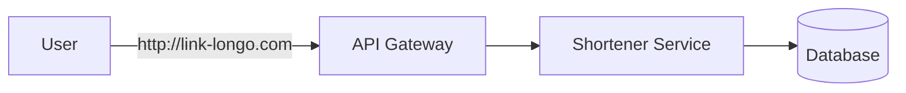
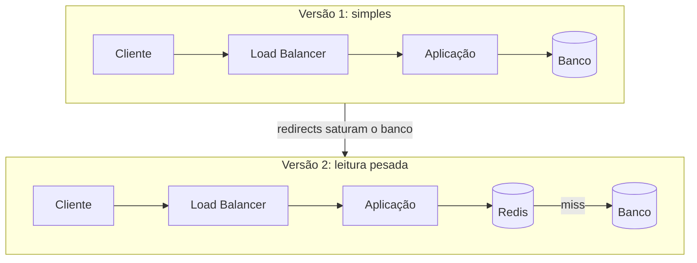

# Encurtador de URL

Um encurtador de URL é um sistema que:

- Recebe uma URL longa
- Gera uma URL curta única
- Redireciona usuários da URL curta para a original

## Estrutura de raciocínio

Um framework útil para entrevistas de system design é o FENCAFA:

1. Funcional
2. Escala
3. Não-funcional
4. Componentes
5. Arquitetura
6. Fluxo
7. Ajustes

## Requisitos do sistema

### Funcionais

- Criar URL curta
- Redirecionar URL
- Métricas de acesso

### Não-funcionais

- Alta disponibilidade
- Baixa latência
- Escalabilidade massiva
- Consistência eventual aceitável

## Estimativa de escala

Você deve pensar em:

- Número de URLs criadas por dia
- Número de redirecionamentos
- Volume de armazenamento

> Esse é um sistema read-heavy.

### Estimativa com números

Um exemplo para treinar a conta: 10 milhões de URLs novas por mês e 100 milhões de redirects por mês. Um mês tem cerca de 2,6 milhões de segundos (30 dias x 86.400), então:

| O que                     | Conta                                    | Resultado               |
| ------------------------- | ---------------------------------------- | ----------------------- |
| Escritas por segundo      | 10.000.000 / 2.600.000                   | cerca de 4 por segundo  |
| Leituras por segundo      | 100.000.000 / 2.600.000                  | cerca de 40 por segundo |
| Proporção leitura/escrita | 100M / 10M                               | 10 para 1               |
| Storage por ano           | 10M x 12 meses x ~500 bytes por registro | cerca de 60 GB          |

Esses são valores médios. O pico costuma ser algumas vezes maior, e um link viral pode concentrar milhares de acessos no mesmo código. O método completo, com pico e bandwidth, está em [Capacity Planning e Capacity Math](/labs/web-dev/system-design/03-capacity-planning/).

O ganho de fazer essa conta antes de desenhar é evitar projetar para uma escala que não existe. Com 40 leituras por segundo, um banco só com um índice resolve com folga. Com 40 mil, a conversa é outra. O número é o que diz em qual dos dois casos você está.

## Definição da API

Antes de escolher banco ou cache, defina quais operações o sistema oferece. A API deixa claro o que precisa ser suportado e evita construir infraestrutura para algo que ninguém vai chamar.

```http
POST /urls
Content-Type: application/json

{ "originalUrl": "https://exemplo.com/artigo/muito/longo", "expiresAt": "2026-12-31T23:59:59Z" }

HTTP/1.1 201 Created
{ "shortUrl": "https://enc.ur/abc123" }
```

```http
GET /abc123

HTTP/1.1 302 Found
Location: https://exemplo.com/artigo/muito/longo
```

Os códigos de resposta também fazem parte do contrato: `201` ao criar, `404` se o código não existe e `410 Gone` se a URL existiu mas já expirou (dizer "expirou" é mais útil do que dizer "nunca existiu").

**301 ou 302?** Os dois redirecionam, mas com efeitos diferentes:

- **301 (Moved Permanently)**: o navegador guarda a resposta e, nas próximas visitas, vai direto ao destino sem passar pelo encurtador. Reduz a carga, mas você deixa de ver esses acessos.
- **302 (Found)**: o redirect é tratado como temporário, então toda visita passa pelo serviço primeiro. Custa mais tráfego, mas é o que permite contar cliques e de onde eles vêm.

Se o requisito funcional "métricas de acesso" está na lista, o 302 é a escolha natural. Sem essa métrica, o 301 economiza requisições.

## Modelo básico

1. Usuário envia URL longa
2. Sistema gera código curto
3. Salva o mapping `short_code -> original_url`
4. O redirecionamento consulta esse mapping

### Modelo de dados

O núcleo é uma relação simples: `shortCode -> originalUrl`. Em volta dela, cabem alguns campos:

| Campo         | Para quê                                                                   |
| ------------- | -------------------------------------------------------------------------- |
| `id`          | Identificador interno                                                      |
| `shortCode`   | O código da URL curta, com índice único (é por ele que toda leitura busca) |
| `originalUrl` | Destino do redirect                                                        |
| `createdAt`   | Auditoria e análises                                                       |
| `expiresAt`   | Quando a URL deixa de valer (opcional)                                     |
| `userId`      | Dono do link, se o sistema exigir autenticação                             |

**SQL ou NoSQL?** A resposta não deve vir da popularidade da tecnologia. Ela sai de perguntas concretas sobre o sistema:

- **Padrão de acesso**: a leitura é uma busca por chave, sem joins, o que combina com key-value, mas também com uma tabela relacional com índice.
- **Escala**: 60 GB por ano cabem sem problema num banco relacional. Bilhões de registros pedem particionamento, e aí a escolha pesa mais.
- **Consistência**: um link recém-criado precisa funcionar logo, mas replicar com atraso de alguns segundos é aceitável (a consistência eventual dos requisitos).
- **Consultas**: se surgirem listagens por usuário ou relatórios, a modelagem relacional ajuda.
- **Disponibilidade**: quanto o negócio tolera de queda define quantas réplicas e regiões.

Para uma comparação dos bancos, veja [Escolha de Banco de Dados na Prática](/labs/web-dev/banco-de-dados/07-escolha-de-banco-de-dados/) e [NoSQL](/labs/web-dev/banco-de-dados/11-nosql/).

**Expiração:** com `expiresAt`, o redirect compara com a data atual e responde `410` se passou. Limpar os registros vencidos pode ser um job em segundo plano, ou um TTL nativo nos bancos que oferecem (Redis, DynamoDB, Cassandra). No cache, a expiração também deve respeitar esse mesmo limite para não servir link vencido.

## Geração da URL curta

### Estratégias

**Auto-increment + Base62**

Simples e determinístico, mas previsível.

**Hash da URL**

Pode colidir e dificulta controle.

**ID distribuído**

Escalável e evita gargalo central.

## Escala e otimizações

Como a leitura domina o sistema, o gargalo principal costuma estar no redirecionamento.

### Otimizações

- **Cache** para reduzir latência
- **CDN** para distribuição geográfica
- **Banco distribuído** com sharding por chave

## Arquitetura proposta

Componentes principais:

- API Service
- Banco de dados
- Cache
- Load Balancer
- Pipeline de analytics

### Fluxo de leitura

1. Recebe short URL
2. Busca no cache
3. Se der miss, consulta o banco
4. Retorna redirect HTTP 301 ou 302

### Fluxo de escrita

1. Gera ID
2. Salva mapping
3. Atualiza cache



## Da arquitetura simples à escalada

Uma armadilha comum em entrevista é abrir o quadro com Kafka, Redis e Kubernetes antes de saber o problema. O caminho mais sólido é começar pelo desenho mais simples possível e deixá-lo mostrar onde quebra.



A pergunta que guia a evolução é: **onde esse desenho falha quando o tráfego crescer?** No encurtador, a resposta costuma ser a leitura no banco, porque cada redirect vira uma consulta. Só então entra o cache:

1. **Cache Redis** para os códigos mais acessados. O banco continua sendo a fonte da verdade, e o cache só guarda cópias (veja [Cache e Redis](/labs/web-dev/escalabilidade/08-cache-e-redis/)).
2. **Escala horizontal** da aplicação atrás do load balancer, que é fácil porque ela não guarda estado.
3. **Replicação e read replicas** quando o banco continua sofrendo com leituras que o cache não pegou ([Replicação de Banco de Dados](/labs/web-dev/escalabilidade/03-replicacao-de-banco-de-dados/)).
4. **Sharding por `shortCode`** quando o volume de dados ou de escritas passa do que um servidor aguenta ([Stateless e Particionamento](/labs/web-dev/escalabilidade/02-stateless-e-particionamento/)).
5. **CDN** onde fizer sentido, para aproximar o redirect do usuário ([CDN](/labs/web-dev/escalabilidade/04-cdn/)).
6. **Rate limiting** para proteger a criação de links contra abuso ([Rate Limiting](/labs/web-dev/escalabilidade/10-rate-limiting/)).

O critério para aceitar cada peça é conseguir dizer por que ela entrou. Saber cem tecnologias importa menos do que explicar, para cada uma, qual problema medido ela resolve.

## Confiabilidade

Depois de escalar, teste o desenho com perguntas de "e se", como na etapa de failure scenarios da [metodologia de design](/labs/web-dev/system-design/06-metodologia-de-design/). Para o encurtador:

| E se...                            | O que acontece e como responder                                                                                                      |
| ---------------------------------- | ------------------------------------------------------------------------------------------------------------------------------------ |
| O banco cair                       | Redirects em cache continuam funcionando; criação falha. Réplica com failover assume, e a API devolve erro claro                     |
| O Redis cair                       | Toda leitura cai no banco, que pode não aguentar. Cache em cluster com réplica, e rate limiting para proteger o banco                |
| Um servidor de aplicação morrer    | O load balancer tira a instância do ar pelo health check; as outras seguem                                                           |
| Uma requisição de rede der timeout | Timeout curto e retry com backoff; a criação precisa ser idempotente para não gerar dois códigos para o mesmo pedido                 |
| Houver um pico repentino           | Cache absorve leituras, autoscaling adiciona instâncias, rate limiting segura abuso                                                  |
| Dois códigos iguais forem gerados  | Com hash, a colisão acontece; o índice único no `shortCode` rejeita a segunda gravação e o serviço gera outro código e tenta de novo |

O último caso depende da estratégia de geração. Com contador + Base62 ou ID distribuído a colisão não acontece por construção, mas o contador vira um ponto central que precisa ser tolerante a falha. Com hash, a colisão é esperada e o retry é parte do fluxo.

As técnicas de cada resposta estão em [Timeout, Retry, Circuit Breaker e Bulkhead](/labs/web-dev/resiliencia/01-timeout-retry-circuit-breaker-e-bulkhead/), [Idempotência](/labs/web-dev/resiliencia/02-idempotencia/) e [Disponibilidade](/labs/web-dev/resiliencia/03-disponibilidade/). E para saber que algo falhou antes do usuário reclamar, [Observabilidade](/labs/web-dev/observabilidade/01-logs-metrics-e-traces/) (métricas de taxa de erro, latência do redirect e taxa de acerto do cache).

## Problemas avançados

- Cache invalidation
- Hot keys
- Consistência eventual
- Abuso e segurança
- Analytics em sistema separado

## Trade-offs

| Decisão           | Trade-off    |
| ----------------- | ------------ |
| Cache agressivo   | Consistência |
| ID sequencial     | Segurança    |
| Hash              | Colisão      |
| Banco único       | Escala       |
| Banco distribuído | Complexidade |

## Referências

- [System Design: Encurtador de URL - Desafio Real de Entrevista RESOLVIDO | Leonardo Zamariola](https://www.youtube.com/watch?v=JHavVCLQT4k)
- [301 Moved Permanently](https://developer.mozilla.org/en-US/docs/Web/HTTP/Reference/Status/301) e [302 Found](https://developer.mozilla.org/en-US/docs/Web/HTTP/Reference/Status/302) - MDN Web Docs, en
- [Design A URL Shortener](https://bytebytego.com/courses/system-design-interview/design-a-url-shortener) - Alex Xu (ByteByteGo), en
