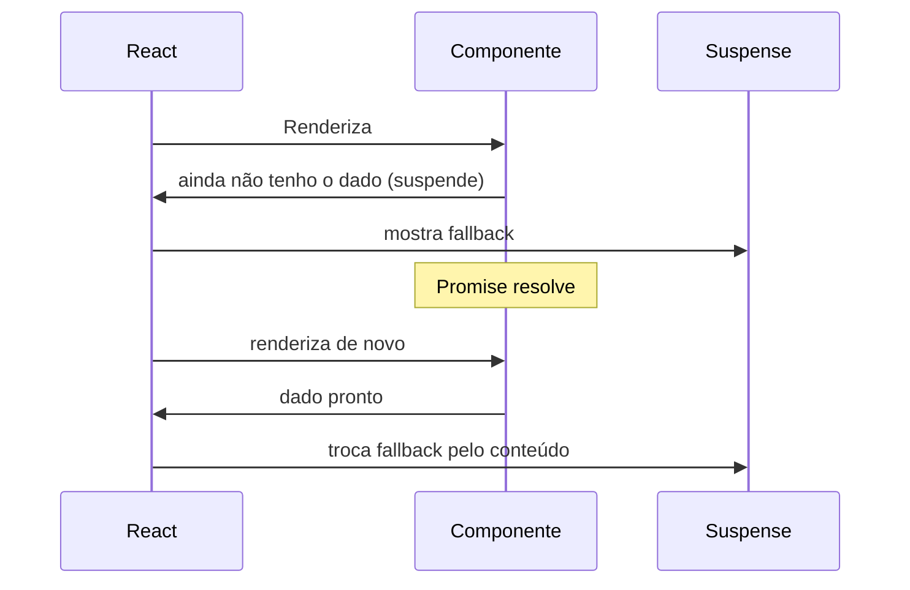

# Data fetching com Suspense e use()

Durante muito tempo, buscar dados num componente React seguiu sempre a mesma receita: um `useState` para guardar o resultado, outro para o loading, e um `useEffect` disparando a requisição depois que o componente montava. Funciona, e ainda funciona, mas o React mais recente (a partir da versão 19) oferece um jeito mais direto de fazer a mesma coisa: o hook `use()` combinado com `Suspense`. Essa combinação é a base de como o App Router do Next.js busca dados hoje em dia, então vale entender os dois lados: como era antes, e o que muda.

## O padrão antigo: useEffect + useState

O jeito clássico de buscar dados no client é assim:

```jsx
function Perfil({ id }) {
  const [usuario, setUsuario] = useState(null);
  const [carregando, setCarregando] = useState(true);

  useEffect(() => {
    let ativo = true;
    setCarregando(true);
    buscarUsuario(id).then((dado) => {
      if (ativo) {
        setUsuario(dado);
        setCarregando(false);
      }
    });
    return () => {
      ativo = false;
    };
  }, [id]);

  if (carregando) return <p>Carregando...</p>;
  return <div>{usuario.nome}</div>;
}
```

Repare no tanto de coisa que esse componente precisa controlar na mão: um estado só para saber se ainda está carregando, uma flag `ativo` para evitar atualizar o estado depois que o componente já desmontou (ou depois que o `id` mudou e uma requisição antiga, mais lenta, chegasse por último e sobrescrevesse uma resposta mais nova, a clássica race condition), e o próprio `if (carregando)` espalhado pelo corpo do componente. Nada disso é exclusivo de bugs de iniciante: é o preço de fazer o gerenciamento de uma Promise manualmente, chamando `useEffect` a cada troca de dependência.

## Suspense

O `Suspense` ataca esse problema de um jeito diferente: em vez de o componente controlar seu próprio estado de carregamento, ele avisa o React "ainda não tenho o que preciso" e deixa o React decidir o que mostrar enquanto isso.

```jsx
<Suspense fallback={<p>Carregando...</p>}>
  <Perfil id={id} />
</Suspense>
```

Quando um componente dentro do `<Suspense>` ainda não tem os dados prontos, ele "suspende": o React pausa a renderização dele, mostra o `fallback` do `<Suspense>` mais próximo, e troca o fallback pelo conteúdo real assim que os dados chegam. Se alguma coisa der errado no meio do caminho (a Promise rejeitar), o erro não vira uma exceção solta no meio do componente, ele propaga para o Error Boundary mais próximo, que é quem decide como mostrar uma tela de erro.



## O hook use()

O `use()` é a peça que faz um componente conseguir "suspender": ele lê o valor de uma Promise (ou de um Context) durante a renderização.

```jsx
function Perfil({ usuarioPromise }) {
  const usuario = use(usuarioPromise);
  return <div>{usuario.nome}</div>;
}
```

Se a Promise ainda está pendente, o componente suspende e o `Suspense` mais próximo mostra o fallback. Se ela já resolveu, `use()` devolve o valor direto, sem precisar de mais nenhum estado. Repare que não tem `if (carregando)` em lugar nenhum: essa lógica não desapareceu, ela só migrou para fora do componente, para o `Suspense` que o envolve.

Uma diferença importante em relação aos hooks que você já conhece (`useState`, `useEffect`, `useContext`): `use()` pode ser chamado dentro de `if`, de loop, depois de um retorno condicional, qualquer lugar. Os outros hooks exigem estar sempre no topo do componente, na mesma ordem a cada renderização; `use()` não tem essa restrição, porque ele não depende de manter uma lista de estados entre renderizações do mesmo jeito que os outros hooks dependem.

Outra diferença: `use()` não funciona dentro de um `try/catch`. Para tratar erro de uma Promise que passa por `use()`, a ferramenta certa é um Error Boundary envolvendo o componente, não um `try/catch` dentro dele.

## Cache de Promises: uma armadilha comum

Tem uma regra da documentação do React que é fácil de passar batido, e que já rendeu bastante confusão em exemplos que circulam por aí: a Promise que você passa para `use()` num Client Component precisa ser **a mesma instância** entre uma renderização e outra.

Isso quer dizer que este código aqui, que parece a versão "moderna" e mais limpa do primeiro exemplo, tem um problema sério:

```jsx
// Não faça isso
function Perfil() {
  const usuario = use(buscarUsuario()); // cria uma Promise nova a cada render
  return <div>{usuario.nome}</div>;
}
```

Como `buscarUsuario()` roda de novo a cada renderização, `use()` recebe uma Promise diferente toda vez, o que faz o componente suspender de novo, disparar uma nova requisição, suspender de novo, num ciclo que na prática significa refazer a busca sem parar. A documentação oficial do React é direta sobre isso: a Promise passada para `use()` num Client Component precisa estar cacheada, para que a mesma instância seja reaproveitada entre renders.

Um jeito simples de resolver é cachear a Promise fora do componente:

```jsx
const cache = new Map();

function buscarUsuarioCacheado(id) {
  if (!cache.has(id)) {
    cache.set(id, buscarUsuario(id));
  }
  return cache.get(id);
}
```

Mas na prática, a forma mais comum de evitar esse problema nem envolve escrever um cache na mão, é deixar quem já resolve isso por você: uma biblioteca como React Query ou SWR, ou (no caso do Next.js) buscar o dado num Server Component, que veremos a seguir.

## Padrão recomendado no Next.js App Router

No App Router, o jeito recomendado de usar `use()` para buscar dados é combinar Server Component e Client Component: o Server Component inicia a busca, sem esperar por ela, e passa a Promise para baixo como prop.

```tsx
// app/perfil/page.tsx (Server Component)
import { Suspense } from "react";
import Perfil from "./perfil";

export default function Page({ id }: { id: string }) {
  const usuarioPromise = buscarUsuario(id); // sem await

  return (
    <Suspense fallback={<p>Carregando...</p>}>
      <Perfil usuarioPromise={usuarioPromise} />
    </Suspense>
  );
}
```

```tsx
// app/perfil/perfil.tsx (Client Component)
"use client";
import { use } from "react";

export default function Perfil({
  usuarioPromise,
}: {
  usuarioPromise: Promise<{ nome: string }>;
}) {
  const usuario = use(usuarioPromise);
  return <div>{usuario.nome}</div>;
}
```

Esse padrão evita a armadilha do tópico anterior de um jeito natural: como o Server Component roda uma vez por requisição (ele não fica "re-renderizando" no navegador do jeito que um Client Component fica), a Promise não é recriada a cada render, ela é criada uma vez e passada adiante. Para completar, o Next.js já memoiza automaticamente chamadas `fetch` idênticas dentro da mesma árvore de requisição, e para fontes de dados que não usam `fetch` (uma consulta via ORM, por exemplo) existe o `React.cache`, que faz o mesmo papel de deduplicação.

O `<Suspense>` no exemplo acima também não é opcional: ele é quem decide que fallback mostrar enquanto `usuarioPromise` não resolve. Um erro comum em exemplos rápidos sobre `use()` é mostrar só o componente que consome a Promise, sem a boundary que o envolve, o que engana quem está aprendendo a achar que o fallback aparece "sozinho".

## Referências

- [use - Referência do React](https://react.dev/reference/react/use) - React (documentação oficial), en
- [Suspense - Referência do React](https://react.dev/reference/react/Suspense) - React (documentação oficial), en
- [Fetching Data - Next.js Docs](https://nextjs.org/docs/app/getting-started/fetching-data) - Vercel (documentação oficial), en
