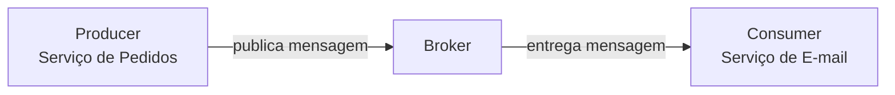
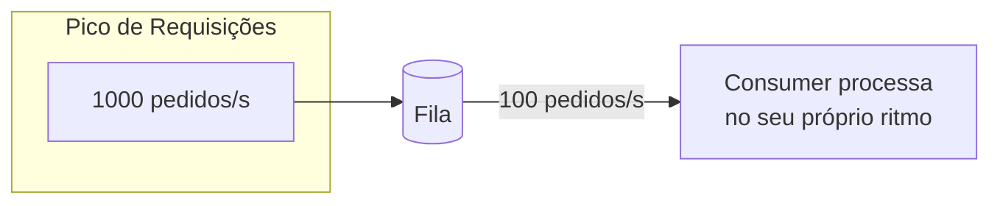

# Filas e Mensageria

Até aqui, boa parte da comunicação entre serviços que este lab cobriu é síncrona: um serviço chama outro via HTTP (veja [HTTP, APIs e REST](/labs/web-dev/apis/01-http-rest/)) e fica esperando a resposta. Isso funciona bem para muita coisa, mas cria um acoplamento no tempo: se o serviço chamado está lento ou fora do ar, quem chamou trava ou falha junto.

Filas resolvem esse problema colocando uma peça no meio: em vez de A chamar B diretamente, A deixa uma mensagem em algum lugar e B pega essa mensagem quando conseguir.

## Por que usar filas

Uma fila (queue) é uma estrutura de "primeiro que entra, primeiro que sai" onde mensagens ficam esperando para ser processadas. O sistema que gerencia essa fila é o **broker** de mensageria (RabbitMQ, Amazon SQS, Kafka, entre outros).

Os papéis envolvidos são sempre os mesmos três:

- **Producer**: quem cria e envia a mensagem para a fila. Ex: o serviço de pedidos, ao criar um pedido novo.
- **Broker**: o sistema que recebe, armazena e entrega a mensagem. Ex: RabbitMQ, SQS, Kafka.
- **Consumer**: quem lê a mensagem da fila e processa. Ex: o serviço de e-mail, que envia a confirmação do pedido.

Vale separar dois termos que aparecem juntos o tempo todo:

- **Mensagem**: o dado em si que trafega, geralmente um payload em JSON com as informações do evento (ex: `{ "pedidoId": 123, "status": "criado" }`).
- **Queue** (fila): o canal onde a mensagem fica até ser consumida, endereçado geralmente a **um** grupo de consumers processando o mesmo tipo de trabalho.
- **Topic**: parecido com uma queue, mas pensado para **múltiplos** consumers independentes lerem a mesma mensagem, cada um pelo seu próprio motivo. É a base do padrão Pub/Sub (publicador/assinante): o producer publica no topic sem saber quem (ou quantos) vai ler.

Por exemplo, um evento "pedido criado" pode ser publicado num topic e lido ao mesmo tempo pelo serviço de e-mail (para mandar a confirmação), pelo serviço de estoque (para reservar o produto) e pelo serviço de analytics (para registrar a venda). Nenhum desses três sabe da existência dos outros.

## Comunicação assíncrona

A diferença central entre chamar um serviço via fila ou via HTTP direto é: síncrono espera resposta, assíncrono não.

|                                    | Síncrono (ex: REST)                              | Assíncrono (ex: fila)                            |
| ---------------------------------- | ------------------------------------------------ | ------------------------------------------------ |
| Quem chama espera a resposta?      | Sim                                              | Não                                              |
| Serviços ficam acoplados no tempo? | Sim, os dois precisam estar de pé ao mesmo tempo | Não, o consumer pode processar depois            |
| E se o consumer cair?              | A chamada falha na hora                          | A mensagem fica esperando na fila até ele voltar |

Essa independência de tempo traz três ganhos práticos:

**Desacoplamento**: o producer não precisa saber quem vai processar a mensagem, nem como. Ele só sabe que publicou um evento. Isso permite adicionar um novo consumer (por exemplo, um novo serviço de notificação por SMS) sem tocar em uma linha do serviço de pedidos.

**Absorção de picos**: se 10 mil pedidos chegam num intervalo de 1 minuto, mas o serviço de e-mail só consegue processar 100 por segundo, a fila absorve essa diferença. As mensagens ficam esperando e são processadas no ritmo que o consumer aguenta, em vez de derrubar o serviço com o pico direto.

**Processamento posterior**: nem tudo precisa acontecer na hora. Gerar um relatório, enviar um e-mail de confirmação ou recalcular uma recomendação são tarefas que podem esperar alguns segundos ou minutos sem prejudicar ninguém. Jogar esse trabalho para uma fila libera o fluxo principal (o que o usuário está esperando na tela) para responder rápido, e deixa o trabalho pesado para ser feito em segundo plano.

O preço dessa flexibilidade é a complexidade operacional: agora existe uma peça a mais no sistema (o broker), e é preciso pensar em cenários que não existiam antes, como mensagens duplicadas, fora de ordem ou que falham repetidamente. As próximas notas desta seção tratam do Kafka como implementação concreta de broker e das garantias de entrega que esses cenários exigem.
