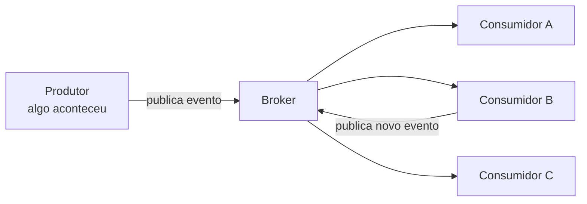

# Arquitetura Orientada a Eventos

A nota de [Filas e Mensageria](/labs/web-dev/mensageria/01-filas-e-mensageria/) apresentou as peças soltas: producer, broker, consumer, mensagem, topic. Arquitetura orientada a eventos (ou EDA, de _event-driven architecture_) é o que acontece quando você organiza o sistema inteiro em volta dessas peças, em vez de usar fila só para uma tarefa pontual aqui e ali.

A ideia central é simples: em vez de um serviço mandar o outro fazer algo ("cobre esse cartão"), ele apenas anuncia que algo aconteceu ("pedido foi criado") e segue a vida. Quem se interessa por esse fato reage por conta própria. O serviço que publicou nem sabe quem está ouvindo.

Antes de entrar nos detalhes, um aviso que vale para a nota toda: EDA não elimina complexidade, ela muda a complexidade de lugar. Você tira o acoplamento forte entre serviços e ganha, no lugar, problemas de entrega, versionamento de contrato e mensagens duplicadas. Se esse trade-off compensa depende do sistema, e a última seção volta nesse ponto.

## O fluxo básico

Todo sistema orientado a eventos segue o mesmo ciclo:



1. Um serviço faz alguma coisa no seu domínio (cria um pedido, aprova um pagamento) e **publica um evento** descrevendo esse fato.
2. O **broker** recebe o evento, guarda e encaminha para quem assinou.
3. Cada **consumidor** processa o evento de forma independente, no próprio ritmo, sem saber da existência dos outros.
4. Um consumidor pode, ao processar, **publicar novos eventos**, e aí o ciclo se repete. O evento `pagamento-aprovado` pode disparar `nota-fiscal-emitida`, que dispara `pedido-pronto-para-envio`.

Repare que ninguém "chama" ninguém. O produtor larga o evento e pronto. Isso é o oposto do modelo síncrono, onde o serviço de pedidos chamaria o de pagamento, esperaria a resposta, depois chamaria o de estoque, e assim por diante, todos amarrados na mesma requisição.

## Por que times adotam

O ganho todo vem de uma coisa só: o produtor não conhece os consumidores. A partir daí:

- **Baixo acoplamento.** Adicionar um consumidor novo (um programa de fidelidade que reage a pedidos, por exemplo) não exige tocar em uma linha do serviço de pedidos. Ele só assina o topic e começa a receber.
- **Escala independente.** O serviço de analytics pode rodar com 2 réplicas e o de envio de e-mail com 20, cada um dimensionado pela própria carga. No modelo síncrono, o serviço mais lento da cadeia segura todo mundo.
- **Resiliência.** Se o consumidor de analytics cai, os eventos ficam acumulados no broker esperando ele voltar. O pedido continua sendo criado, o e-mail continua saindo. A falha fica contida em vez de subir pela cadeia de chamadas.
- **Processamento em tempo real.** Os eventos fluem conforme acontecem, então dá para reagir na hora: recalcular uma recomendação, atualizar um painel, disparar um alerta antifraude.
- **Absorção de picos.** Se 10 mil pedidos entram em um minuto e o consumidor aguenta 100 por segundo, o broker segura a diferença. As mensagens esperam na fila em vez de derrubar o serviço.

Esses três últimos aparecem com mais detalhe em [Filas e Mensageria](/labs/web-dev/mensageria/01-filas-e-mensageria/); aqui o ponto é que eles deixam de ser um bônus de uma fila específica e viram a característica do sistema todo.

## Anatomia de um sistema orientado a eventos

Um sistema orientado a eventos costuma ter quatro camadas:

```mermaid
flowchart LR
    subgraph Produtores
        O[Serviço de pedidos]
        PG[Serviço de pagamento]
        U[Serviço de usuários]
    end
    subgraph Broker
        K[(Kafka / Kinesis /<br/>RabbitMQ / NATS)]
    end
    subgraph Consumidores
        E[Estoque]
        S[Envio]
        N[Notificação]
        A[Analytics]
    end
    subgraph "Camadas de dados"
        DB[(Banco)]
        CA[(Cache)]
        SE[(Busca)]
        API[APIs externas]
    end
    Produtores --> Broker --> Consumidores --> "Camadas de dados"
```

**Produtores** são os serviços que geram eventos quando algo muda no domínio deles: pedido criado, pagamento capturado, e-mail do usuário alterado.

**Broker** é o meio de campo que recebe, guarda e distribui os eventos. As opções mais comuns:

| Broker | Jeitão | Costuma aparecer em |
| --- | --- | --- |
| Apache Kafka | Log distribuído e particionado, guarda o histórico | Streaming, event sourcing, pipelines de dados |
| Amazon Kinesis | Kafka gerenciado da AWS, mesma ideia de log | Quem já vive no ecossistema AWS |
| RabbitMQ | Broker "esperto" que roteia mensagem por regras, entrega e esquece | Filas de trabalho, roteamento complexo |
| NATS | Minimalista, latência baixíssima, foco em pub/sub | Comunicação entre serviços, IoT, edge |

Kafka e RabbitMQ estão detalhados nas notas de [Kafka](/labs/web-dev/mensageria/03-kafka/) e [RabbitMQ](/labs/web-dev/mensageria/04-rabbitmq/). A escolha muda bastante coisa: um log que guarda histórico (Kafka) permite reprocessar eventos antigos; um broker que entrega e esquece (RabbitMQ no modo padrão) não.

**Consumidores** são os serviços que reagem: reservar estoque, agendar envio, mandar notificação, registrar no analytics. Cada um lê o mesmo fluxo pelo seu próprio motivo.

**Camadas de dados** é onde cada consumidor guarda o resultado do que processou: seu próprio banco, um cache, um índice de busca, ou uma chamada para uma API externa. Detalhe importante: cada consumidor mantém sua própria cópia derivada dos dados. O serviço de envio tem a tabela de entregas dele, o de analytics tem o data warehouse dele, e os dois foram construídos a partir do mesmo evento `pedido-criado`. Não existe um banco central que todo mundo lê.

## Garantias de entrega e o custo de cada uma

Quando um evento sai do produtor e chega no consumidor, três coisas podem ser prometidas:

- **At-most-once**: chega zero ou uma vez. Pode perder evento, nunca duplica.
- **At-least-once**: chega uma ou mais vezes. Nunca perde, pode duplicar.
- **Exactly-once**: chega e é processado exatamente uma vez. É o ideal na teoria, mas caro e cheio de asteriscos na prática, porque exige coordenar o broker com o efeito colateral do processamento (a escrita no banco, a chamada na API).

O padrão da indústria é não perseguir exactly-once e sim assumir **at-least-once com consumidores idempotentes**: aceita-se que a mesma mensagem pode chegar duas vezes e faz-se o consumidor tratar isso, de modo que processar de novo produza o mesmo resultado que processar uma vez. A mecânica completa está em [Garantias de Entrega](/labs/web-dev/mensageria/05-garantias-de-entrega/) e em [Idempotência](/labs/web-dev/resiliencia/02-idempotencia/).

Por que isso é uma decisão de arquitetura e não um detalhe: se você escolhe at-least-once, todo consumidor do sistema precisa ser idempotente, sempre. Isso vira uma regra de projeto que atravessa todos os times, não uma configuração que você liga num serviço só.

## O schema é o contrato

No modelo síncrono, quando o serviço A chama o serviço B, existe geralmente um cliente, uma interface, um contrato que o compilador ou os testes cobram. Em EDA não tem nada disso: o produtor escreve um JSON (ou Avro, ou Protobuf) no topic e o consumidor lê. O **formato do evento é o único contrato** entre eles.

Isso tem uma consequência dura: se o serviço de pedidos renomeia o campo `valor_total` para `total` no evento `pedido-criado` sem cuidado, todos os consumidores que liam `valor_total` quebram de uma vez, em produção, sem ninguém ter mudado uma linha do código deles.

As duas peças que seguram isso:

- **Schema registry**: um serviço central onde cada formato de evento é registrado. O produtor valida contra o registry antes de publicar, o consumidor consulta para saber como desserializar. Ninguém publica um evento "fora do contrato" por acidente.
- **Versionamento e evolução compatível**: mudanças no schema precisam ser retrocompatíveis (adicionar campo opcional, ok; remover campo ou mudar tipo, não). Quando a mudança é inevitável, publica-se uma nova versão do evento e os consumidores migram no próprio tempo.

A nota de [Kafka](/labs/web-dev/mensageria/03-kafka/) mostra como isso funciona na prática com o Schema Registry do ecossistema Kafka e as regras de compatibilidade do Avro.

## Mecânica de confiabilidade

Alguns mecanismos aparecem em praticamente todo sistema orientado a eventos, independente do broker:

**Armazenamento durável.** O broker grava o evento em disco (e replica) antes de confirmar o recebimento ao produtor. Se o broker reiniciar, o evento continua lá.

**Acknowledgment (ack).** O consumidor só avisa "processei" depois de terminar de verdade. Se ele cai no meio, não deu ack, e o broker reentrega. É esse detalhe (dar o ack antes ou depois de processar) que define se a entrega é at-most-once ou at-least-once.

**Retry com backoff.** Falha temporária (a API externa deu timeout, o banco engasgou) não é motivo para jogar o evento fora. O consumidor tenta de novo, esperando um intervalo cada vez maior entre as tentativas para não martelar um serviço que já está sofrendo. Esse padrão está em [Timeout, Retry, Circuit Breaker e Bulkhead](/labs/web-dev/resiliencia/01-timeout-retry-circuit-breaker-e-bulkhead/).

**Dead letter queue (DLQ).** Depois de N tentativas sem sucesso, o evento problemático (a _poison message_) é movido para uma fila separada, em vez de ficar travando o processamento de tudo que vem atrás. Alguém precisa monitorar essa DLQ, porque um evento parado lá é um pedido não processado. Detalhado em [Garantias de Entrega](/labs/web-dev/mensageria/05-garantias-de-entrega/).

## Padrões

"Arquitetura orientada a eventos" é um guarda-chuva. Debaixo dele existem padrões com nomes próprios, e a maioria dos sistemas usa mais de um ao mesmo tempo:

| Padrão | O que é | Quando usar |
| --- | --- | --- |
| **Publish-subscribe** | Um evento, vários consumidores independentes lendo cada um pelo seu motivo | O caso mais comum: notificar N serviços de que algo aconteceu |
| **Event streaming** | Um cálculo contínuo sobre o fluxo de eventos (contagem, janela de tempo, join entre streams) | Antifraude em tempo real, alertas de SRE, recomendação que reage a cada clique |
| **Event sourcing** | A sequência de eventos é a fonte da verdade; o estado atual é derivado dela | Quando o histórico completo importa: contabilidade, auditoria, saldo de conta |
| **Saga** | Coordenar uma transação que atravessa vários serviços usando eventos e passos de compensação | Quando uma operação precisa ser "tudo ou nada" mas não cabe numa transação de banco única |

Publish-subscribe e event streaming aparecem em [Casos de Uso do Kafka](/labs/web-dev/mensageria/07-casos-de-uso-do-kafka/). Saga e event sourcing têm nota própria em [Saga](/labs/web-dev/transacoes-distribuidas/03-saga/) e [Dual-Write Problem](/labs/web-dev/transacoes-distribuidas/04-escrita-dupla/).

## Anti-padrões

Alguns erros aparecem sempre que um time começa a usar eventos:

**Chamada síncrona bloqueante dentro do handler.** O consumidor recebe o evento e, para processá-lo, faz uma chamada HTTP para outro serviço e fica esperando a resposta. Isso reintroduz o acoplamento que o evento tinha eliminado: se aquele serviço está fora do ar, o consumidor trava, os eventos se acumulam, e você tem o pior dos dois mundos.

**Payload grande demais.** Colocar o pedido inteiro, com todos os itens, endereço e histórico, dentro do evento. O broker fica pesado, a serialização custa caro, e boa parte dos consumidores só queria o ID. O comum é o evento carregar o ID e os poucos campos que a maioria precisa; quem quiser o resto busca na fonte.

**Encadeamento excessivo de eventos.** Evento A dispara B, que dispara C, que dispara D, sem que ninguém tenha desenhado esse fluxo de propósito. Quando algo falha no meio, ninguém sabe dizer o que deveria ter acontecido. Fluxos longos com significado de negócio pedem uma [saga](/labs/web-dev/transacoes-distribuidas/03-saga/) explícita, não uma corrente de eventos acidental.

**Ignorar consumidores com falha.** Um consumidor está dando erro há três dias e ninguém percebeu porque não tem alerta na DLQ nem no _consumer lag_ (o quanto o consumidor está atrasado em relação ao topic). No modelo síncrono, uma chamada que falha estoura na cara de alguém; em EDA, a falha é silenciosa até alguém reclamar que o e-mail não chegou.

## O trade-off que não some

Volta o aviso do começo: EDA move a complexidade, não remove.

No modelo síncrono, quando um pedido não é cobrado, você abre o log do serviço de pedidos, segue a chamada para o serviço de pagamento, vê o erro. O fluxo está todo numa requisição, num lugar.

Em EDA, um único `pedido-criado` dispara cinco workflows assíncronos em cinco serviços diferentes. Responder "por que esse pedido não foi cobrado" vira uma investigação: qual consumidor recebeu o evento, qual não recebeu, qual recebeu e falhou, qual está atrasado. O fluxo não está em lugar nenhum, está espalhado.

Por isso duas coisas deixam de ser opcionais num sistema orientado a eventos:

- **Rastreamento distribuído.** Cada evento carrega um ID de correlação que atravessa todos os serviços que o processaram, para dar para reconstruir o caminho completo depois. Isso está em [Logs, Métricas e Traces](/labs/web-dev/observabilidade/01-logs-metrics-e-traces/).
- **Disciplina de schema.** Registry, versionamento, testes de compatibilidade. Sem isso, uma mudança inocente num evento vira um incidente de produção.

Uma frase resume bem o custo: sistemas orientados a eventos trocam um problema de depuração que você entende por um que você ainda não entende. Se o desacoplamento e a escala independente valem esse preço, aí é decisão de projeto, e a nota de [Trade-offs Arquiteturais](/labs/web-dev/system-design/05-trade-offs-arquiteturais/) ajuda a pesar.
