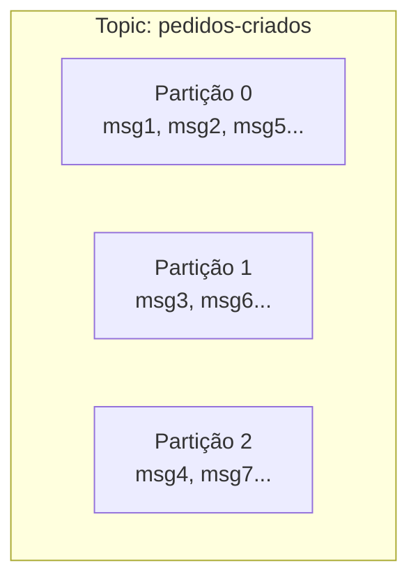

# Kafka

A nota anterior, [Filas e Mensageria](/labs/web-dev/mensageria/filas-e-mensageria/), descreve o papel genérico de um broker: receber mensagens de producers e entregar para consumers. O Apache Kafka é hoje uma das implementações mais usadas desse papel, mas com um jeito próprio de organizar os dados que vale entender em detalhe, porque ele explica boa parte das decisões de projeto que aparecem ao usar Kafka na prática.

## Conceitos fundamentais

**Topic** é o nome que o Kafka dá ao canal onde as mensagens são publicadas, equivalente ao conceito de topic visto na nota anterior. Um sistema de e-commerce pode ter topics como `pedidos-criados`, `pagamentos-aprovados` ou `estoque-atualizado`.

**Partition**: aqui está a diferença que faz o Kafka escalar. Um topic não é uma fila única, ele é dividido em várias **partições**, e cada partição é uma sequência ordenada e imutável de mensagens, guardada em disco. Isso permite que várias mensagens do mesmo topic sejam escritas e lidas em paralelo, uma por partição.



Quando o producer publica uma mensagem, o Kafka decide em qual partição ela cai (por padrão, com base numa chave que o producer envia, tipo o ID do pedido). Mensagens com a mesma chave sempre vão para a mesma partição, o que garante que a ordem entre elas seja preservada, isso é aprofundado na próxima nota, sobre [Garantias de Entrega](/labs/web-dev/mensageria/garantias-de-entrega/).

**Offset**: dentro de cada partição, toda mensagem recebe um número sequencial crescente, o offset (0, 1, 2, 3...). É basicamente o "número da posição" da mensagem naquela partição. O Kafka não remove uma mensagem assim que ela é lida, como uma fila tradicional faria, ele guarda a mensagem por um tempo configurável (dias, semanas) e é o consumer quem controla até qual offset já leu.

Essa é uma diferença importante de mentalidade: no Kafka, ler uma mensagem não a "consome" no sentido de apagar. Vários consumers diferentes podem ler a mesma partição, cada um na sua própria posição, e é possível até voltar o offset e reprocessar mensagens antigas.

**Producer**: quem publica mensagens num topic, o mesmo papel visto na nota anterior. No Kafka, o producer normalmente informa uma chave (para controlar a partição de destino) e o payload da mensagem.

**Consumer** e **Consumer Group**: um consumer lê mensagens de uma ou mais partições. Mas o uso comum é agrupar vários consumers num **consumer group**: o Kafka distribui as partições do topic entre os consumers daquele grupo, um consumer só, uma ou várias partições, mas cada partição só vai para um consumer do grupo por vez.

```mermaid
flowchart LR
    subgraph Topic (3 partições)
    P0[Partição 0]
    P1[Partição 1]
    P2[Partição 2]
    end
    subgraph Consumer Group A
    C1[Consumer 1]
    C2[Consumer 2]
    C3[Consumer 3]
    end
    P0 --> C1
    P1 --> C2
    P2 --> C3
```

Isso é o que dá ao Kafka a capacidade de escalar o consumo horizontalmente (veja [Escalabilidade horizontal](/labs/web-dev/escalabilidade/escalabilidade/)): quer processar mais rápido? Aumenta o número de partições e o número de consumers no grupo, até o limite de um consumer por partição. Se você tiver mais consumers do que partições, os consumers extras ficam ociosos, sem partição para ler.

Vale notar que grupos diferentes são independentes entre si: o consumer group do serviço de e-mail e o consumer group do serviço de estoque podem ler o mesmo topic `pedidos-criados` do começo ao fim, cada um no seu próprio ritmo, sem interferir um no outro.

**Replication**: cada partição não vive numa única máquina do cluster Kafka, ela é replicada em várias, uma delas é a **líder** (recebe todas as escritas e leituras) e as outras são **réplicas** que copiam os dados dela. Se a máquina líder cair, uma das réplicas assume o posto automaticamente, e o topic continua disponível sem perder mensagens já confirmadas. O nível de replicação (quantas cópias existem) é configurável por topic, e é o principal mecanismo do Kafka para tolerar falha de máquina sem perder dado.
