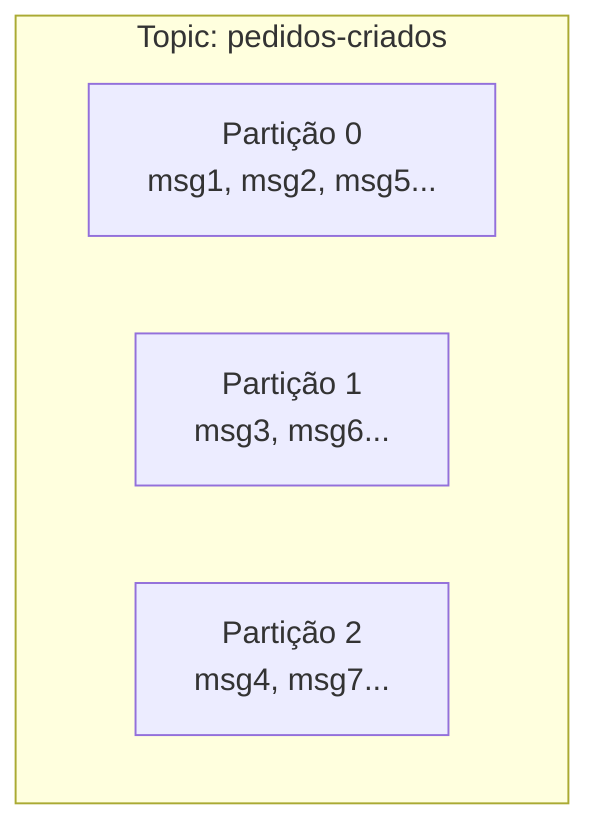
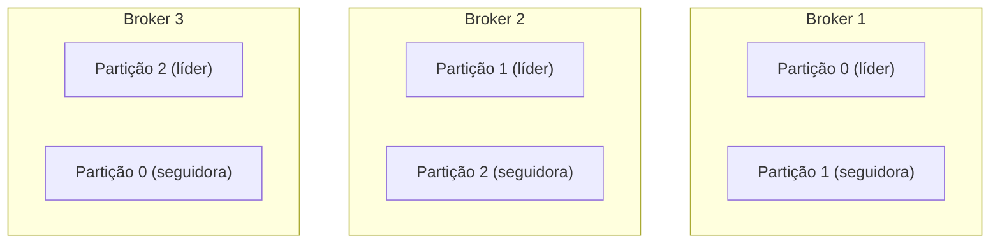
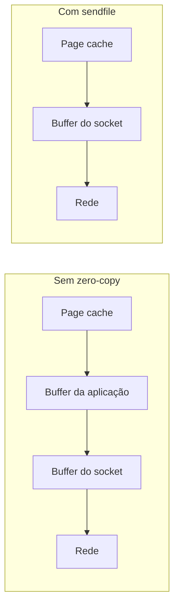
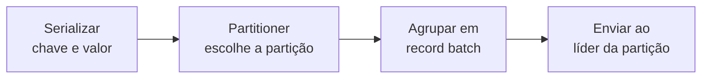
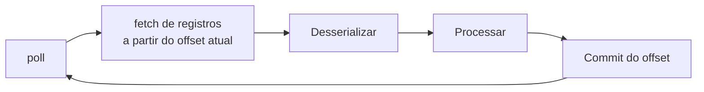

# Kafka

A nota de [Filas e Mensageria](/labs/web-dev/mensageria/01-filas-e-mensageria/) descreve o papel genérico de um broker: receber mensagens de producers e entregar para consumers. O Apache Kafka é hoje uma das implementações mais usadas desse papel, mas com um jeito próprio de organizar os dados que vale entender em detalhe, porque ele explica boa parte das decisões de projeto que aparecem ao usar Kafka na prática.

## Conceitos fundamentais

**Topic** é o nome que o Kafka dá ao canal onde as mensagens são publicadas, equivalente ao conceito de topic visto na nota anterior. Um sistema de e-commerce pode ter topics como `pedidos-criados`, `pagamentos-aprovados` ou `estoque-atualizado`.

**Partition**: aqui está a diferença que faz o Kafka escalar. Um topic não é uma fila única, ele é dividido em várias **partições**, e cada partição é uma sequência ordenada e imutável de mensagens, guardada em disco. Isso permite que várias mensagens do mesmo topic sejam escritas e lidas em paralelo, uma por partição.



Quando o producer publica uma mensagem, o Kafka decide em qual partição ela cai (por padrão, com base numa chave que o producer envia, tipo o ID do pedido). Mensagens com a mesma chave sempre vão para a mesma partição, o que garante que a ordem entre elas seja preservada, isso é aprofundado na próxima nota, sobre [Garantias de Entrega](/labs/web-dev/mensageria/05-garantias-de-entrega/).

**Offset**: dentro de cada partição, toda mensagem recebe um número sequencial crescente, o offset (0, 1, 2, 3...). É basicamente o "número da posição" da mensagem naquela partição. O Kafka não remove uma mensagem assim que ela é lida, como uma fila tradicional faria, ele guarda a mensagem por um tempo configurável (dias, semanas) e é o consumer quem controla até qual offset já leu.

Essa é uma diferença importante de mentalidade: no Kafka, ler uma mensagem não a "consome" no sentido de apagar. Vários consumers diferentes podem ler a mesma partição, cada um na sua própria posição, e é possível até voltar o offset e reprocessar mensagens antigas.

**Producer**: quem publica mensagens num topic, o mesmo papel visto na nota anterior. No Kafka, o producer normalmente informa uma chave (para controlar a partição de destino) e o payload da mensagem.

**Consumer** e **Consumer Group**: um consumer lê mensagens de uma ou mais partições. Mas o uso comum é agrupar vários consumers num **consumer group**: o Kafka distribui as partições do topic entre os consumers daquele grupo, um consumer só, uma ou várias partições, mas cada partição só vai para um consumer do grupo por vez.

```mermaid
flowchart LR
    subgraph Topic (3 partições)
    P0[Partição 0]
    P1[Partição 1]
    P2[Partição 2]
    end
    subgraph Consumer Group A
    C1[Consumer 1]
    C2[Consumer 2]
    C3[Consumer 3]
    end
    P0 --> C1
    P1 --> C2
    P2 --> C3
```

Isso é o que dá ao Kafka a capacidade de escalar o consumo horizontalmente (veja [Escalabilidade horizontal](/labs/web-dev/escalabilidade/01-escalabilidade/)): quer processar mais rápido? Aumenta o número de partições e o número de consumers no grupo, até o limite de um consumer por partição. Se você tiver mais consumers do que partições, os consumers extras ficam ociosos, sem partição para ler.

Vale notar que grupos diferentes são independentes entre si: o consumer group do serviço de e-mail e o consumer group do serviço de estoque podem ler o mesmo topic `pedidos-criados` do começo ao fim, cada um no seu próprio ritmo, sem interferir um no outro.

**Replication**: cada partição não vive numa única máquina do cluster Kafka, ela é replicada em várias, uma delas é a **líder** (recebe todas as escritas e leituras) e as outras são **réplicas** que copiam os dados dela. Se a máquina líder cair, uma das réplicas assume o posto automaticamente, e o topic continua disponível sem perder mensagens já confirmadas. O nível de replicação (quantas cópias existem) é configurável por topic, e é o principal mecanismo do Kafka para tolerar falha de máquina sem perder dado.

## Arquitetura do cluster

Um cluster Kafka é um conjunto de máquinas chamadas **brokers**. Cada broker guarda um pedaço dos dados e atende parte do tráfego, e é essa divisão de trabalho que faz o Kafka escalar para muitos gigabytes por segundo.

As partições de cada topic são espalhadas entre os brokers. Como visto na seção de replication, cada partição tem uma cópia **líder** e uma ou mais cópias **seguidoras**, em brokers diferentes. Toda escrita e toda leitura daquela partição passam pelo líder; os seguidores só ficam copiando os dados do líder e de prontidão para assumir se ele cair.



O **replication factor** é quantas cópias de cada partição o cluster mantém. Com replication factor 3, cada partição existe em 3 brokers: 1 líder e 2 seguidoras.

**ISR (In-Sync Replicas)** é o conjunto de réplicas que estão em dia com o líder, ou seja, já copiaram tudo que o líder tem (ou estão a poucos milissegundos disso). Uma réplica que ficou muito para trás (porque o broker dela está lento ou teve um soluço de rede) sai do ISR até se recuperar. O ISR importa por dois motivos: a confirmação de escrita mais forte espera todo o ISR gravar (mais sobre isso no fluxo do producer), e só uma réplica que está no ISR pode ser promovida a líder. Promover uma réplica atrasada significaria perder as mensagens que ela ainda não tinha copiado.

Quando o broker que era líder de uma partição cai, o cluster escolhe uma das réplicas do ISR daquela partição para ser o novo líder. Os producers e consumers percebem a mudança e passam a falar com o novo líder. Se a replicação estava saudável, isso acontece em segundos e sem perder mensagem já confirmada.

Alguém precisa coordenar tudo isso: saber quais brokers estão vivos, qual é o líder de cada partição, quais topics existem e com que configuração. Esse papel é do **controller**:

- Nas versões antigas do Kafka, essa coordenação dependia do **ZooKeeper**, um serviço separado que precisava ser instalado e operado à parte.
- A partir do Kafka 4.0 (março de 2025), o ZooKeeper foi removido de vez e o padrão passou a ser o **KRaft** (Kafka Raft): o controller roda dentro do próprio cluster de brokers, usando um algoritmo de consenso parecido com o Raft para manter os metadados replicados. Menos uma peça para instalar e monitorar.

Do ponto de vista de quem usa o Kafka, ZooKeeper e KRaft fazem a mesma coisa; a diferença é operacional.

O **controller** ativo é eleito por quórum entre os controllers do cluster: com N controllers, é preciso o voto de N/2 + 1 deles para decidir quem manda, o mesmo tipo de maioria que aparece em [Consenso: Paxos e Raft](/labs/web-dev/sistemas-distribuidos/02-consenso-paxos-e-raft/).

## Armazenamento em disco e desempenho

O Kafka guarda tudo em disco e ainda assim move gigabytes por segundo. Isso não é mágica, é um conjunto de decisões de projeto que evitam os dois gargalos clássicos de I/O: o seek de disco e a cópia de memória.

### Segments e índice esparso

Uma partição não é um arquivo gigante único. Ela é quebrada em **segments**: arquivos de tamanho parecido (o padrão é 1 GB, config `segment.bytes`). O Kafka escreve no segment ativo até ele encher, fecha esse arquivo e abre o próximo. A retenção e a compactação trabalham em cima de segments inteiros, é por isso que "apagar mensagem velha" no Kafka é barato: ele deleta o arquivo do segment todo de uma vez, não linha por linha.

Cada segment tem três arquivos:

| Arquivo      | O que guarda                                     |
| ------------ | ------------------------------------------------ |
| `.log`       | as mensagens em si, na ordem em que chegaram     |
| `.index`     | mapa de offset para a posição em bytes no `.log` |
| `.timeindex` | mapa de timestamp para posição no `.log`         |

O `.index` é **esparso**: o Kafka não anota a posição de toda mensagem, só a cada N bytes escritos (config `index.interval.bytes`, padrão 4 KB). Assim o índice fica pequeno o suficiente para viver na memória mesmo numa partição com bilhões de mensagens. Para achar o offset 1.000.000, o Kafka pula para a entrada de índice mais próxima antes dele e lê sequencialmente o resto.

### Por que a escrita é rápida

O Kafka só faz uma coisa com o `.log`: **acrescenta no fim**. Nunca atualiza uma mensagem no meio, nunca reordena. Escrita sempre sequencial.

Isso importa porque disco (tanto HDD quanto SSD) é ordens de grandeza mais rápido em acesso sequencial do que em acesso aleatório: no HDD a cabeça não precisa ficar se movendo, no SSD o controlador consegue escrever em blocos grandes contíguos. Um append sequencial em disco chega perto da velocidade de escrita na memória, e é aí que um banco tradicional, que precisa atualizar índices B-tree em posições espalhadas, perde para o Kafka em volume de escrita.

### Por que a leitura é rápida

Dois truques trabalham juntos na leitura.

**OS page cache**: quando o Kafka escreve no `.log`, o sistema operacional mantém esses bytes num cache em memória (o page cache). Um consumer que está acompanhando o topic em tempo real lê mensagens que foram escritas há segundos, e essas mensagens ainda estão no page cache, então a leitura nem toca o disco. Num cluster Kafka saudável, com os consumers em dia, o disco quase não tem atividade de leitura.

**Zero-copy (`sendfile`)**: para mandar mensagens pela rede até um consumer, o caminho ingênuo seria copiar os bytes do page cache para dentro da aplicação (a JVM do broker), e da aplicação para o buffer do socket. São duas cópias e duas trocas de contexto à toa, já que o broker não precisa nem olhar o conteúdo da mensagem. O Kafka usa a chamada de sistema `sendfile()`, que manda o kernel copiar direto do page cache para o socket de rede.



### A soma das partes

Nenhuma dessas escolhas isolada é revolucionária. O ganho vem de todas juntas: append sequencial em disco, índice esparso na memória, page cache servindo as leituras, `sendfile` cortando as cópias, e o batch do lado do producer (visto na próxima seção) reduzindo o número de idas e voltas na rede. É essa pilha de trade-offs que dá ao Kafka o throughput que ele tem.

## Fluxo do producer

Publicar uma mensagem não é só "manda pro Kafka". O producer faz algumas etapas antes:



1. **Serialização**: a chave e o valor da mensagem viram bytes (JSON, Avro, Protobuf, string simples).
2. **Partitioner**: decide para qual partição a mensagem vai. Com chave, ele faz `hash(chave) % número de partições`, então mensagens com a mesma chave sempre caem na mesma partição (o que preserva a ordem entre elas). Sem chave, ele distribui de forma equilibrada (round robin). Também dá para escrever um **partitioner customizado** com a sua própria regra. A escolha da chave importa: uma chave mal escolhida ou concentra o tráfego numa única partição (uma **hot partition**, que vira gargalo enquanto as outras ficam ociosas) ou espalha demais e faz você perder a ordem que precisava.
3. **Batching**: em vez de mandar uma mensagem por vez, o producer junta várias num lote (record batch) e envia de uma vez, o que é muito mais eficiente. As configs que controlam isso são `batch.size` (tamanho máximo do lote) e `linger.ms` (quanto tempo esperar juntando mensagens antes de mandar mesmo que o lote não tenha enchido). O lote ainda pode ser comprimido com `compression.type` (lz4, snappy, zstd).
4. **Envio ao líder** da partição de destino.

Depois de enviar, o producer espera uma confirmação. O nível dessa confirmação é o parâmetro **`acks`**, e ele é a decisão mais importante do lado do producer:

| `acks` | O producer considera a mensagem enviada quando... | Risco                                                               |
| ------ | ------------------------------------------------- | ------------------------------------------------------------------- |
| `0`    | ele soltou a mensagem na rede, sem esperar nada   | perde mensagem se o líder não recebeu                               |
| `1`    | o líder gravou a mensagem                         | perde mensagem se o líder cair antes de replicar para os seguidores |
| `all`  | o líder e todos os seguidores do ISR gravaram     | mais lento, mas não perde mensagem confirmada                       |

`acks=all` sozinho não basta: se o ISR encolheu para só o líder (todos os seguidores estão atrasados), "todos do ISR" vira "só o líder", e você está de volta ao risco do `acks=1`. Por isso `acks=all` costuma vir junto com **`min.insync.replicas=2`** na configuração do topic: se não houver pelo menos 2 réplicas no ISR, o Kafka recusa a escrita em vez de aceitar uma mensagem que pode se perder.

Quando um envio falha por um motivo temporário (o líder mudou, deu timeout), o producer tenta de novo automaticamente, controlado por **`retries`**. O problema é que um retry pode duplicar a mensagem: o Kafka recebeu a primeira tentativa, a confirmação se perdeu no caminho, o producer reenvia. Para resolver isso existe **`enable.idempotence=true`**: o producer numera cada mensagem, e o broker ignora uma mensagem que já viu. Nas versões recentes do Kafka isso já vem ligado por padrão. O mecanismo (Producer ID, números de sequência) e o que ele cobre estão detalhados em [Producer Idempotente no Kafka](/labs/web-dev/mensageria/06-producer-idempotente/).

## Fluxo do consumer

Do outro lado, o consumer roda um ciclo:



O consumer chama `poll` num laço. A cada chamada, ele busca um lote de mensagens da partição a partir do offset onde parou, desserializa, processa e, quando termina, faz o **commit do offset**: registra até onde já leu, para não reprocessar tudo se reiniciar.

Onde esse offset fica guardado? Num topic interno do próprio Kafka, o **`__consumer_offsets`**. Cada consumer group tem sua posição registrada lá.

O commit pode ser:

- **Automático** (`enable.auto.commit=true`): o consumer confirma o offset de tempos em tempos (`auto.commit.interval.ms`), sozinho. Simples, mas perigoso: se o offset é confirmado antes do processamento terminar e o consumer cai no meio, aquela mensagem é pulada.
- **Manual**: o código chama o commit explicitamente, depois de ter certeza de que processou a mensagem. Dá mais controle e é o que se usa quando não pode perder nem duplicar mensagem à toa.

Quando o consumer group não tem nenhum offset salvo (é um grupo novo, ou o offset expirou), o parâmetro **`auto.offset.reset`** decide por onde começar: `earliest` (do começo do que ainda existe na partição) ou `latest` (só o que chegar a partir de agora).

Sempre que um consumer entra ou sai do grupo (deploy, crash, autoscaling), o Kafka faz um **rebalance**: redistribui as partições entre os consumers que sobraram. Durante o rebalance o consumo para por um instante, então rebalances muito frequentes atrapalham. As configs `session.timeout.ms` e `heartbeat.interval.ms` controlam quão rápido o Kafka considera um consumer morto, e `max.poll.records` limita quantas mensagens vêm por `poll` para o processamento de um lote não estourar o tempo e disparar um rebalance sem querer.

## Retenção e compactação

O Kafka não apaga uma mensagem quando ela é lida. Ele apaga quando a **política de retenção** manda. As duas mais comuns:

- **Por tempo** (`retention.ms`): guarda as mensagens por X tempo (padrão 7 dias) e depois descarta as mais antigas, lidas ou não.
- **Por tamanho** (`retention.bytes`): mantém a partição até um tamanho máximo, descartando o começo quando estoura.

Existe uma terceira opção, o **log compaction**: em vez de apagar por idade, o Kafka mantém pelo menos a **última mensagem de cada chave** e vai limpando as versões antigas daquela mesma chave. Serve para topics que representam "o estado atual de cada coisa" em vez de "o histórico de eventos". Exemplo: um topic `perfil-usuario` com a chave sendo o ID do usuário. Não interessa guardar todas as 40 vezes que o usuário trocou de foto, só a foto atual. Com compactação, um consumer novo consegue reconstruir o estado de todos os usuários lendo o topic do começo, sem ele crescer para sempre.

## Semânticas de entrega no Kafka

A nota de [Garantias de Entrega](/labs/web-dev/mensageria/05-garantias-de-entrega/) explica as três semânticas em geral (at-most-once, at-least-once, exactly-once). No Kafka, cada uma sai de uma combinação de configuração:

- **At-most-once**: `acks` baixo no producer e/ou commit do offset no consumer **antes** de processar. Se algo cai no meio, a mensagem some, mas nunca duplica.
- **At-least-once**: `acks=1` ou `acks=all` no producer e commit do offset **depois** de processar. É o comportamento padrão. Nada se perde, mas uma mensagem pode ser reprocessada.
- **Exactly-once (EOS)**: `acks=all` + `enable.idempotence=true` no producer + a API de **transações** do Kafka, que permite escrever em várias partições e confirmar o offset do consumer de forma atômica (tudo ou nada).

Mesmo com EOS ligado, o "exatamente uma vez" só vale dentro do Kafka. Se o seu consumer processa a mensagem e grava num banco externo, garantir que essa gravação também aconteça exatamente uma vez exige coordenação extra entre o Kafka e o banco. Por isso a saída mais comum na prática continua sendo at-least-once + idempotência no consumer, como descrito na nota de garantias.

## Casos de uso comuns

O Kafka costuma aparecer em cinco padrões recorrentes: pipelines de dados em tempo real, sistemas orientados a evento, processamento de streams, logs e métricas centralizados e Change Data Capture (CDC). Cada um, com a arquitetura típica e os trade-offs, está na nota [Casos de Uso do Kafka](/labs/web-dev/mensageria/07-casos-de-uso-do-kafka/).

## Principais configurações

Um resumo das configs citadas acima, para consulta rápida:

| Lado           | Config                                           | Para que serve                                                      |
| -------------- | ------------------------------------------------ | ------------------------------------------------------------------- |
| Producer       | `acks`                                           | nível de confirmação de escrita (`0`, `1`, `all`)                   |
| Producer       | `retries`                                        | reenvio automático de lotes que falharam                            |
| Producer       | `batch.size` / `linger.ms`                       | tamanho do lote e tempo de espera antes de enviar                   |
| Producer       | `compression.type`                               | compressão do lote (lz4, snappy, zstd)                              |
| Producer       | `enable.idempotence`                             | evita duplicata em reenvios                                         |
| Consumer       | `enable.auto.commit` / `auto.commit.interval.ms` | commit automático de offset e sua frequência                        |
| Consumer       | `auto.offset.reset`                              | por onde começar quando não há offset salvo (`earliest` / `latest`) |
| Consumer       | `max.poll.records`                               | máximo de mensagens por `poll`                                      |
| Consumer       | `session.timeout.ms` / `heartbeat.interval.ms`   | quão rápido um consumer é considerado morto                         |
| Topic / broker | `replication.factor`                             | número de cópias de cada partição                                   |
| Topic / broker | `min.insync.replicas`                            | mínimo de réplicas no ISR para aceitar escrita com `acks=all`       |
| Topic / broker | `retention.ms` / `retention.bytes`               | política de retenção por tempo ou por tamanho                       |

## Evolução de schema

Um evento publicado no Kafka tem um formato: quais campos existem, que tipo cada um tem, quais são obrigatórios. Esse formato é o schema do evento, e ele raramente fica parado. Uma regra de negócio nova exige um campo a mais, um campo muda de tipo, um relacionamento fica mais complexo. O problema é que producer e consumer não fazem deploy juntos: são times diferentes, com ritmos de deploy diferentes, e no meio do caminho é comum ter um producer já publicando no schema novo enquanto um consumer ainda espera o schema antigo, ou o inverso, um consumer atualizado lendo mensagens que foram escritas há dias com o schema antigo (lembra que o Kafka guarda as mensagens por um tempo configurável, não apaga assim que alguém lê). Se essa mudança de schema não for pensada, o consumer quebra: um campo que ele espera não existe mais, um tipo não bate, a deserialização falha.

Isso é diferente de uma API REST, onde cliente e servidor costumam conversar em tempo real e dá para simplesmente forçar os dois lados a atualizar juntos. No Kafka não tem esse luxo: uma mensagem publicada hoje pode ser lida daqui a uma semana, por um consumer que nem existia quando ela foi escrita. O schema precisa aguentar esse desencontro no tempo.

**Compatibilidade** é o nome que se dá à capacidade de um schema novo conviver com um schema antigo sem quebrar quem está lendo ou escrevendo. Existem quatro tipos:

- **Backward**: um consumer com o schema novo consegue ler mensagens escritas com o schema antigo. É o tipo mais buscado na prática, porque permite atualizar o consumer sem depender do producer, e ainda deixa reprocessar o histórico de mensagens antigas com o código novo.
- **Forward**: um consumer com o schema antigo consegue ler mensagens escritas com o schema novo. Útil quando o producer precisa evoluir rápido e nem todo consumer atualizou ainda.
- **Full**: as duas garantias ao mesmo tempo, backward e forward. É o cenário mais seguro, mas também o mais restritivo sobre o que pode mudar no schema.
- **Incompatível**: a mudança quebra o contrato em pelo menos uma direção, e algum consumer (novo ou antigo, dependendo do caso) para de conseguir ler a mensagem.

| Tipo         | Consumer novo lê mensagem antiga? | Consumer antigo lê mensagem nova? | Exemplo de mudança permitida                                                                   |
| ------------ | --------------------------------- | --------------------------------- | ---------------------------------------------------------------------------------------------- |
| Backward     | Sim                               | Não garantido                     | Remover um campo, ou adicionar um campo opcional com valor default                             |
| Forward      | Não garantido                     | Sim                               | Adicionar um campo, ou remover um campo opcional                                               |
| Full         | Sim                               | Sim                               | Só adicionar campos opcionais com default, nunca remover nem renomear                          |
| Incompatível | Não                               | Não                               | Renomear um campo, mudar o tipo de um campo existente, tornar um campo opcional em obrigatório |

Na prática, a recomendação geral é mirar em compatibilidade backward como padrão. Algumas boas práticas seguem direto dessa lógica:

- **Adicionar campos em vez de remover ou renomear.** Um campo novo, se for opcional, não quebra quem ainda não sabe da existência dele. Remover ou renomear um campo existente é a mudança mais arriscada, porque qualquer consumer que dependa daquele campo quebra na hora.
- **Campos opcionais com valor default.** Quando um campo precisa ser adicionado, dar um valor default evita que mensagens antigas, que nunca tiveram esse campo, causem erro de deserialização: o consumer usa o default para o que não veio.
- **Versionar eventos** quando a mudança é grande demais para caber numa evolução compatível, como reestruturar o payload inteiro. Nesse caso, um campo de versão no próprio evento, ou até um topic novo (`pedidos-criados-v2`), deixa explícito que aquilo é um contrato diferente e dá tempo para migrar os consumers de um lado para o outro sem quebra.

Nada disso fica garantido sozinho: alguém, ou alguma ferramenta, precisa checar se uma mudança de schema realmente respeita a regra de compatibilidade antes de ir para produção. É aí que entra o **Schema Registry**, o mais usado é o Confluent Schema Registry: um serviço central que guarda todas as versões de schema de cada topic, normalmente escritas em **Avro** ou **Protobuf**, formatos binários compactos com schema bem definido, ao contrário de um JSON solto sem contrato nenhum. Antes de aceitar um schema novo, o registry valida contra a regra de compatibilidade configurada para aquele topic (backward, forward ou full) e recusa a publicação se a mudança quebrar o contrato. Isso tira a checagem de compatibilidade da cabeça de cada dev e coloca num ponto único, automatizado, que barra o problema antes dele virar incidente em produção.

## Referências

- [Apache Kafka Documentation - Design](https://kafka.apache.org/documentation/#design) - Apache Kafka, en
- [Kafka Internals (curso gratuito)](https://developer.confluent.io/courses/architecture/get-started/) - Confluent Developer, en
