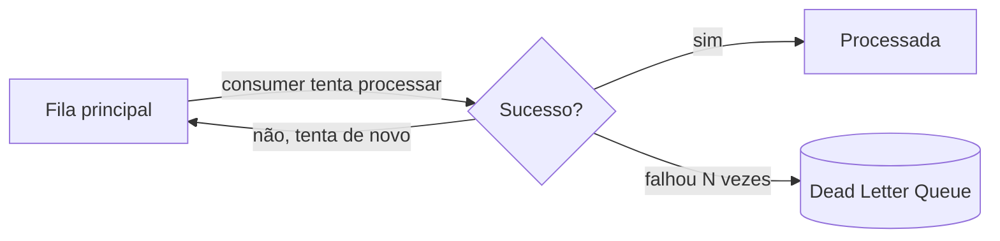

# Garantias de Entrega: Ordenação, DLQ e Idempotência

Depois de entender como uma mensagem trafega (veja [Filas e Mensageria](/labs/web-dev/mensageria/01-filas-e-mensageria/) e [Kafka](/labs/web-dev/mensageria/02-kafka/)), a próxima pergunta é: o que acontece quando algo dá errado no meio do caminho? Um consumer trava ao processar uma mensagem, a rede engasga, o mesmo evento chega duas vezes. Esta nota cobre os mecanismos que lidam com essas falhas.

## Dead Letter Queue

Nem toda mensagem consegue ser processada. Pode ser um bug no consumer, um payload mal formado, ou uma regra de negócio que rejeita aquele caso. Se o consumer simplesmente tentar de novo (retry) sem limite, uma mensagem com problema (chamada de **poison message**, "mensagem envenenada") fica travando a fila para sempre, bloqueando o processamento de tudo que vem depois dela.

A **Dead Letter Queue** (DLQ) é a saída padrão para isso: depois de um número configurado de tentativas de retry sem sucesso, o broker move a mensagem para uma fila separada, a DLQ, em vez de deixá-la travando a fila principal.

Isso resolve o bloqueio, mas cria uma responsabilidade nova: alguém precisa monitorar a DLQ. Uma mensagem parada lá é, na prática, um pedido não processado, um pagamento não confirmado, um e-mail não enviado. O time responsável pelo serviço deve ter um processo (manual ou automatizado) de olhar o que caiu na DLQ, entender por que falhou e decidir: corrigir e reprocessar a mensagem, ou descartar de vez.

## Ordenação

Mensagens que chegam fora de ordem podem causar bugs sutis. Imagine dois eventos do mesmo pedido: `pedido-criado` e `pedido-cancelado`. Se o consumer processar o cancelamento antes da criação (porque chegaram fora de ordem), o sistema pode acabar com um pedido "criado" que já deveria estar cancelado.

Sistemas de fila em geral só garantem ordem dentro do mesmo canal físico de entrega. No Kafka, isso significa: ordem garantida **dentro de uma partição**, sem garantia nenhuma **entre partições diferentes**. Como mensagens com a mesma chave sempre caem na mesma partição (visto na nota de Kafka), a prática comum é usar como chave algo que precise manter ordem entre si, por exemplo o ID do pedido. Assim, todos os eventos daquele pedido específico vão para a mesma partição e são processados na ordem em que foram publicados.

O trade-off é: quanto mais você depende de ordenação estrita, menos consegue paralelizar, porque tudo que precisa ficar em ordem tem que passar pela mesma partição, processada por um único consumer por vez.

## Semânticas de entrega

Quando se fala em "garantia de entrega" de um broker, existem três níveis possíveis, e cada um implica um trade-off diferente entre perder mensagem e duplicar mensagem:

- **At-most-once** ("no máximo uma vez"): a mensagem é entregue zero ou uma vez, nunca mais que isso. Na prática, o consumer marca a mensagem como processada _antes_ de processá-la de fato. Se ele cair no meio do processamento, a mensagem se perde, mas nunca é duplicada. Simples, mas arriscado, útil só quando perder uma mensagem ocasional é aceitável (ex: métricas não críticas).

- **At-least-once** ("pelo menos uma vez"): a mensagem é entregue uma ou mais vezes, nunca menos. O consumer só marca como processada _depois_ de terminar o processamento. Se ele cair entre processar e confirmar, o broker reentrega a mesma mensagem. Nada se perde, mas duplicatas acontecem. É o padrão mais comum na prática, porque perder mensagem costuma ser pior do que duplicar, contanto que a duplicação seja tratada.

- **Exactly-once** ("exatamente uma vez"): a mensagem é entregue e processada uma única vez, garantido. Na teoria é o ideal, mas é a garantia mais difícil e cara de implementar de ponta a ponta, exige coordenação entre o broker e o efeito colateral do processamento (ex: uma escrita em banco), e a maioria dos sistemas reais não oferece isso de forma completa e sem custo de performance.

Na prática, a saída mais comum não é perseguir exactly-once no broker, é aceitar **at-least-once** (que é mais simples e mais barato) e fazer o consumer tratar duplicatas do lado dele. Essa técnica tem nome próprio, idempotência, e está detalhada na nota de [Idempotência](/labs/web-dev/resiliencia/02-idempotencia/): reprocessar a mesma mensagem duas vezes tem que produzir o mesmo resultado que processá-la uma vez só.
