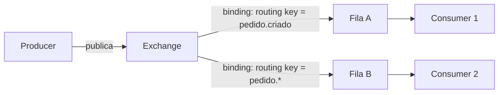
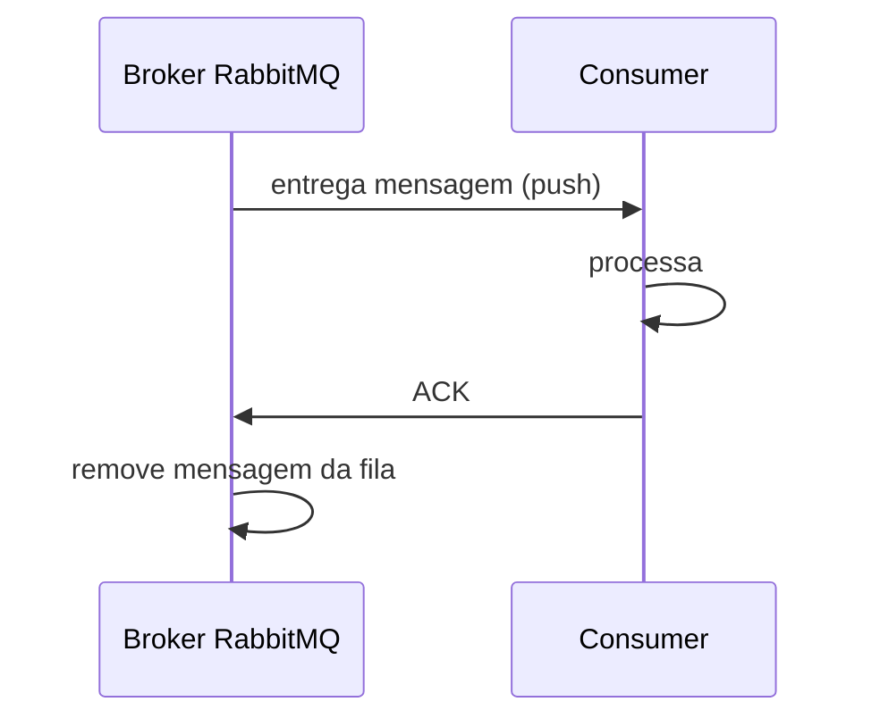

# RabbitMQ

A nota de [Kafka](/labs/web-dev/mensageria/03-kafka/) mostrou uma implementação concreta de broker com um jeito próprio de organizar dados: log distribuído, particionado, que guarda mensagens por um tempo configurável. O RabbitMQ resolve o mesmo problema geral descrito em [Filas e Mensageria](/labs/web-dev/mensageria/01-filas-e-mensageria/), entregar mensagens de producers para consumers, mas parte de um modelo bem diferente por baixo dos panos. Entender os dois lado a lado ajuda a enxergar que "broker de mensageria" não é uma coisa só, é uma categoria com implementações que resolvem trade-offs diferentes.

## Smart broker, AMQP

O RabbitMQ implementa o **AMQP** (Advanced Message Queuing Protocol), um protocolo aberto criado para mensageria empresarial, com regras bem definidas sobre como mensagens são roteadas, confirmadas e descartadas. Ele costuma ser descrito como um **smart broker**: boa parte da inteligência de roteamento (decidir para qual fila cada mensagem vai) vive dentro do próprio broker, configurada por quem publica ou administra o sistema.

Isso contrasta com o Kafka, que é quase o oposto: um **dumb broker** com **smart clients**. O Kafka só armazena mensagens em partições ordenadas e deixa a lógica de quem lê o quê, e em que ritmo, a cargo do consumer. O RabbitMQ, ao contrário, decide o roteamento antes mesmo da mensagem chegar numa fila.

## Exchanges, filas e bindings

No RabbitMQ, um producer nunca publica diretamente numa fila. Ele publica numa **exchange**, e é a exchange quem decide para qual fila (ou filas) aquela mensagem deve ir, seguindo regras chamadas **bindings**.

Existem quatro tipos de exchange, cada um com uma lógica de roteamento diferente:

- **Direct**: entrega a mensagem para a fila cuja binding tem a **routing key** exatamente igual à da mensagem. É o roteamento mais simples, tipo "vá para essa fila específica e pronto".
- **Topic**: parecido com direct, mas a routing key aceita padrões com curinga (`pedido.*`, `pedido.#`). Uma fila pode se inscrever em `pedido.criado`, outra em `pedido.*` (qualquer evento de pedido), sem precisar saber o nome exato de cada evento.
- **Fanout**: ignora a routing key e manda uma cópia da mensagem para **todas** as filas ligadas àquela exchange. É o jeito do RabbitMQ fazer broadcast, equivalente ao padrão pub/sub visto na nota de Filas e Mensageria.
- **Headers**: roteia com base em atributos (headers) da mensagem, não na routing key. Menos comum na prática, usado quando o critério de roteamento é mais complexo do que uma string só.

O **binding** é o elo que conecta uma exchange a uma fila, opcionalmente com uma routing key associada. Sem binding, uma mensagem publicada numa exchange simplesmente não chega a lugar nenhum, ela é descartada (a menos que a exchange tenha uma fila de fallback configurada).

## Entrega push-based e confirmação (ACK)

Outra diferença importante em relação ao Kafka está em como a mensagem chega ao consumer. No RabbitMQ, o broker **empurra** (push) a mensagem para o consumer assim que ela chega numa fila com um consumer ativo esperando. No Kafka, é o consumer quem **puxa** (pull) as mensagens no ritmo que consegue processar.

Depois que o consumer termina de processar, ele envia um **ACK** (acknowledgement) de volta para o broker, confirmando que a mensagem foi tratada com sucesso. Só então o RabbitMQ remove a mensagem da fila. Se o consumer cair ou desconectar antes de mandar o ACK, o broker entende que a mensagem não foi processada e a reentrega, seja para o mesmo consumer quando ele voltar, seja para outro consumer da mesma fila.

Essa é uma diferença de comportamento que vale destacar: uma vez confirmada, a mensagem **desaparece** da fila do RabbitMQ. Não dá para outro consumer ler a mesma mensagem depois, nem voltar no tempo e reprocessar algo que já foi confirmado. O Kafka, por guardar as mensagens num log que não é apagado na leitura, permite isso naturalmente, replay de mensagens antigas, múltiplos consumer groups lendo o mesmo topic de pontos diferentes.

## RabbitMQ vs Kafka

|                   | RabbitMQ                                                             | Kafka                                                                          |
| ----------------- | -------------------------------------------------------------------- | ------------------------------------------------------------------------------ |
| Modelo            | Smart broker (AMQP), roteamento rico via exchanges                   | Distributed commit log, dumb broker                                            |
| Entrega           | Push (broker empurra para o consumer)                                | Pull (consumer busca no seu próprio ritmo)                                     |
| Retenção          | Mensagem é removida da fila após ACK                                 | Log append-only, mensagens retidas por tempo configurável, mesmo após lidas    |
| Replay            | Não é o caso de uso natural                                          | Nativo, é só reposicionar o offset do consumer                                 |
| Roteamento        | Rico e flexível na entrada (direct, topic, fanout, headers)          | Simples: producer escolhe a partição, roteamento fino fica a cargo do consumer |
| Ordem             | Garantida dentro de uma fila                                         | Garantida dentro de uma partição                                               |
| Throughput típico | Alto, mas geralmente menor que Kafka em cenários de altíssimo volume | Otimizado para volumes muito altos, casos como streaming de eventos e logs     |

Na prática, a escolha depende menos de qual dos dois é "melhor" e mais de qual modelo encaixa no problema:

- **RabbitMQ** tende a se sair bem quando o roteamento em si é complexo (várias filas recebendo subconjuntos diferentes de mensagens com base em regras), quando cada mensagem representa uma tarefa que deve ser processada uma vez e desaparecer (uma fila de jobs clássica), ou quando a aplicação precisa de garantias refinadas de entrega ponto a ponto oferecidas pelo AMQP.
- **Kafka** tende a se sair melhor quando o volume de eventos é muito alto, quando múltiplos consumers independentes precisam ler o mesmo fluxo de eventos do começo ao fim, ou quando existe valor real em guardar o histórico de eventos e poder reprocessá-lo depois, como uma fonte de verdade replayável.

RabbitMQ e Kafka não são as únicas opções. A nota [Escolhendo a Plataforma de Mensageria](/labs/web-dev/mensageria/09-escolhendo-a-plataforma-de-mensageria/) abre a comparação para Amazon SQS e Solace e lista os critérios que costumam decidir a escolha.

Nenhum dos dois é estritamente superior, são ferramentas com filosofias diferentes para o mesmo problema de fundo: desacoplar quem produz de quem consome uma mensagem.
