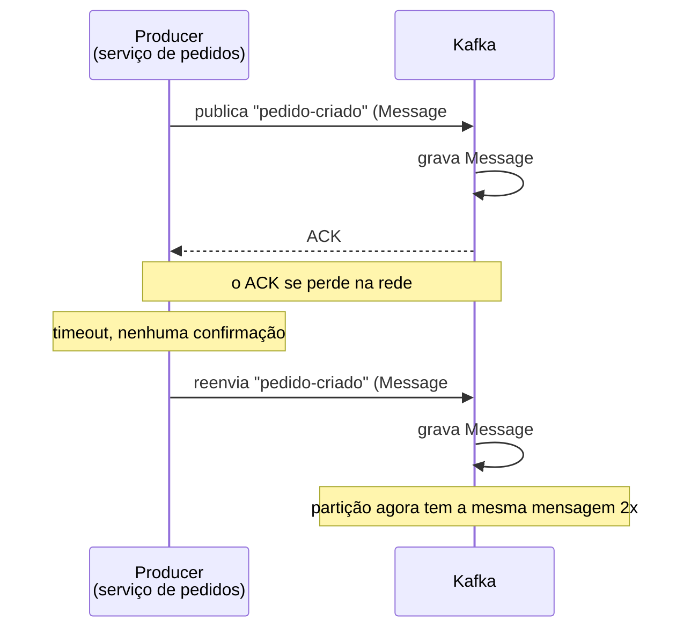
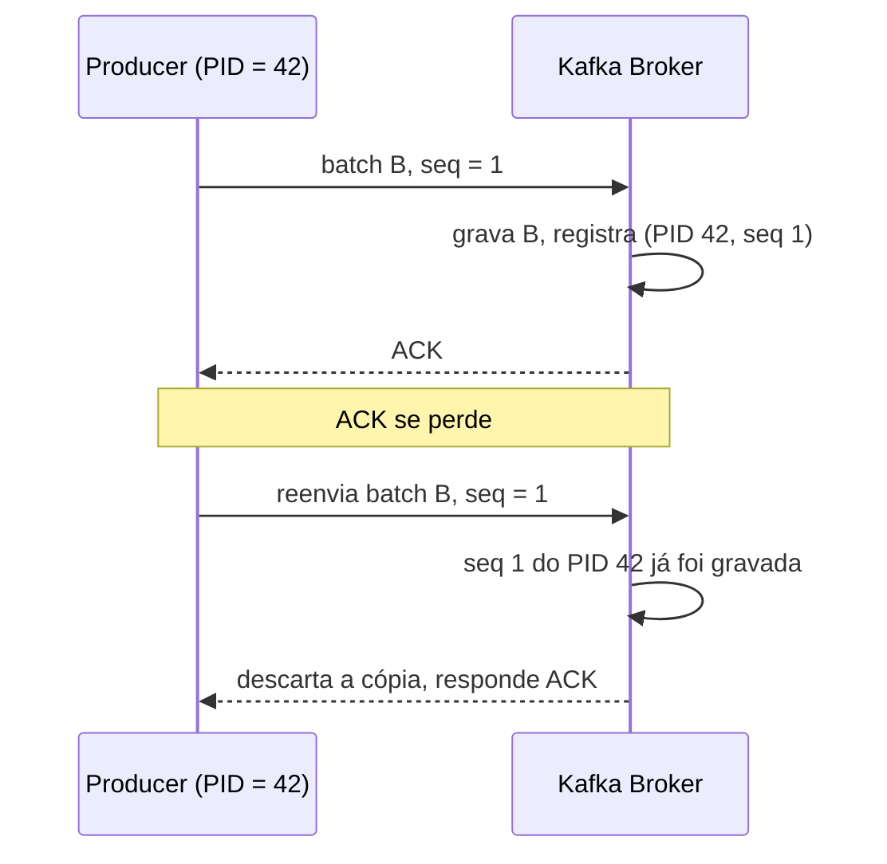
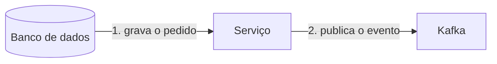
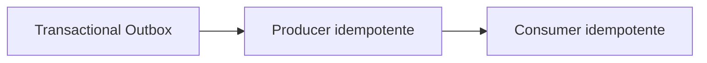

# Producer Idempotente no Kafka

A nota de [Kafka](/labs/web-dev/mensageria/02-kafka/) mencionou de passagem que ligar `enable.idempotence=true` evita duplicatas quando o producer reenvia uma mensagem. A nota de [Garantias de Entrega](/labs/web-dev/mensageria/04-garantias-de-entrega/) mostrou que, na prática, a entrega mais comum é at-least-once: nada se perde, mas a mesma mensagem pode aparecer duas vezes. Esta nota junta as duas pontas e abre o mecanismo que o Kafka usa para o reenvio do producer não virar um registro duplicado, além de deixar claro o que esse mecanismo cobre e o que ele não cobre.

## O problema: um retry pode duplicar a mensagem

Imagine o serviço de pedidos publicando o evento `pedido-criado` no Kafka. O caminho parece simples: o producer manda a mensagem, o Kafka grava na partição e responde com um ACK confirmando o recebimento. O producer vê o ACK e segue a vida.

O problema aparece quando o ACK se perde no meio do caminho:

Do lado do producer, "a mensagem não chegou" e "a mensagem chegou, mas a confirmação se perdeu" são situações idênticas: nos dois casos ele fica sem ACK. A reação natural é reenviar. Sem nenhuma proteção, esse reenvio grava uma segunda cópia da mensagem na partição, e qualquer consumer que leia esse topic vai processar o mesmo pedido duas vezes.

É exatamente o cenário de rede não confiável descrito em [Idempotência](/labs/web-dev/resiliencia/02-idempotencia/): a operação funcionou, mas a resposta se perdeu no caminho de volta.

## Como o Kafka reconhece que é um retry

A ideia central é dar ao broker uma forma de saber que aquele segundo envio é a repetição do primeiro, e não uma mensagem nova. O Kafka faz isso com duas informações que viajam junto de cada envio.

**Producer ID (PID)**: quando um producer com idempotência ligada inicializa, ele pede ao broker um identificador único, o PID. Todo envio daquele producer carrega esse PID.

**Número de sequência**: para cada partição de destino, o producer mantém um contador que começa em zero e sobe de um em um a cada batch de registros enviado. Esse número vai anexado ao batch.

O broker, por sua vez, guarda para cada partição qual foi o maior par `(PID, número de sequência)` que ele já aceitou e gravou. Com isso, a verificação fica direta:

Quando o reenvio chega com `PID 42, seq 1` e o broker já tem `seq 1` gravada para o `PID 42` naquela partição, ele entende que é um retry, não grava de novo e mesmo assim responde um ACK de sucesso para o producer. Do ponto de vista de quem publicou, deu tudo certo. Do ponto de vista da partição, a mensagem existe uma vez só.

Um detalhe que costuma confundir: o número de sequência é por partição, não global. Cada partição tem sua própria contagem para o mesmo PID. E a numeração precisa ser contígua, o broker espera receber `seq N` logo depois de `seq N-1`. Se um batch fura a sequência (chega `seq 5` quando o broker só tinha visto até `seq 2`), ele rejeita o envio com erro, porque isso significaria gravar mensagens fora de ordem ou com buracos.

Com a idempotência ligada, dá para resumir assim: **retry deixou de ser sinônimo de duplicata**.

## As configurações que ligam a idempotência

A partir do Kafka 3.0, o producer já vem com `enable.idempotence=true` por padrão. Mas a idempotência só funciona se um conjunto de outras configs estiver coerente, e o próprio producer se recusa a subir se você pedir idempotência e ao mesmo tempo setar algo que a quebra.

| Config                                  | Valor exigido               | Por quê                                                                                                                                                                                                  |
| --------------------------------------- | --------------------------- | -------------------------------------------------------------------------------------------------------------------------------------------------------------------------------------------------------- |
| `enable.idempotence`                    | `true` (padrão desde o 3.0) | liga o PID e os números de sequência                                                                                                                                                                     |
| `acks`                                  | `all`                       | a mensagem só é confirmada depois que o líder e as réplicas do ISR gravaram (ver [Kafka](/labs/web-dev/mensageria/02-kafka/)); sem isso, uma troca de líder poderia perder mensagens e furar a sequência |
| `retries`                               | maior que `0`               | se o producer nunca reenvia, não existe reenvio para deduplicar                                                                                                                                          |
| `max.in.flight.requests.per.connection` | no máximo `5`               | é o teto de envios sem ACK que podem estar "no ar" ao mesmo tempo; acima de 5 o broker não consegue mais garantir a validação da ordem das sequências                                                    |

Se você deixar `enable.idempotence=true` e explicitamente setar, por exemplo, `acks=1`, o producer lança um `ConfigException` na inicialização em vez de rodar com uma configuração que não entrega o que promete.

O limite de 5 envios simultâneos merece um comentário. Versões bem antigas do Kafka exigiam `max.in.flight.requests.per.connection=1` para manter a ordem, o que machucava a vazão. Hoje o producer idempotente consegue reordenar internamente os batches que voltaram fora de ordem e reenviar na sequência certa, desde que não haja mais que 5 pendentes. Então dá para ter ordem e um pouco de paralelismo ao mesmo tempo.

## Por que isso importa na prática

A duplicata silenciosa de um evento costuma ser cara justamente porque ninguém percebe na hora. Alguns lugares onde ela dói:

- **Pagamentos**: um evento `cobranca-autorizada` publicado duas vezes pode virar débito em dobro no cartão do cliente, caso o consumer que processa esse evento não trate duplicata por conta própria.
- **E-commerce**: eventos de baixa de estoque ou de criação de pedido duplicados bagunçam a contagem. O estoque fica menor do que o real, ou dois pedidos idênticos entram na fila de separação.
- **Processamento de pedidos**: se o mesmo `pedido-criado` chega duas vezes ao serviço de fulfillment, o fluxo de embalar e despachar pode ser disparado em duplicidade.
- **Pipelines de analytics**: aqui a duplicata não quebra nada de imediato, só infla os números. Retries e soluços de rede fazem a contagem de eventos subir sem que nenhuma venda real tenha acontecido, e as métricas mentem.

## O que a idempotência do producer não resolve

Essa é a parte que separa saber uma config de entender confiabilidade de sistema distribuído. A idempotência do producer protege **um trecho específico** do caminho: do producer até o Kafka. Ela não faz a aplicação inteira ser exactly-once.

Pense num fluxo comum: o serviço grava o pedido no banco e depois publica o evento no Kafka.

São duas operações separadas contra dois sistemas diferentes. A idempotência do producer não amarra uma na outra. O serviço pode gravar no banco e cair antes de publicar, ou publicar e a gravação no banco falhar no rollback. Esse é o [problema da escrita dupla](/labs/web-dev/transacoes-distribuidas/04-escrita-dupla/), e o PID com número de sequência não encosta nele.

Para confiabilidade de ponta a ponta, três peças se somam, cada uma fechando um buraco diferente:

- **[Transactional Outbox](/labs/web-dev/transacoes-distribuidas/05-outbox-pattern/)**: garante que o evento seja publicado se, e somente se, a transação de negócio no banco commitou. Resolve o desencontro entre o banco e o Kafka.
- **Producer idempotente**: garante que, se o processo de publicação reenviar a mensagem, o Kafka não grave duas cópias. Resolve o retry entre o producer e o broker.
- **Consumer idempotente**: garante que, se o mesmo evento for entregue ao consumer mais de uma vez, o efeito de negócio (debitar estoque, cobrar o cartão) aconteça uma vez só. Resolve a entrega at-least-once do broker para o consumer. O como está em [Idempotência](/labs/web-dev/resiliencia/02-idempotencia/).

Nenhuma das três sozinha entrega "exatamente uma vez" no sistema todo. Juntas, cada cenário de falha tem um dono.

## Idempotência do producer x do consumer

Vale fixar a diferença, porque os dois termos aparecem colados e resolvem coisas distintas:

- **Producer idempotente**: elimina registros duplicados causados por retry do producer, e isso acontece dentro do Kafka, antes de qualquer consumer ver a mensagem.
- **Consumer idempotente**: elimina processamento de negócio duplicado quando o mesmo evento chega ao consumer mais de uma vez, seja por reentrega do broker, por rebalance ou por reprocessamento de offset.

A distinção pesa mais sob entrega at-least-once, que é o padrão (ver [Garantias de Entrega](/labs/web-dev/mensageria/04-garantias-de-entrega/)). Mesmo com o producer idempotente ligado, o consumer ainda pode receber a mesma mensagem duas vezes por motivos que não têm nada a ver com retry de publicação, então ele precisa da própria proteção.

Se numa entrevista aparecer "como você evita mensagens duplicadas no Kafka?", a resposta curta "usa producer idempotente" cobre só um pedaço. Uma resposta melhor reconhece que o producer idempotente trata o retry de publicação, e que confiabilidade de ponta a ponta ainda pede idempotência no consumer e, quando há um banco no meio, o padrão Outbox.

## O princípio por trás disso

Todo esse mecanismo existe para um cenário só: **a operação teve sucesso, mas a resposta se perdeu**. Não é um caso raro, é o modo padrão de falha de qualquer chamada de rede, e é onde a maioria dos problemas de "evento duplicado" começa.

Duas frases que valem levar para o projeto de qualquer sistema orientado a evento:

- Um retry nunca deveria transformar um evento de negócio em dois registros.
- Pense além do caminho feliz. E se o broker estiver fora no momento do publish? E se a mensagem foi gravada mas o ACK sumiu? O sistema tem que continuar correto nesses casos, não só quando tudo dá certo na primeira tentativa.
