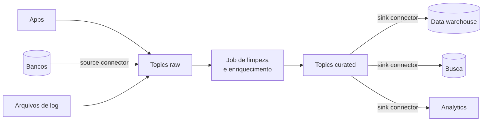
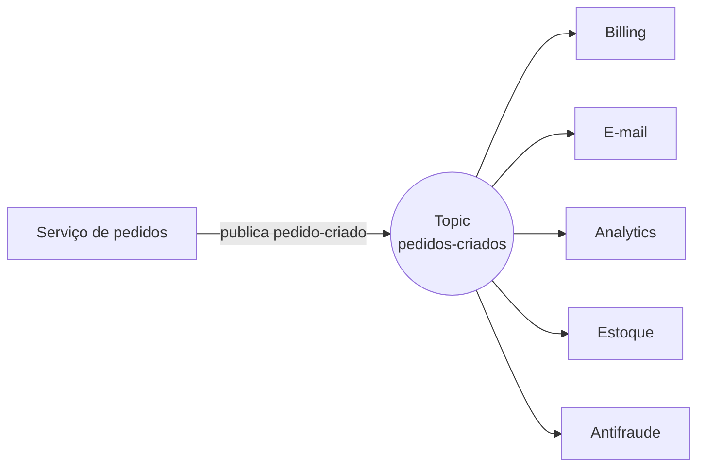
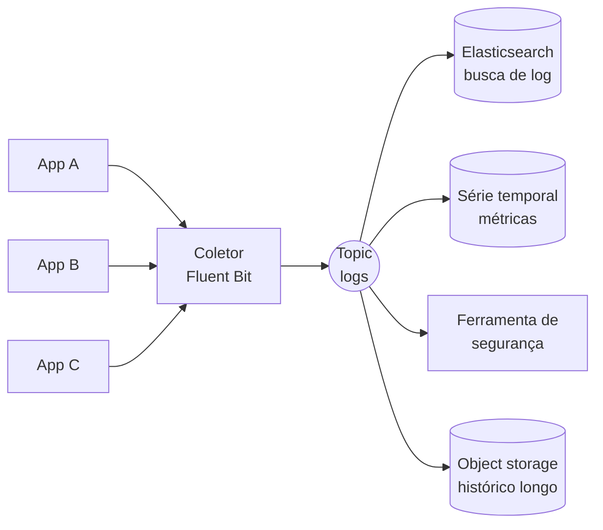
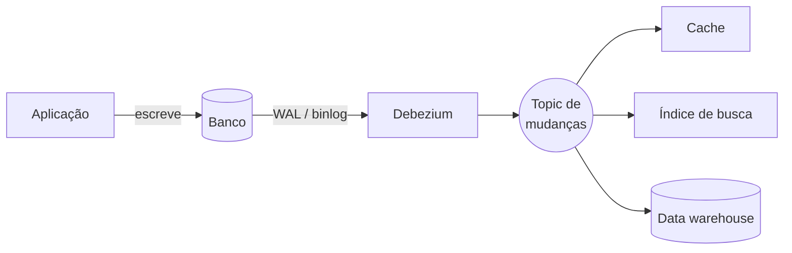

# Casos de Uso do Kafka

As notas anteriores abriram o Kafka por dentro: [topic, partição, offset e consumer group](/labs/web-dev/mensageria/03-kafka/), [garantias de entrega](/labs/web-dev/mensageria/05-garantias-de-entrega/) e [producer idempotente](/labs/web-dev/mensageria/06-producer-idempotente/). Esta fecha o assunto pelo outro lado: onde o Kafka costuma ser usado de verdade.

Existem cinco padrões que aparecem o tempo todo. Não são categorias oficiais, é só a forma prática de agrupar o que as empresas fazem com Kafka. Cada um tem uma arquitetura típica e um conjunto de trade-offs, e na prática eles se misturam bastante.

## Pipelines de dados em tempo real

Antes do Kafka, mover dado de um sistema para outro costumava ser um job batch que rodava de madrugada, ou uma conexão direta entre os dois sistemas. O problema aparece quando você tem muitas fontes e muitos destinos: cada banco que precisa alimentar cada warehouse, cada ferramenta de analytics, cada índice de busca vira uma integração própria para manter. Com 5 fontes e 4 destinos, são 20 integrações frágeis.

O Kafka entra no meio como ponto único de passagem. Cada fonte publica seus dados uma vez, num topic, e cada destino consome no ritmo dele. As 20 integrações viram 5 + 4 = 9, e todas falam o mesmo protocolo.

A peça que sustenta isso é o **Kafka Connect**, uma camada de conectores prontos que você configura com um JSON, sem escrever código:

- **source connector**: puxa dados de um sistema externo (Postgres, MongoDB, um bucket S3) para dentro de um topic.
- **sink connector**: joga o conteúdo de um topic para fora, num destino (Elasticsearch, BigQuery, Snowflake, um data lake).

É comum separar os topics em duas camadas: um topic **raw** recebe o evento como ele veio da fonte, e um job intermediário valida, limpa e enriquece esse dado, publicando o resultado num topic **curated**. Os consumidores de negócio leem só o curated, que já vem no formato certo.

Quando a lógica de transformação muda, ou tinha um bug, você não precisa reextrair tudo da fonte. Como o Kafka guarda as mensagens pelo tempo da [política de retenção](/labs/web-dev/mensageria/03-kafka/), basta reposicionar o offset do job e reprocessar a partir do ponto necessário. A recuperação vira "replay a partir daqui" em vez de "reconstruir tudo na mão".

## Sistemas orientados a evento

Pense no serviço de pedidos de um e-commerce. Quando um pedido é criado, várias coisas precisam acontecer: cobrar o cartão, mandar o e-mail de confirmação, registrar a venda no analytics, acionar a separação no estoque, rodar a checagem antifraude.

Na versão acoplada, o serviço de pedidos chama esses cinco serviços, um por um. Cada serviço novo que precisa saber de pedidos obriga a mexer no código do serviço de pedidos. E se o serviço de analytics estiver fora do ar na hora, o que acontece com a criação do pedido?

Na versão orientada a evento, o serviço de pedidos publica um evento `pedido-criado` no Kafka e encerra o trabalho dele. Billing, e-mail, analytics, estoque e antifraude têm cada um seu [consumer group](/labs/web-dev/mensageria/03-kafka/) lendo o mesmo topic, no próprio ritmo. Um serviço novo, digamos um programa de fidelidade, assina o topic e passa a reagir a pedidos sem ninguém tocar no serviço original.

Esse é o backbone dos microsserviços orientados a evento, o mesmo assunto visto em [Comunicação entre Serviços](/labs/web-dev/microsservicos/03-comunicacao-entre-servicos/).

O preço é que o fluxo deixa de ser óbvio. Um único `pedido-criado` dispara vários workflows assíncronos espalhados por serviços diferentes. Responder "por que esse pedido não foi cobrado" exige [rastreamento distribuído](/labs/web-dev/observabilidade/01-logs-metrics-e-traces/), e o contrato do evento precisa ser estável: se o serviço de pedidos muda o formato de `pedido-criado` sem cuidado, quebra todos os consumidores de uma vez. É por isso que a [evolução de schema](/labs/web-dev/mensageria/03-kafka/) pesa tanto nesse cenário.

## Processamento de streams

Nos casos anteriores o Kafka é transporte: ele leva o dado de um lado para o outro. No processamento de streams ele é a base de um cálculo que nunca para.

Em vez de rodar um `SELECT ... GROUP BY` de hora em hora sobre uma tabela, um programa lê o stream de eventos conforme eles chegam e mantém o resultado sempre atualizado. As operações típicas são filtrar (deixar passar só os eventos que interessam), transformar (mudar o formato), enriquecer (juntar com dado de outra fonte), agregar (contar, somar ou tirar média dentro de uma janela de tempo) e fazer join entre dois streams, por exemplo casar o stream de cliques com o stream de compras.

A arquitetura é sempre parecida: um ou mais **input topics** entram num processador, que calcula e publica em **output topics**. O processador é ao mesmo tempo consumer e producer.

As ferramentas mais comuns:

- **Kafka Streams**: uma biblioteca Java que roda dentro da sua aplicação, sem cluster separado.
- **ksqlDB**: você escreve SQL sobre os streams e ele cuida do resto.
- **Apache Flink**: uma engine à parte, mais robusta para estado grande e lógica complexa. É a que aparece com mais frequência em pipelines pesados.

Como o cálculo de um evento às vezes depende dos anteriores (somar o total gasto por um usuário, por exemplo), os eventos de uma mesma entidade precisam cair na mesma partição e ser processados em ordem. Isso volta para a [escolha da chave no producer](/labs/web-dev/mensageria/03-kafka/): mesma chave, mesma partição, ordem preservada.

O ponto mais delicado é o **estado**. Um agregador do tipo "erros por serviço nos últimos 5 minutos" guarda contadores na memória. Se o processo cai, esse estado se perde. As ferramentas resolvem isso salvando o estado num topic compactado do próprio Kafka (o changelog): ao reiniciar, o processador reconstrói os contadores lendo esse topic. As **janelas** (windows) definem o recorte de tempo do cálculo: os últimos 5 minutos deslizando, cada hora cheia, ou a sessão de um usuário até 30 minutos de inatividade.

Onde isso aparece: antifraude correlacionando um pagamento com o histórico de comportamento na hora da transação, times de SRE disparando alerta quando a taxa de erro móvel passa de um limite, engines de recomendação que reordenam as sugestões a cada clique.

## Logs e métricas centralizados

Cinquenta serviços, cada um rodando em várias réplicas, todos cuspindo log e métrica o tempo todo. Se cada réplica manda esse dado direto para o Elasticsearch, o dia em que o Elasticsearch fica lento, todos os serviços que tentam escrever nele ficam lentos junto. A pressão volta para o lugar errado.

Colocar o Kafka no meio muda isso. Agentes leves rodam ao lado de cada aplicação (**Fluentd**, **Fluent Bit** ou **Vector** são os mais usados), leem o log do stdout ou de um arquivo, empacotam e publicam num topic. Do outro lado, vários consumidores independentes leem o mesmo stream, cada um com um destino:

O Kafka funciona como amortecedor de choque: se o Elasticsearch cai por vinte minutos, os eventos ficam acumulados no topic (dentro da janela de retenção) e o consumidor do Elasticsearch processa o atraso quando volta. Os serviços que produzem log nem percebem.

Guardar log para sempre no Kafka sai caro em disco, então o padrão é retenção curta ali (de algumas horas a poucos dias) só como buffer, enquanto os consumidores arquivam o histórico longo em object storage ou num banco analítico. Esse mesmo pipeline aparece na nota de [logs, métricas e traces](/labs/web-dev/observabilidade/01-logs-metrics-e-traces/).

## Change Data Capture (CDC)

Nos casos anteriores, a aplicação publica o evento de propósito. No CDC, ninguém na aplicação escreve código para publicar nada: uma ferramenta observa o log de transações do banco (o WAL no Postgres, o binlog no MySQL, detalhados em [Postgres vs MySQL](/labs/web-dev/banco-de-dados/11-postgres-vs-mysql/)) e transforma cada `INSERT`, `UPDATE` e `DELETE` já commitado num evento no Kafka.

A ferramenta padrão é o **Debezium**, que roda como source connector do Kafka Connect. Você configura um connector apontando para o banco, e ele publica as mudanças em topics como `loja.public.pedidos`.

Serve para manter cópias derivadas do banco sempre em dia: invalidar o cache no instante em que a linha muda, atualizar o índice de busca, reconstruir um read model de [CQRS](/labs/web-dev/transacoes-distribuidas/06-cqrs/), replicar para o data warehouse quase em tempo real. Tudo sem job de sincronização batch e sem um `SELECT ... WHERE updated_at > ?` martelando o banco de tempos em tempos.

Tem uma distinção importante aqui. O CDC te entrega `UPDATE pedidos SET status = 2 WHERE id = 99`, uma mudança de linha descrita no vocabulário da tabela. Isso não é a mesma coisa que `pagamento-capturado`, um evento de negócio com significado próprio. O CDC é ótimo para replicação e sincronização de dados. Para dirigir um workflow de negócio, o certo é um evento de domínio publicado de propósito pela aplicação, que carrega a intenção real. Fazer o serviço de e-mail reagir a `status = 2` amarra ele à estrutura interna da tabela de outro time, e no dia em que essa tabela mudar, quebra.

O CDC também é a tecnologia por trás do [Outbox Pattern](/labs/web-dev/transacoes-distribuidas/05-outbox-pattern/): lá, o Debezium lê uma tabela de outbox onde a aplicação grava eventos de domínio de propósito, resolvendo o [Dual-Write Problem](/labs/web-dev/transacoes-distribuidas/04-escrita-dupla/). Mesma ferramenta, propósito diferente.

## Qual padrão se aplica

| O que você precisa                                                   | Padrão                            |
| -------------------------------------------------------------------- | --------------------------------- |
| Mover dados de várias fontes para vários destinos sem integração 1:1 | Pipeline de dados + Kafka Connect |
| Serviços reagindo a fatos de negócio sem chamada síncrona            | Sistema orientado a evento        |
| Calcular algo continuamente sobre o fluxo (contagem, janela, join)   | Processamento de streams          |
| Concentrar log e métrica de tudo, com vários destinos                | Logs e métricas centralizados     |
| Manter cache, índice ou réplica em dia com um banco                  | CDC                               |

Na prática esses padrões se combinam: um pipeline de dados usa processamento de streams na etapa de limpeza, e um sistema de CDC alimenta tanto o pipeline quanto, com cuidado, a sincronização de read models.

## Referências

- [Kafka Use Cases (Level Up Coding)](https://blog.levelupcoding.com/p/kafka-use-cases)
