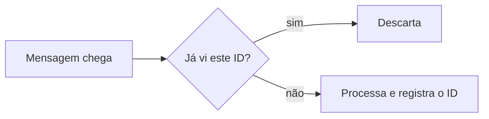
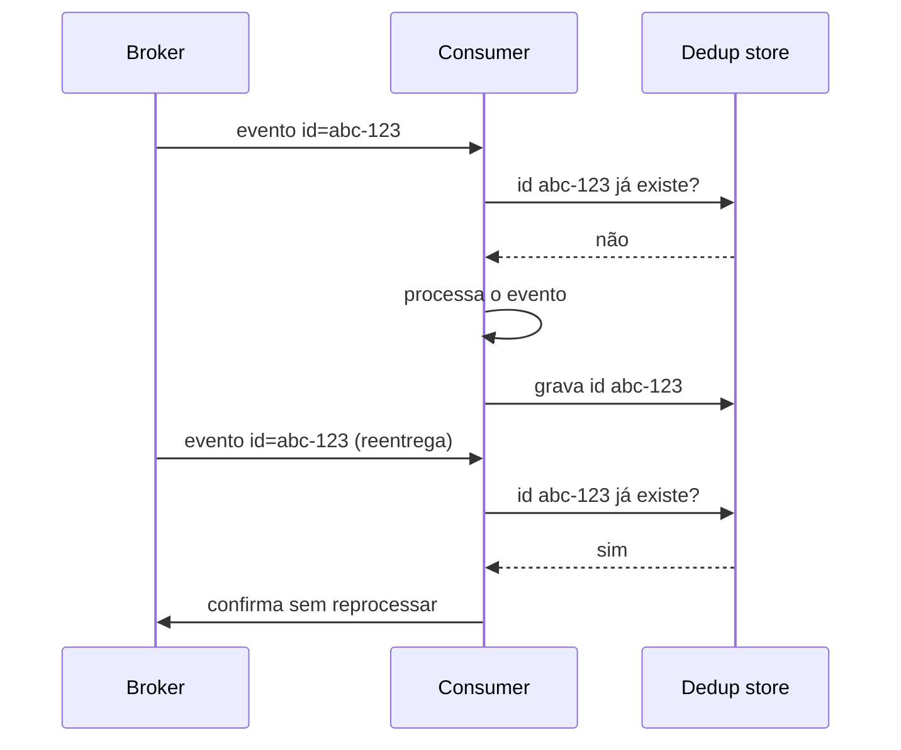
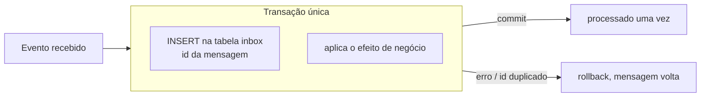
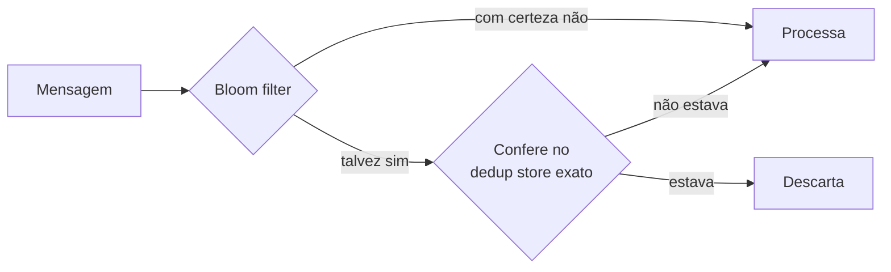
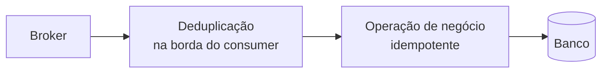

# Deduplicação de Mensagens

Em um sistema de mensageria com entrega "pelo menos uma vez" (at-least-once), que é o padrão da maioria dos brokers, o mesmo evento vai chegar repetido ao consumer mais cedo ou mais tarde. A nota de [Garantias de Entrega](/labs/web-dev/mensageria/05-garantias-de-entrega/) mostrou de onde vêm essas duplicatas. Esta nota é sobre uma das duas formas de lidar com elas: a deduplicação, ou seja, reconhecer que uma mensagem já foi vista e descartá-la antes de processar.

## Deduplicação e idempotência não são a mesma coisa

Os dois termos aparecem juntos o tempo todo e resolvem coisas diferentes. Vale separar antes de seguir.

- **Idempotência** responde: "posso executar esta operação de novo sem causar dano?". O foco está na operação de negócio. Um `PUT /usuarios/123 { nome: "Ana" }` é idempotente porque rodar dez vezes deixa o mesmo estado final. O tema tem nota própria em [Idempotência](/labs/web-dev/resiliencia/02-idempotencia/).
- **Deduplicação** responde: "eu já processei esta mensagem específica?". O foco está na mensagem, não na operação. Se o ID do evento já está registrado como processado, o consumer nem chega a rodar a lógica de negócio.

As duas são independentes. Dá para ter deduplicação sem idempotência: o consumer filtra duplicatas pelo ID, mas se uma passar (bug no filtro, ID gerado errado), a operação de negócio roda duas vezes e faz estrago. E dá para ter idempotência sem deduplicação: a operação aguenta repetição, mas o consumer processa toda cópia que chega, gastando CPU e I/O à toa. Na prática, sistemas sérios usam as duas em camadas, e a última seção volta nisso.

## Como a deduplicação funciona

O mecanismo é sempre o mesmo:

1. Toda mensagem carrega um **ID único e estável**. No Kafka, esse ID é um campo dentro do payload do evento (um UUID gerado por quem publicou, ou algo como `pedido-456-criado`), nunca o offset da partição, que muda se a mensagem for reentregue.
2. Antes de processar, o consumer consulta se aquele ID já está marcado como processado.
3. Se já está, ele confirma a mensagem para o broker (para ela não voltar) e não faz mais nada.
4. Se não está, ele processa e registra o ID.

O ponto delicado está entre os passos 3 e 4: se o consumer processa e cai antes de registrar o ID, na volta ele vai reprocessar. Por isso, quando o processamento envolve escrever num banco, o ideal é gravar o efeito e o ID **na mesma transação**. É o que o Inbox pattern faz, mais abaixo.

## Dedup store: onde guardar os IDs vistos

O dedup store é o lugar onde ficam os IDs já processados. As opções são parecidas com as da idempotency store, mas o conteúdo é mais simples: aqui basta o ID (e talvez um timestamp), não o resultado inteiro da operação.

- **Redis** funciona bem quando a duplicata só é risco por uma janela curta (minutos a poucas horas). É rápido e a chave expira sozinha.
- **Tabela no banco** (`mensagens_processadas`, com o ID da mensagem como chave primária ou com constraint `UNIQUE`) é a escolha quando a checagem precisa acontecer na mesma transação do efeito de negócio, ou quando a garantia precisa durar dias.

Dois cuidados valem para qualquer opção:

- **Constraint de unicidade** no ID: assim, se dois processos tentarem registrar o mesmo ID ao mesmo tempo, o banco rejeita o segundo em vez de deixar passar uma corrida.
- **TTL ou limpeza periódica**: a tabela de IDs cresce para sempre se ninguém apagar. Um TTL de alguns dias cobre qualquer reentrega realista. Passado esse tempo, o registro some.

A diferença para a idempotency store da nota de [Idempotência](/labs/web-dev/resiliencia/02-idempotencia/) é o propósito: a idempotency store guarda o resultado para devolver a mesma resposta a um cliente que repetiu a chamada; o dedup store guarda só o "já vi isto" para pular o processamento de um evento repetido.

## Inbox pattern

O Inbox pattern é a contraparte do [Transactional Outbox](/labs/web-dev/transacoes-distribuidas/05-outbox-pattern/). Se o Outbox garante que um evento só é publicado quando a transação de negócio commitou, o Inbox garante que um evento recebido só é considerado processado quando o efeito dele commitou, e uma vez só.

A ideia: quando a mensagem chega, o consumer grava numa tabela `inbox` (com o ID da mensagem como chave única) **dentro da mesma transação** que aplica o efeito de negócio. Se a transação commitar, os dois acontecem juntos. Se falhar, nenhum dos dois acontece, e a mensagem volta para ser reprocessada sem ter deixado rastro.

Quando o processamento é feito assim, na mesma transação e de forma síncrona, esse arranjo também é chamado de **Idempotent Consumer**. Um dedup store separado (Redis, por exemplo) é mais simples de montar e serve quando o efeito de negócio não é uma escrita transacional, ou quando a reentrega gerenciada pelo broker já é suficiente. O Inbox compensa o esforço quando você precisa da garantia atômica entre "marquei como processado" e "apliquei o efeito".

## Deduplicação por janela de tempo

Alguns sistemas não guardam os IDs para sempre nem por dias: consideram duas mensagens duplicadas só se chegarem **dentro de um intervalo curto**. Fora desse intervalo, a mesma mensagem volta a ser tratada como nova.

O exemplo concreto é o Amazon SQS FIFO. Você manda um `MessageDeduplicationId` junto com a mensagem, e o SQS descarta qualquer mensagem com o mesmo ID que chegar dentro de uma **janela de 5 minutos**. Se um retry acontecer 6 minutos depois, o SQS trata como mensagem nova e entrega de novo.

Isso é leve e resolve o caso mais comum (retry de rede acontece em segundos), mas tem um limite claro: reprocessamento de um backlog antigo, replay de eventos ou um consumer que ficou horas parado escapam da janela. Se o seu cenário inclui esses casos, você precisa de um dedup store com retenção maior, não de janela de tempo.

## Bloom filter para escala

Quando o volume de mensagens é alto demais para consultar o dedup store a cada mensagem, entra o Bloom filter como otimização. Ele é uma estrutura probabilística que responde à pergunta "já vi este ID?" com duas respostas possíveis:

- **"Com certeza não"**: o ID definitivamente não foi visto. Pode processar direto.
- **"Talvez sim"**: o ID provavelmente foi visto, mas pode ser um falso positivo.

O Bloom filter nunca dá falso negativo (nunca diz "não vi" para algo que viu), mas dá falso positivo. Por isso ele **não serve sozinho**: se você descartar toda mensagem que o filtro diz "talvez sim", vai jogar fora mensagens legítimas de vez em quando.

O uso correto é como **pré-filtro barato** na frente do store exato:

A maioria das mensagens não é duplicata, então a maioria passa direto pelo Bloom filter sem tocar no banco. Só as poucas que dão "talvez sim" pagam o custo da consulta exata. É uma troca de precisão total por velocidade na maioria dos casos.

## Usar dedup e idempotência juntas

A recomendação prática é montar as duas em camadas:

- A **deduplicação na borda** descarta a maior parte das mensagens repetidas antes de gastar processamento com elas.
- A **operação idempotente no núcleo** é a rede de segurança: se uma duplicata escapar do filtro, o efeito de negócio ainda acontece uma vez só.

O post que originou esta nota resume bem a ideia: o objetivo não é impedir toda duplicata, é fazer com que uma duplicata, quando acontecer, seja inofensiva. Em sistema distribuído, reentrega é o comportamento normal, não a exceção.

## Onde isso aparece

- **Consumers Kafka e RabbitMQ**: entrega at-least-once, então todo consumer que causa efeito colateral (cobrar, debitar estoque, enviar e-mail) precisa de dedup, de idempotência, ou das duas.
- **Handlers de webhook**: provedores de pagamento e plataformas SaaS reenviam o mesmo webhook quando não recebem `200` rápido. O ID do evento no corpo do webhook é a chave de dedup.
- **Pipelines de CDC**: uma reinicialização do conector pode reemitir eventos já publicados. Ver [Casos de Uso do Kafka](/labs/web-dev/mensageria/08-casos-de-uso-do-kafka/).
- **Sistemas de notificação**: sem dedup, o usuário recebe o mesmo push três vezes.
- **Microsserviços orientados a evento** em geral, onde o mesmo evento alimenta vários consumers independentes.

## Referências

- [Diretrizes de design resiliente para Hubs de Eventos e Funções - Azure Architecture Center](https://learn.microsoft.com/pt-br/azure/architecture/serverless/event-hubs-functions/resilient-design) - Microsoft Learn, pt-BR
- [Inscrevendo-se para eventos: idempotência e deduplicação de mensagens - .NET Microservices](https://learn.microsoft.com/pt-br/dotnet/architecture/microservices/multi-container-microservice-net-applications/subscribe-events) - Microsoft Learn, pt-BR
- [Usando o ID de desduplicação de mensagens no Amazon SQS](https://docs.aws.amazon.com/pt_br/AWSSimpleQueueService/latest/SQSDeveloperGuide/using-messagededuplicationid-property.html) - AWS Docs, pt-BR
- [Pattern: Idempotent consumer - Chris Richardson](https://microservices.io/patterns/communication-style/idempotent-consumer.html) - microservices.io, en
- [Outbox, Inbox patterns and delivery guarantees explained - Oskar Dudycz](https://event-driven.io/en/outbox_inbox_patterns_and_delivery_guarantees_explained/) - event-driven.io, en
