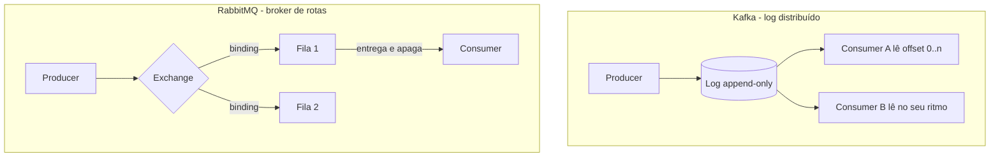
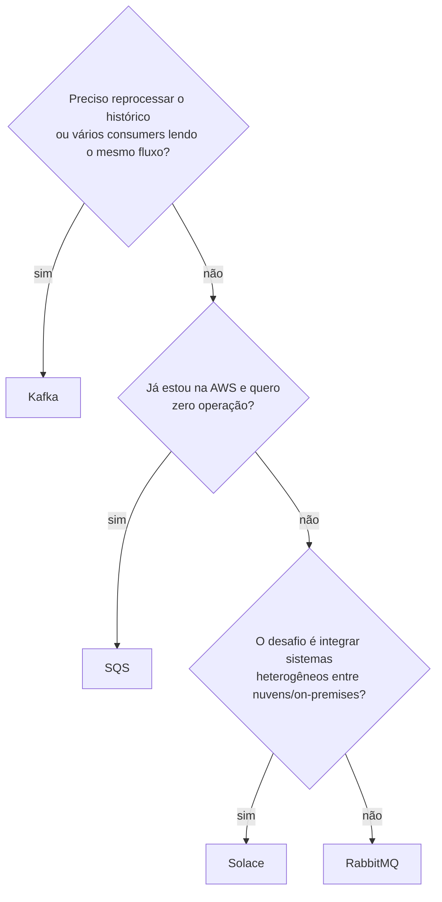

# Escolhendo a Plataforma de Mensageria

As notas anteriores mostraram dois brokers a fundo: [Kafka](/labs/web-dev/mensageria/03-kafka/) e [RabbitMQ](/labs/web-dev/mensageria/04-rabbitmq/). Na vida real a lista de opções é maior, e a pergunta que aparece em toda decisão de arquitetura (e em entrevista) é: qual broker para qual problema? Esta nota compara quatro plataformas comuns - Kafka, RabbitMQ, Amazon SQS e Solace - e os critérios que fazem a escolha pender para um lado ou para o outro.

## Por que isso é decisão de arquitetura

Escolher um broker não é como escolher um banco de dados de fila qualquer e seguir a vida. A plataforma define coisas que depois ficam espalhadas pelo sistema inteiro:

- **Se dá para reprocessar mensagens antigas** ou se, uma vez consumidas, elas somem para sempre
- **Como os times se acoplam**: um broker que guarda histórico deixa um time novo plugar um consumer e ler tudo desde o começo; um que apaga na entrega obriga a combinar antes quem lê o quê
- **Qual o custo de operar**: rodar um cluster próprio, pagar por mensagem trafegada ou comprar licença de um produto fechado

Trocar depois que o sistema cresceu significa reescrever producers, consumers e a forma como o time pensa o fluxo de dados. Por isso a regra prática é começar pelo padrão de negócio e deixar a tecnologia ser consequência, não o contrário.

## Os quatro modelos mentais

Cada plataforma parte de uma ideia central diferente. Entender essa ideia já resolve 80% da decisão.

### Kafka: log distribuído

O Kafka é um **log append-only**: mensagens são anexadas ao fim de um arquivo particionado e ficam lá até a política de retenção expirar (por tempo ou por tamanho), mesmo depois de lidas. Cada consumer guarda a própria posição de leitura (o **offset**) e avança no ritmo dele. Vários consumers independentes podem ler o mesmo fluxo sem atrapalhar um ao outro, e reprocessar o histórico é só voltar o offset.

Bom para: pipelines de dados, event streaming, cenários em que o histórico de eventos tem valor.

### RabbitMQ: broker de rotas

O RabbitMQ é um **broker inteligente** no modelo AMQP. O producer publica numa _exchange_, que aplica regras de roteamento (_bindings_) e decide em quais filas a mensagem cai. O consumer lê de uma fila e, depois do ACK, a mensagem é removida - leitura destrutiva. O trabalho pesado aqui é o roteamento na entrada, que pode ser bem fino (por chave, por padrão de tópico, por header).

Bom para: filas de tarefas (jobs), roteamento complexo, comunicação ponto a ponto entre serviços de backend.

### Amazon SQS: fila gerenciada

O SQS é uma fila **totalmente gerenciada pela AWS**. Não há servidor para instalar, atualizar ou dimensionar: você cria a fila e usa. O consumo é por _polling_ (o consumer fica perguntando "tem mensagem nova?"). Em troca da simplicidade, vêm limites rígidos: mensagem de até 1 MiB, retenção de no máximo 14 dias, e sem replay - mensagem consumida e confirmada não volta.

Tem dois tipos:

- **Fila padrão (standard)**: throughput praticamente ilimitado, entrega at-least-once, ordem "de melhor esforço" (pode entregar fora de ordem)
- **Fila FIFO**: ordem estrita e processamento exactly-once, com teto de throughput bem menor (300 mensagens/s, ou até 70.000/s no modo de alto throughput)

Bom para: quem já está na AWS e quer o mínimo de operação, com necessidades de mensageria diretas.

### Solace PubSub+: event broker e event mesh

O Solace PubSub+ é um **event broker** comercial (existe como software, appliance de hardware e serviço gerenciado) com duas marcas registradas:

- **Roteamento por hierarquia de tópicos**: o producer publica em algo como `pedido/BR/SP/criado` e os consumers assinam padrões (`pedido/BR/>` pega tudo do Brasil). O broker filtra pelo tópico, não é preciso criar fila e binding para cada recorte.
- **Event mesh com Dynamic Message Routing (DMR)**: vários brokers Solace se conectam formando uma malha, e um evento publicado num broker chega a assinantes ligados a qualquer outro, mesmo em nuvens ou datacenters diferentes, sem o producer saber onde o consumer está.

Também é o que fala mais protocolos nativamente: AMQP, MQTT, JMS, REST e WebSocket, além do protocolo próprio (SMF).

Bom para: integração corporativa entre sistemas heterogêneos, cenários híbridos (on-premises + várias nuvens), IoT.

## Critérios de comparação

Com os modelos mentais na cabeça, os eixos abaixo são o que costuma decidir a escolha. A comparação direta e detalhada entre RabbitMQ e Kafka em si já está na nota de [RabbitMQ](/labs/web-dev/mensageria/04-rabbitmq/); aqui a ideia é o quadro geral com SQS e Solace no meio.

| Critério   | Kafka                         | RabbitMQ                      | SQS                    | Solace                            |
| ---------- | ----------------------------- | ----------------------------- | ---------------------- | --------------------------------- |
| Retenção   | Longa, configurável           | Até o ACK                     | Até 14 dias            | Longa, configurável               |
| Replay     | Nativo (offset)               | Não                           | Não                    | Sim, com fila persistente         |
| Ordenação  | Por partição                  | Por fila                      | Só em fila FIFO        | Por fila/tópico                   |
| Escala     | Adicionar partições e brokers | Quorum queues, mais nós       | Automática, gerenciada | Malha de brokers (mesh)           |
| Protocolos | Protocolo próprio             | AMQP 0-9-1 (+ plugins)        | API HTTP da AWS        | AMQP, MQTT, JMS, REST, WebSocket  |
| Operação   | Cluster próprio ou gerenciado | Cluster próprio ou gerenciado | Nada para operar       | Software, appliance ou gerenciado |
| Custo      | Infra do cluster              | Infra do cluster              | Por requisição         | Licença / assinatura              |

Alguns eixos merecem detalhe:

- **Retenção e replay** andam juntos. Kafka e Solace (com fila persistente) guardam a mensagem depois de entregue, então dá para um consumer novo ler o passado ou um consumer com bug reprocessar depois de corrigido. RabbitMQ e SQS apagam na confirmação: o que passou, passou.
- **Ordenação** nunca é global de graça. Kafka garante ordem dentro de uma partição, RabbitMQ dentro de uma fila, SQS só se você usar fila FIFO (e paga em throughput por isso). Se a ordem importa, o desenho de particionamento vem antes da escolha do broker. Isso está aprofundado em [Garantias de Entrega](/labs/web-dev/mensageria/05-garantias-de-entrega/).
- **Semântica de falha e Dead Letter Queue**. Toda plataforma tem um jeito de lidar com a mensagem que não processa (a _poison message_): SQS e RabbitMQ têm DLQ nativa, no Kafka o padrão é o próprio consumer publicar num topic de "dead letter". O comportamento de retry e para onde a mensagem vai depois de N falhas muda de um para outro, e isso costuma pesar mais na prática do que o número de throughput.
- **Governança de schema**. No ecossistema Kafka é comum ter um Schema Registry validando o formato das mensagens e checando compatibilidade entre versões. Nos outros a responsabilidade fica mais com a aplicação. A ideia de que "o schema é o contrato" está em [Arquitetura Orientada a Eventos](/labs/web-dev/mensageria/02-arquitetura-orientada-a-eventos/).
- **Latência esperada**. RabbitMQ e Solace são desenhados para latência baixa por mensagem; Kafka otimiza throughput agregado e aceita um pouco mais de latência em troca; SQS por polling tende a ter a maior latência das quatro, o que raramente é problema para processamento assíncrono comum.
- **Modelo operacional e custo**. SQS não tem servidor para cuidar, mas cobra por requisição e prende você à AWS. Kafka e RabbitMQ podem rodar em qualquer lugar, ao preço de operar (ou pagar por) um cluster. Solace resolve integração multi-nuvem, mas é produto comercial com licença.

## Como decidir

Um caminho rápido, partindo do que o sistema precisa fazer:

Em texto:

- **Streaming, pipelines de dados, histórico replayável**: Kafka
- **Filas de tarefas, roteamento fino entre serviços de backend**: RabbitMQ
- **Já roda na AWS e quer simplicidade operacional acima de tudo**: SQS
- **Integração corporativa, ambientes híbridos, muitos protocolos**: Solace

Vale lembrar que os quatro não são mutuamente exclusivos: é comum um sistema usar Kafka para o fluxo de eventos de domínio e SQS ou RabbitMQ para filas de trabalho pontuais.

## O que a escolha não resolve sozinha

Nenhum broker entrega, só por ser bem escolhido, um sistema de mensageria correto. Continua sendo trabalho da aplicação:

- **Idempotência do consumer**: qualquer plataforma at-least-once pode entregar a mesma mensagem duas vezes. O consumer precisa tratar isso, tema de [Garantias de Entrega](/labs/web-dev/mensageria/05-garantias-de-entrega/) e [Producer Idempotente no Kafka](/labs/web-dev/mensageria/06-producer-idempotente/).
- **Desenho de ordenação**: escolher a chave de particionamento ou a fila certa para que as mensagens que precisam de ordem caiam no mesmo lugar.
- **Tratamento de DLQ**: ter um processo real de olhar o que caiu na dead letter e decidir corrigir e reprocessar ou descartar.
- **Escrita atômica com o banco**: publicar um evento e gravar no banco sem risco de um acontecer e o outro não é o [Dual-Write Problem](/labs/web-dev/transacoes-distribuidas/04-escrita-dupla/), resolvido com [Outbox](/labs/web-dev/transacoes-distribuidas/05-outbox-pattern/).

## Referências

- [O que é o Amazon SQS](https://docs.aws.amazon.com/pt_br/AWSSimpleQueueService/latest/SQSDeveloperGuide/welcome.html) - AWS, pt-BR
- [Amazon SQS - Perguntas frequentes](https://aws.amazon.com/pt/sqs/faqs/) - AWS, pt-BR
- [Documentation - Apache Kafka](https://kafka.apache.org/documentation/#design) - Apache Software Foundation, en
- [RabbitMQ Tutorials](https://www.rabbitmq.com/tutorials) - Broadcom / RabbitMQ, en
- [Solace PubSub+ Platform - Get Started](https://docs.solace.com/Get-Started/Solace-PubSub-Platform.htm) - Solace, en
- [When to use RabbitMQ or Apache Kafka](https://www.cloudamqp.com/blog/when-to-use-rabbitmq-or-apache-kafka.html) - CloudAMQP, en
