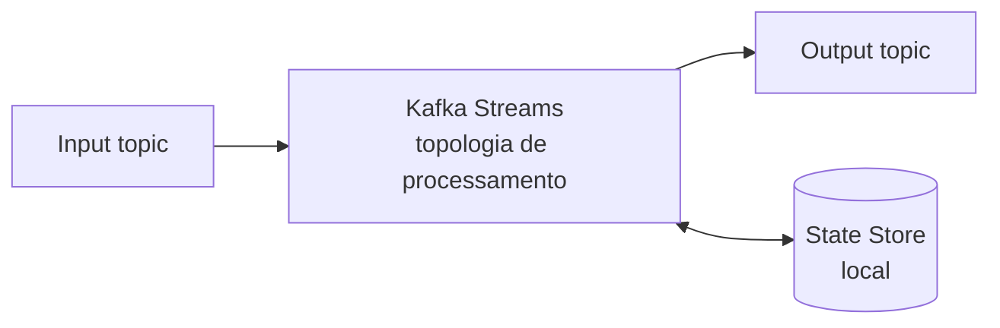
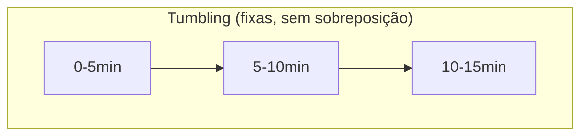
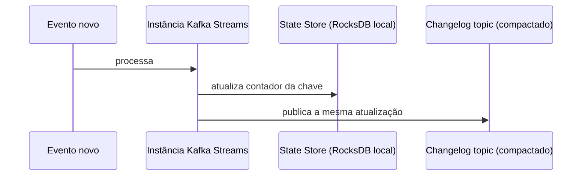

# Kafka Streams

A nota de [Casos de Uso do Kafka](/labs/web-dev/mensageria/08-casos-de-uso-do-kafka/) apresentou o processamento de streams como um dos cinco padrões recorrentes do Kafka, e citou o Kafka Streams como uma das ferramentas para isso. Esta nota entra no funcionamento por dentro: como uma agregação com estado sobrevive a eventos atrasados e a um reinício do processo sem perder o que já tinha calculado.

## Kafka Streams

Kafka Streams é uma biblioteca Java (existe também um wrapper para Kotlin e Scala), não um serviço à parte. Isso é a diferença mais importante em relação a ksqlDB e Apache Flink: você adiciona a dependência no seu projeto, escreve a topologia de processamento em código e ela roda dentro do próprio processo da sua aplicação, sem precisar subir e operar um cluster adicional. Escalar o processamento é escalar o número de instâncias da sua aplicação, cada instância pega um pedaço das partições envolvidas, do mesmo jeito que um consumer group normal distribui partições entre consumers.

O modelo básico é sempre o mesmo: um ou mais **input topics** entram numa cadeia de processadores, e o resultado sai em **output topics**. Cada aplicação Kafka Streams é, ao mesmo tempo, consumer (lê o input) e producer (escreve o output). A diferença para escrever esse consumer/producer manualmente, na mão, é que a biblioteca já resolve para você o controle de offset, o reprocessamento em caso de falha e, o assunto central desta nota, a manutenção de estado entre um evento e outro.



Um exemplo de topologia simples, contando pedidos por cliente:

```java
StreamsBuilder builder = new StreamsBuilder();

builder.stream("pedidos-criados", Consumed.with(Serdes.String(), pedidoSerde))
    .groupByKey()
    .count(Materialized.as("contagem-pedidos-por-cliente"))
    .toStream()
    .to("contagem-pedidos-por-cliente-output", Produced.with(Serdes.String(), Serdes.Long()));
```

`groupByKey` reagrupa o stream pela chave (o ID do cliente, no exemplo), e `count` mantém um contador por chave. Esse contador é exatamente o que a seção de State Store, mais adiante, explica como é guardado.

Vale notar que Kafka Streams processa um evento de cada vez, sem esperar um lote se formar, o que o diferencia de um `SELECT ... GROUP BY` batch tradicional: o resultado da agregação fica sempre atualizado, evento a evento, em vez de recalculado de hora em hora.

## Windowing

Contar "pedidos por cliente" desde o início dos tempos é simples: um contador que só sobe. Mas boa parte das perguntas reais tem um recorte de tempo embutido: quantos erros um serviço teve nos últimos 5 minutos, qual o total de vendas na última hora, quantos cliques um usuário deu na sessão atual. Sem um limite de tempo, uma agregação como essa cresceria para sempre e nunca representaria "agora", só o acumulado histórico. É para isso que existe o **windowing**: agrupar os eventos de um stream em janelas de tempo e calcular a agregação dentro de cada janela.

Kafka Streams define quatro tipos de janela, e a escolha entre elas muda o que "os últimos 5 minutos" realmente significa:



- **Tumbling window:** janelas de tamanho fixo, uma emendada na outra, sem sobreposição. "Vendas a cada 5 minutos" é uma tumbling window: o evento das 10h03 cai só na janela 10h00-10h05, nunca em duas ao mesmo tempo. É a mais simples de raciocinar e a mais usada para relatórios periódicos.
- **Hopping window:** também tem tamanho fixo, mas as janelas se sobrepõem porque o passo (o "hop") é menor que o tamanho da janela. Uma janela de 10 minutos com hop de 5 minutos gera uma janela nova a cada 5 minutos, cada uma cobrindo os últimos 10, então um evento cai em duas janelas ao mesmo tempo. Serve para uma média móvel: "o total das últimas 2 horas, atualizado de hora em hora" é mais suave de acompanhar do que um número que reseta de golpe a cada tumbling window.
- **Sliding window:** parecida com a hopping, mas o deslizamento não é em passos fixos, uma janela nova nasce a cada evento novo que chega, sempre cobrindo os N minutos anteriores àquele evento específico. É o formato mais caro computacionalmente (mais janelas ativas ao mesmo tempo) e mais usado em joins entre dois streams dentro de uma margem de tempo, por exemplo casar um clique com uma compra que aconteceu até 10 minutos depois.
- **Session window:** não tem tamanho fixo. A janela permanece aberta enquanto eventos daquela chave continuam chegando, e fecha depois de um período de inatividade (o "gap"). É o formato certo para medir uma sessão de usuário de verdade: alguém navegando sem parar fica numa janela só, não importa se levou 3 minutos ou 40; quando passa, digamos, 30 minutos sem nenhum clique novo, a sessão fecha e a próxima atividade abre uma janela nova.

A escolha entre elas depende da pergunta que a agregação precisa responder: um relatório periódico pede tumbling, uma média suavizada pede hopping, um join com tolerância de tempo pede sliding, e o comportamento de um usuário ao longo de uma visita pede session.

## Grace Period

Toda janela de tempo esbarra no mesmo problema: rede lenta, retry, ou um producer que ficou temporariamente sem conexão fazem um evento chegar depois do relógio "de verdade" em que ele aconteceu. Se a janela das 10h00-10h05 já fechou e processou o resultado, e um evento com timestamp 10h04 chega às 10h07, o que fazer com ele?

O **grace period** é o tempo extra que Kafka Streams espera depois do fim nominal da janela antes de considerá-la definitivamente fechada e descartar qualquer evento atrasado que ainda chegue. Uma janela tumbling de 5 minutos com grace period de 1 minuto continua aceitando eventos atrasados até 1 minuto depois do fim dela; só depois desse tempo extra o resultado é dado como final e eventos atrasados demais são descartados.

```java
TimeWindows.ofSizeWithNoGrace(Duration.ofMinutes(5))
    .grace(Duration.ofMinutes(1));
```

Configurar o grace period é balancear dois custos opostos. Um grace period curto (ou zero) fecha o resultado mais rápido, o que é bom quando a resposta precisa estar disponível o quanto antes, mas tem mais chance de descartar eventos legítimos que só chegaram um pouco atrasados, distorcendo o resultado para baixo. Um grace period longo aceita mais eventos atrasados e produz um número mais completo, ao custo de manter a janela aberta (e o estado dela em memória) por mais tempo, atrasando quando o resultado fica disponível. Não existe um valor certo universal, depende de quão atrasada a rede ou os producers do seu sistema costumam ficar, e de quanto atraso na resposta final a aplicação tolera.

## State Store

Toda operação com estado, um `count`, um `groupByKey` seguido de agregação, uma janela acumulando total, precisa guardar esse estado em algum lugar entre o processamento de um evento e o próximo. É isso que o **state store** faz: cada instância de uma aplicação Kafka Streams mantém, localmente, um banco embutido (por padrão RocksDB, um key-value store leve e rápido para leitura e escrita em disco) com o estado das agregações daquela partição que ela está processando.

Guardar o estado só localmente, na própria instância, seria arriscado: se a instância cai, o estado embutido junto com ela desaparece, e recalcular tudo do zero lendo o topic inteiro de novo pode ser lento demais. É por isso que Kafka Streams espelha cada mudança no state store para um **topic interno de changelog**, com log compaction (o mesmo mecanismo de compactação visto na nota de [Kafka](/labs/web-dev/mensageria/03-kafka/)): a cada atualização de uma chave no estado local, a mesma atualização é publicada nesse topic.



Quando a instância cai e reinicia (ou quando uma instância nova assume aquela partição, num rebalance), ela reconstrói o state store lendo o changelog topic do começo: como ele é compactado, só a última atualização de cada chave sobrevive, então a reconstrução lê bem menos dado do que reprocessar o input topic inteiro de novo. Esse é o mesmo padrão de recuperação via log compactado que a nota de Kafka menciona para topics do tipo "estado atual de cada coisa" - aqui aplicado automaticamente pela própria biblioteca, sem o desenvolvedor escrever esse mecanismo à mão.

## Referências

- [Kafka Streams - Core Concepts](https://kafka.apache.org/42/streams/core-concepts/) - Apache Kafka, en
- [Windowing in Kafka Streams](https://www.confluent.io/blog/windowing-in-kafka-streams/) - Confluent, en
- [org.apache.kafka.streams.state (Javadoc)](https://kafka.apache.org/35/javadoc/org/apache/kafka/streams/state/package-summary.html) - Apache Kafka, en
