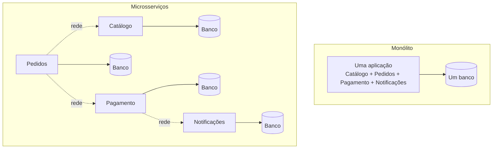
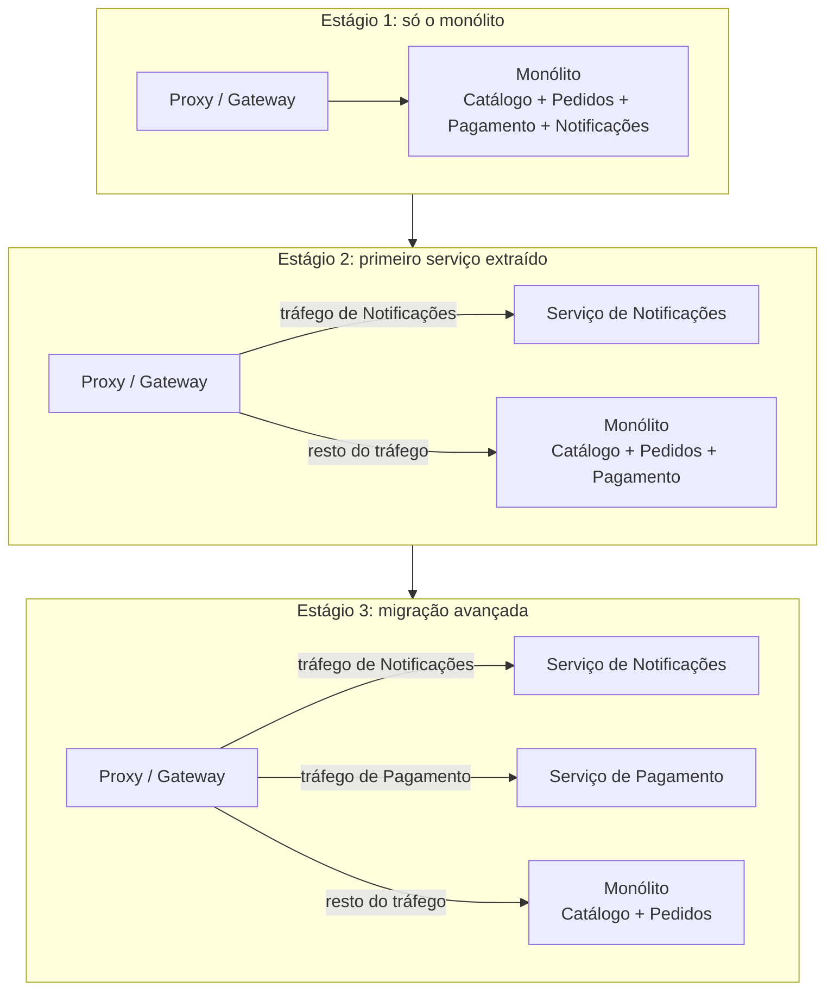

# Fundamentos de Microsserviços

## O que são microsserviços

Um microsserviço é uma aplicação pequena, com uma responsabilidade de negócio bem delimitada, que roda de forma independente e se comunica com outros serviços pela rede (normalmente HTTP, gRPC ou mensageria). Um sistema de e-commerce, por exemplo, pode ser dividido em serviço de catálogo, serviço de pedidos, serviço de pagamento e serviço de notificações, cada um com seu próprio código, seu próprio deploy e, geralmente, seu próprio banco de dados.

Isso se opõe ao modelo de monólito, onde toda essa lógica vive num único processo, compartilhando o mesmo código-base, o mesmo banco e o mesmo ciclo de deploy.

### Monólito vs microsserviços

| Aspecto                  | Monólito                                                   | Microsserviços                                                                                                                                              |
| ------------------------ | ---------------------------------------------------------- | ----------------------------------------------------------------------------------------------------------------------------------------------------------- |
| Deploy                   | Um deploy para o sistema inteiro                           | Cada serviço tem seu próprio deploy                                                                                                                         |
| Escalabilidade           | Escala a aplicação inteira, mesmo que só uma parte precise | Escala só o serviço que está sob carga                                                                                                                      |
| Times                    | Um time (ou vários mexendo no mesmo código)                | Um time por serviço (ou por grupo de serviços)                                                                                                              |
| Comunicação interna      | Chamada de função, na memória                              | Chamada de rede, com toda a instabilidade que isso traz                                                                                                     |
| Consistência de dados    | Transação ACID cobrindo tudo                               | Cada serviço com seu banco, sem transação única entre eles ([Transações Distribuídas](/labs/web-dev/transacoes-distribuidas/01-consistencia-transacional/)) |
| Debug                    | Um stack trace só                                          | Precisa de tracing distribuído ([Observabilidade](/labs/web-dev/observabilidade/01-logs-metrics-e-traces/)) para seguir uma requisição entre serviços       |
| Complexidade operacional | Baixa                                                      | Alta: mais serviços para monitorar, versionar e manter no ar                                                                                                |

Nenhum dos dois é "melhor" de forma absoluta, são otimizados para problemas diferentes.

### Quando usar microsserviços

Microsserviços tendem a valer a pena quando:

- O time cresceu a ponto de várias equipes mexerem no mesmo monólito e travarem umas nas outras em deploy e revisão de código (o problema de [escalabilidade organizacional](/labs/web-dev/escalabilidade/01-escalabilidade/))
- Partes diferentes do sistema têm necessidades de escala muito diferentes (ex: o serviço de busca recebe 100x mais tráfego que o de configurações de conta, e faz sentido escalar só ele)
- Times precisam de autonomia para escolher stack, ritmo de deploy e ciclo de vida próprios para sua área

### Trade-offs

O que você ganha em autonomia de time e escalabilidade seletiva, você paga em:

- **Complexidade de rede**: chamadas que antes eram uma função virando função viram chamadas HTTP/gRPC sujeitas a latência, timeout e falha parcial
- **Consistência de dados**: sem uma transação única cobrindo tudo, problemas como o [dual-write](/labs/web-dev/transacoes-distribuidas/03-escrita-dupla/) aparecem
- **Overhead operacional**: cada serviço novo é mais um pipeline de deploy, mais um conjunto de métricas, mais um ponto de falha para monitorar
- **Testes de integração mais caros**: testar o fluxo completo exige subir vários serviços, não só rodar uma suíte local

Por isso, times pequenos ou produtos ainda em validação costumam começar com um monólito bem organizado (ou um "monólito modular", com fronteiras internas claras) e só extrair microsserviços quando a dor de organização ou de escala justificar o custo extra.

## Cinco princípios de design

Existe uma lista curta de princípios que serve como checklist mental na hora de desenhar ou revisar uma arquitetura de microsserviços. Nenhum deles é regra absoluta, mas quando um serviço fere vários ao mesmo tempo, quase sempre é sinal de que a fronteira está no lugar errado.

### Serviços independentes

Cada serviço deve poder ser construído, testado e implantado sozinho, sem depender do calendário de deploy de nenhum outro. Na prática isso significa processo próprio, runtime próprio, porta própria e memória própria: se dois "serviços" só sobem juntos, no mesmo deploy, eles são um serviço só com o código separado em duas pastas. Essa independência é o que sustenta os ganhos de autonomia de time descritos na seção de trade-offs.

### Fronteiras orientadas ao negócio

Os serviços devem ser recortados em torno de capacidades de negócio (Pedidos, Pagamentos, Estoque, Catálogo), não de camadas técnicas (um serviço de "banco", um de "regras", um de "API"). Recorte técnico recria as dependências fortes do monólito, só que agora pela rede. Esse é o assunto inteiro da próxima nota, [Decomposição de Serviços e Bounded Context](/labs/web-dev/microsservicos/02-decomposicao-e-bounded-context/).

### Serviços no tamanho certo

A heurística clássica é a **regra das duas pizzas**: um serviço deve caber num time que duas pizzas alimentam, algo entre 6 e 8 pessoas. A ideia não é o número exato, é que o serviço seja pequeno o bastante para um time dar conta dele por inteiro e grande o bastante para ter um propósito de negócio real.

Os dois extremos machucam. Serviço grande demais vira um mini-monólito, com os mesmos problemas de acoplamento interno e deploy arriscado. Serviço pequeno demais leva ao "distributed monolith": cada requisição de negócio vira uma cadeia longa de chamadas entre serviços minúsculos, com mais latência e mais pontos de falha, sem nenhum ganho de autonomia. A nota de decomposição trata desse erro em detalhe na parte de over-decomposition.

### Smart endpoints, dumb pipes

A lógica de negócio e as decisões ficam dentro dos serviços (os "endpoints inteligentes"). O meio de comunicação entre eles, seja HTTP ou um broker de mensageria, fica burro de propósito: só transporta mensagem, sem orquestrar fluxo nem aplicar regra de negócio.

Esse princípio é uma reação à era do SOA, quando era comum colocar um ESB (Enterprise Service Bus) no meio, um barramento central cheio de lógica de roteamento e transformação. O ESB virava um ponto único de acoplamento e de falha: mudar qualquer serviço exigia mexer na configuração do barramento. A abordagem de microsserviços joga essa complexidade de volta para dentro dos serviços e mantém o transporte simples.

### Síncrono vs assíncrono

A comunicação entre serviços pode ser síncrona (quem chama espera a resposta) ou assíncrona (quem chama publica uma mensagem e segue em frente). A escolha depende da necessidade:

- **Síncrono** quando o usuário precisa da resposta na hora: confirmar que o pagamento passou antes de mostrar a tela de sucesso.
- **Assíncrono** quando o processamento pode acontecer depois, através de um broker como Kafka, RabbitMQ ou ActiveMQ: mandar o e-mail de confirmação, atualizar o painel de analytics.

A maioria dos sistemas usa as duas. O detalhamento de cada estilo, com os problemas específicos que a comunicação síncrona traz, está em [Comunicação entre Serviços](/labs/web-dev/microsservicos/03-comunicacao-entre-servicos/), e a parte assíncrona começa em [Filas e Mensageria](/labs/web-dev/mensageria/01-filas-e-mensageria/).

## Stateless Services

### O que significa stateless

Um serviço stateless não guarda, na própria memória do processo, nenhuma informação que precise sobreviver entre requisições diferentes ou ser vista por outra instância do mesmo serviço. Cada requisição chega com tudo que o serviço precisa para respondê-la (token de autenticação, ID do recurso, payload), e a resposta não depende de nada que ficou guardado de uma chamada anterior naquela instância específica.

Isso importa especialmente em microsserviços porque cada serviço normalmente roda em várias instâncias atrás de um load balancer, e essas instâncias sobem e descem o tempo todo (deploy, autoscaling, crash e restart). Se o serviço guardasse estado na memória local, uma requisição atendida pela instância 2 não teria acesso ao que ficou guardado na instância 1, e um restart simplesmente apagaria esse estado. O critério completo de como desenhar isso (e os problemas de sincronizar estado entre instâncias) está em [Stateless, Particionamento e Sharding](/labs/web-dev/escalabilidade/02-stateless-e-particionamento/).

### Onde armazenar estado

Se o processo do serviço não pode guardar estado, esse estado precisa morar em algum lugar compartilhado e acessível por qualquer instância:

- **Sessões de usuário**: em vez de guardar a sessão na memória do serviço, ela fica num store compartilhado como Redis, acessível por qualquer instância que receber a próxima requisição daquele usuário
- **Cache**: da mesma forma, um cache local por instância gera inconsistência entre elas. Um cache distribuído (ver [Cache e Redis](/labs/web-dev/escalabilidade/08-cache-e-redis/)) resolve isso
- **Banco de dados**: é o destino natural para qualquer dado que precisa ser durável e consistente entre requisições, independente de qual instância atendeu cada uma

Regra prática: se matar a instância agora e subir uma nova no lugar dela quebraria alguma coisa para o usuário, tem estado escondido em algum lugar que não deveria estar ali.

## Migração de monolito: Strangler Fig Pattern

Boa parte dos sistemas que hoje usam microsserviços não nasceram assim, começaram como monólito e migraram depois que a dor de manter tudo junto ficou grande demais. A pergunta prática nesse momento não é só "para onde migrar", é "como migrar sem parar o sistema no meio do caminho". É esse o problema que o Strangler Fig Pattern resolve.

### Problemas típicos do monólito que motivam a migração

Alguns sintomas costumam aparecer juntos quando chega a hora de considerar a migração:

- **Acoplamento**: mudanças em uma parte do código quebram outras partes sem relação aparente, e times diferentes mexendo no mesmo código-base travam uns nos outros em revisão e deploy.
- **Dificuldade de escalar**: como o sistema inteiro sobe como um processo só, escalar a parte que está sob carga significa escalar tudo junto, mesmo o que não precisa.
- **Lock-in de tecnologia**: todo o sistema preso à mesma linguagem, framework e versão de banco, tornando inviável modernizar só uma parte sem mexer no resto.
- **Deploys lentos e arriscados**: uma mudança pequena obriga rodar a suíte de testes do sistema inteiro e publicar tudo junto, aumentando o raio de impacto de qualquer bug introduzido.

### A ideia do Strangler Fig

O nome vem da figueira-estranguladora, uma trepadeira que cresce em volta de uma árvore hospedeira e, aos poucos, a substitui por completo, sem nunca derrubar a árvore de uma vez. A analogia técnica, popularizada por Martin Fowler, segue a mesma lógica: em vez de reescrever o monólito do zero, extrai-se um bounded context por vez (ver [Decomposição de Serviços e Bounded Context](/labs/web-dev/microsservicos/02-decomposicao-e-bounded-context/)), esse pedaço passa a rodar como um microsserviço novo, e o tráfego daquela funcionalidade é redirecionado para o serviço novo, enquanto o resto do sistema continua rodando no monólito, sem alteração. O processo se repete, contexto por contexto, até o monólito não ter mais nada relevante rodando dentro dele, ou sobrar só um núcleo pequeno demais para valer a pena extrair.

Na prática, isso é feito colocando um proxy ou gateway na frente de todo o tráfego, decidindo requisição por requisição se ela vai para o monólito antigo ou para um dos serviços novos já extraídos. No início da migração, quase tudo ainda vai para o monólito. Conforme mais contextos são extraídos, mais fatias do tráfego são desviadas para os serviços novos, até o monólito virar uma fração pequena do sistema (ou sumir de vez).

O ponto chave é que, em qualquer momento da migração, o sistema inteiro continua no ar e continua sendo publicado normalmente. Não existe um período em que "está tudo quebrado enquanto migramos", cada extração é um passo pequeno e reversível.

### Princípios da migração

- **Começar por features não críticas**: extrair primeiro a funcionalidade de menor risco e menor tráfego, algo bem desacoplado do resto, serve para validar o processo (proxy, deploy do serviço novo, monitoramento) sem apostar o negócio inteiro nisso. As partes mais centrais e arriscadas do sistema (checkout, pagamento) ficam para depois, quando o time já tem confiança no processo.
- **Definir fronteiras claras de serviço**: extrair um pedaço do monólito sem antes aplicar o raciocínio de [decomposição e bounded context](/labs/web-dev/microsservicos/02-decomposicao-e-bounded-context/) só transporta a bagunça para um lugar distribuído, o que costuma ser pior e mais difícil de corrigir do que deixar como monólito.
- **Extrair, testar, repetir**: cada extração deve ser validada em produção (com monitoramento e, se possível, uma fração de tráfego por vez) antes de seguir para a próxima. Manter o caminho antigo disponível por um tempo como plano B, redirecionando o tráfego de volta ao monólito se algo der errado, reduz bastante o risco de cada etapa.
- **Nunca fazer big bang rewrite**: reescrever tudo de uma vez significa meses (ou anos) sem entregar valor novo, uma base de código congelada nesse período, e o risco de descobrir um problema sério no projeto novo só perto do fim, quando já foi gasto o investimento inteiro sem nada em produção para mostrar. O Strangler Fig evita esse risco justamente por manter o sistema entregável e funcional a cada passo da migração, não só no final dela.
