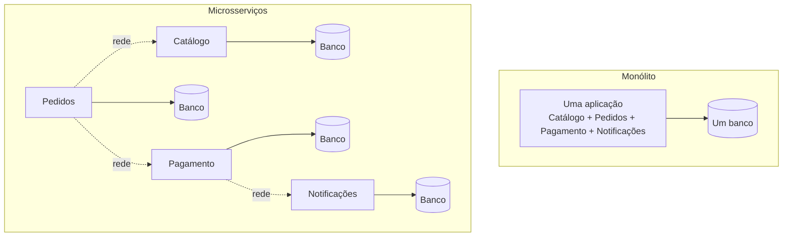

# Fundamentos de Microsserviços

## O que são microsserviços

Um microsserviço é uma aplicação pequena, com uma responsabilidade de negócio bem delimitada, que roda de forma independente e se comunica com outros serviços pela rede (normalmente HTTP, gRPC ou mensageria). Um sistema de e-commerce, por exemplo, pode ser dividido em serviço de catálogo, serviço de pedidos, serviço de pagamento e serviço de notificações, cada um com seu próprio código, seu próprio deploy e, geralmente, seu próprio banco de dados.

Isso se opõe ao modelo de monólito, onde toda essa lógica vive num único processo, compartilhando o mesmo código-base, o mesmo banco e o mesmo ciclo de deploy.

### Monólito vs microsserviços

| Aspecto                  | Monólito                                                   | Microsserviços                                                                                                                                           |
| ------------------------ | ---------------------------------------------------------- | -------------------------------------------------------------------------------------------------------------------------------------------------------- |
| Deploy                   | Um deploy para o sistema inteiro                           | Cada serviço tem seu próprio deploy                                                                                                                      |
| Escalabilidade           | Escala a aplicação inteira, mesmo que só uma parte precise | Escala só o serviço que está sob carga                                                                                                                   |
| Times                    | Um time (ou vários mexendo no mesmo código)                | Um time por serviço (ou por grupo de serviços)                                                                                                           |
| Comunicação interna      | Chamada de função, na memória                              | Chamada de rede, com toda a instabilidade que isso traz                                                                                                  |
| Consistência de dados    | Transação ACID cobrindo tudo                               | Cada serviço com seu banco, sem transação única entre eles ([Transações Distribuídas](/labs/web-dev/transacoes-distribuidas/consistencia-transacional/)) |
| Debug                    | Um stack trace só                                          | Precisa de tracing distribuído ([Observabilidade](/labs/web-dev/observabilidade/logs-metrics-e-traces/)) para seguir uma requisição entre serviços       |
| Complexidade operacional | Baixa                                                      | Alta: mais serviços para monitorar, versionar e manter no ar                                                                                             |

Nenhum dos dois é "melhor" de forma absoluta, são otimizados para problemas diferentes.

### Quando usar microsserviços

Microsserviços tendem a valer a pena quando:

- O time cresceu a ponto de várias equipes mexerem no mesmo monólito e travarem umas nas outras em deploy e revisão de código (o problema de [escalabilidade organizacional](/labs/web-dev/escalabilidade/escalabilidade/))
- Partes diferentes do sistema têm necessidades de escala muito diferentes (ex: o serviço de busca recebe 100x mais tráfego que o de configurações de conta, e faz sentido escalar só ele)
- Times precisam de autonomia para escolher stack, ritmo de deploy e ciclo de vida próprios para sua área

### Trade-offs

O que você ganha em autonomia de time e escalabilidade seletiva, você paga em:

- **Complexidade de rede**: chamadas que antes eram uma função virando função viram chamadas HTTP/gRPC sujeitas a latência, timeout e falha parcial
- **Consistência de dados**: sem uma transação única cobrindo tudo, problemas como o [dual-write](/labs/web-dev/transacoes-distribuidas/escrita-dupla/) aparecem
- **Overhead operacional**: cada serviço novo é mais um pipeline de deploy, mais um conjunto de métricas, mais um ponto de falha para monitorar
- **Testes de integração mais caros**: testar o fluxo completo exige subir vários serviços, não só rodar uma suíte local

Por isso, times pequenos ou produtos ainda em validação costumam começar com um monólito bem organizado (ou um "monólito modular", com fronteiras internas claras) e só extrair microsserviços quando a dor de organização ou de escala justificar o custo extra.

## Stateless Services

### O que significa stateless

Um serviço stateless não guarda, na própria memória do processo, nenhuma informação que precise sobreviver entre requisições diferentes ou ser vista por outra instância do mesmo serviço. Cada requisição chega com tudo que o serviço precisa para respondê-la (token de autenticação, ID do recurso, payload), e a resposta não depende de nada que ficou guardado de uma chamada anterior naquela instância específica.

Isso importa especialmente em microsserviços porque cada serviço normalmente roda em várias instâncias atrás de um load balancer, e essas instâncias sobem e descem o tempo todo (deploy, autoscaling, crash e restart). Se o serviço guardasse estado na memória local, uma requisição atendida pela instância 2 não teria acesso ao que ficou guardado na instância 1, e um restart simplesmente apagaria esse estado. O critério completo de como desenhar isso (e os problemas de sincronizar estado entre instâncias) está em [Stateless, Particionamento e Sharding](/labs/web-dev/escalabilidade/stateless-e-particionamento/).

### Onde armazenar estado

Se o processo do serviço não pode guardar estado, esse estado precisa morar em algum lugar compartilhado e acessível por qualquer instância:

- **Sessões de usuário**: em vez de guardar a sessão na memória do serviço, ela fica num store compartilhado como Redis, acessível por qualquer instância que receber a próxima requisição daquele usuário
- **Cache**: da mesma forma, um cache local por instância gera inconsistência entre elas. Um cache distribuído (ver [Cache e Redis](/labs/web-dev/escalabilidade/cache-e-redis/)) resolve isso
- **Banco de dados**: é o destino natural para qualquer dado que precisa ser durável e consistente entre requisições, independente de qual instância atendeu cada uma

Regra prática: se matar a instância agora e subir uma nova no lugar dela quebraria alguma coisa para o usuário, tem estado escondido em algum lugar que não deveria estar ali.
