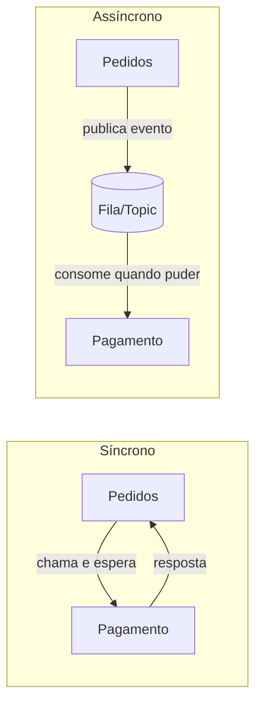

# Comunicação entre Serviços

## Comunicação síncrona e assíncrona

Uma vez que a lógica está espalhada em vários serviços, alguém precisa decidir como um serviço fala com o outro. Essa escolha tem impacto direto em latência, acoplamento e resiliência do sistema inteiro.

**Comunicação síncrona** é quando quem chama fica esperando a resposta antes de continuar. O exemplo mais comum é REST sobre HTTP: o serviço de pedidos chama o serviço de pagamento e só segue em frente depois que a resposta (aprovado ou recusado) chega. É simples de raciocinar, mas acopla os dois serviços no tempo: se o serviço de pagamento está fora do ar, o serviço de pedidos trava ou falha junto.

**Comunicação assíncrona** é quando quem chama não espera resposta imediata, normalmente publicando uma mensagem ou um evento e seguindo em frente. O consumer processa quando puder. Isso desacopla os serviços no tempo, ao custo de não ter mais uma resposta imediata de "deu certo ou não" para devolver ao usuário.

### As opções mais comuns

- **REST**: comunicação síncrona sobre HTTP, usando os verbos e status codes já vistos em [HTTP, APIs e REST](/labs/web-dev/apis/http-rest/). É a opção mais simples de começar e a mais interoperável, praticamente qualquer linguagem ou ferramenta sabe falar HTTP.
- **gRPC**: também síncrono, mas usa HTTP/2 e Protocol Buffers (um formato binário) em vez de JSON sobre HTTP/1.1. É mais rápido e mais compacto que REST, com contratos de tipagem forte gerados a partir de um arquivo `.proto`, mas exige mais setup e é menos amigável para debugar manualmente (não dá para simplesmente abrir no navegador ou testar com `curl` sem ferramentas extras). Costuma aparecer em comunicação interna entre serviços de alta performance, onde REST não tem espaço, e menos em APIs públicas voltadas a clientes externos.
- **Eventos e mensageria**: comunicação assíncrona, onde um serviço publica que algo aconteceu ("pedido criado", "pagamento aprovado") e outros serviços reagem a isso sem que o publicador saiba quem está ouvindo. Essa é a base de filas, tópicos e brokers como Kafka, aprofundada em [Filas e Mensageria](/labs/web-dev/mensageria/filas-e-mensageria/) e nas notas seguintes daquela seção.

Na prática, a maioria dos sistemas usa as duas formas ao mesmo tempo: síncrono para o que o usuário precisa ver na hora (confirmar que o pagamento passou), assíncrono para o que pode esperar alguns segundos (mandar o e-mail de confirmação, atualizar o painel de analytics).

## Service-to-Service

Comunicação síncrona entre serviços traz um conjunto de problemas específicos, que não existem dentro de um monólito, porque ali a "chamada" é uma chamada de rede real, sujeita a tudo que pode dar errado numa rede.

**Service discovery**: num monólito, chamar outra parte do sistema é só chamar uma função, o endereço dela é resolvido em tempo de compilação. Com serviços separados, cada um rodando em várias instâncias que sobem e descem (deploy, autoscaling, crash), quem chama precisa descobrir, em tempo real, quais instâncias do serviço de destino estão de pé e prontas para receber tráfego agora. Isso é resolvido por um mecanismo de service discovery (um registro central que os serviços consultam ou que atualiza automaticamente, comum em orquestradores como Kubernetes) combinado com [health checks](/labs/web-dev/escalabilidade/load-balancer/) para tirar da lista instâncias que pararam de responder.

**Load balancing**: depois de descobrir quais instâncias estão saudáveis, ainda é preciso decidir para qual delas mandar cada chamada, distribuindo a carga entre elas. Os algoritmos e a mecânica disso já estão cobertos em detalhe em [Load Balancer](/labs/web-dev/escalabilidade/load-balancer/); aqui o que importa é que, em arquitetura de microsserviços, esse balanceamento não acontece só na borda (entre cliente e sistema), ele também acontece internamente, entre um serviço e outro.

As chamadas de rede entre serviços também podem falhar de formas que uma chamada de função nunca falha: a rede pode cair, o serviço remoto pode estar lento ou sobrecarregado, uma instância pode cair no meio da resposta. Três padrões cuidam disso, e têm uma nota própria com o funcionamento completo de cada um em [Timeout, Retry, Circuit Breaker e Bulkhead](/labs/web-dev/resiliencia/timeout-retry-circuit-breaker-e-bulkhead/):

- **Timeouts**: definir por quanto tempo vale a pena esperar uma resposta antes de desistir, para não travar o próprio serviço esperando um vizinho que não vai responder.
- **Retries**: tentar de novo uma chamada que falhou por um motivo provavelmente temporário, com cuidado para não martelar um serviço já sobrecarregado nem duplicar efeitos colaterais.
- **Circuit breaker**: parar de tentar chamar um serviço que está claramente fora do ar, em vez de continuar gastando tempo e recursos em chamadas fadadas ao fracasso.
- **Bulkhead**: isolar os recursos usados para chamar cada dependência, para que uma dependência lenta não consuma os recursos que seriam usados para chamar as outras.

O fio condutor de todos esses padrões é o mesmo: numa arquitetura de microsserviços, a rede entre os serviços é uma fonte constante de falha parcial, e o design da comunicação precisa assumir isso desde o início, não tratar como exceção rara.
