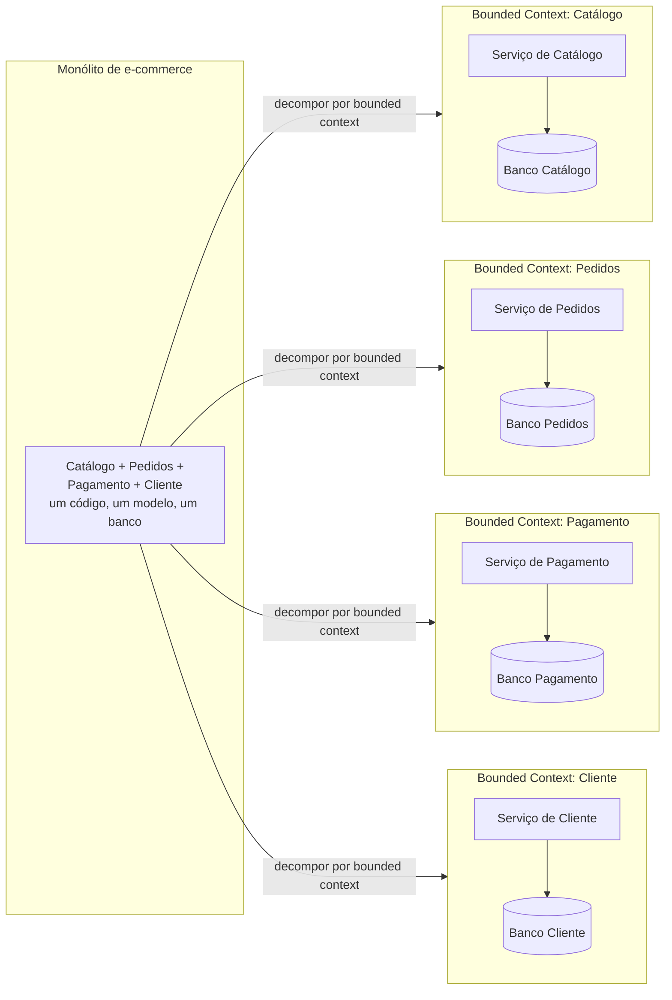
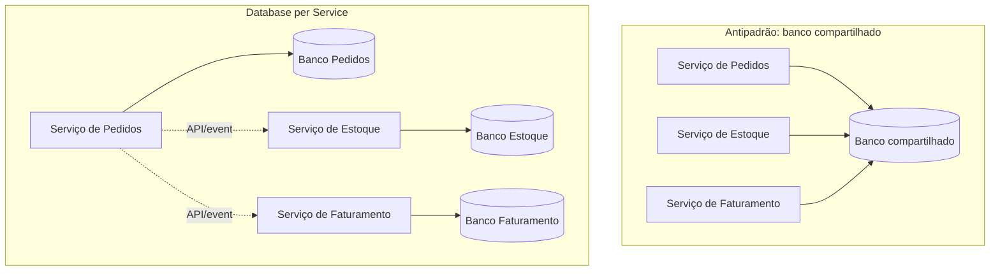

# Decomposição de Serviços e Bounded Context

Depois de entender o que é um microsserviço (ver [Fundamentos de Microsserviços](/labs/web-dev/microsservicos/01-fundamentos-de-microsservicos/)), a pergunta que sobra é a mais difícil de responder na prática: onde exatamente cortar o sistema? Decompor mal um domínio gera o pior dos dois mundos, um monte de serviços separados que continuam profundamente acoplados entre si, só que agora conversando pela rede em vez de por chamada de função. Esta nota é sobre como pensar esse corte.

## Por que decompor

Decompor não é picar o código em pedaços menores só para dizer que "agora é microsserviço". O objetivo é alinhar cada serviço a um pedaço de negócio que faz sentido sozinho, e isso traz um conjunto de ganhos concretos:

- **Alinhamento com o negócio**: cada serviço passa a representar uma capacidade real da empresa (pedidos, pagamento, catálogo), em vez de uma divisão técnica arbitrária (camada de banco, camada de API). Isso facilita conversar sobre o sistema com quem não é dev, e facilita mapear qual time é dono de qual parte.
- **Desenvolvimento e deploy independentes**: se o corte é bom, o time de pagamento consegue mudar e publicar o serviço de pagamento sem esperar o time de catálogo terminar nada, e vice-versa.
- **Escalabilidade seletiva**: como já visto em [Fundamentos de Microsserviços](/labs/web-dev/microsservicos/01-fundamentos-de-microsservicos/), a vantagem de separar serviços só se realiza se cada um puder escalar de acordo com sua própria carga, não a carga do sistema inteiro.
- **Isolamento de falhas**: um bug ou uma sobrecarga no serviço de notificações não deveria conseguir derrubar o serviço de pagamento junto, se as fronteiras estiverem bem desenhadas (mais sobre lidar com isso em [Comunicação entre Serviços](/labs/web-dev/microsservicos/03-comunicacao-entre-servicos/) e nas notas de resiliência).
- **Manutenção e evolução**: serviços menores e focados em uma responsabilidade são mais fáceis de entender, testar e reescrever quando necessário, sem que essa mudança se espalhe para o resto do sistema.

Nenhum desses ganhos aparece de graça: eles só existem se o corte entre os serviços seguir fronteiras de negócio reais. Um corte ruim (por exemplo, um serviço por tabela do banco) produz serviços tecnicamente separados que continuam presos uns aos outros, sem nenhum desses benefícios.

## Abordagens de decomposição

Existem três lentes comuns para decidir onde estão essas fronteiras. Na prática, a maioria das decomposições combina as três, mas vale entender cada uma isoladamente.

### Business Capability

Uma capacidade de negócio é algo que a empresa faz, independente de como isso é implementado hoje: "gerenciar pedidos", "processar pagamentos", "gerenciar catálogo de produtos", "cadastrar clientes". Essas capacidades tendem a ser bem mais estáveis ao longo do tempo do que qualquer implementação técnica específica, uma loja continua "processando pagamentos" mesmo que troque de gateway de pagamento três vezes em cinco anos.

Decompor por capacidade de negócio significa perguntar "o que essa parte do sistema faz pela empresa", não "que tabelas ela usa" ou "que camada técnica ela representa". O resultado costuma ser um pequeno número de serviços com nomes que fazem sentido até para alguém de fora da engenharia: `orders`, `payments`, `catalog`, `users`.

### Subdomain-Driven (DDD)

Domain-Driven Design (DDD) é uma forma mais formal de chegar a essas fronteiras, olhando o domínio de negócio inteiro e dividindo-o em subdomínios. O DDD costuma classificar esses subdomínios em três tipos:

- **Core domain**: a parte do negócio que é o diferencial competitivo, onde vale investir mais tempo de design (para um marketplace, provavelmente o motor de busca e recomendação de produtos).
- **Supporting subdomain**: importante para o negócio funcionar, mas não é o diferencial (por exemplo, gestão de catálogo).
- **Generic subdomain**: resolvido praticamente da mesma forma em qualquer empresa do setor, onde geralmente compensa mais usar algo pronto do que construir do zero (autenticação, envio de e-mail).

Dentro de cada subdomínio, o DDD introduz o conceito de **ubiquitous language** (linguagem ubíqua): o time de negócio e o time técnico usam exatamente os mesmos termos, com o mesmo significado, tanto na conversa quanto no código. Se o pessoal de negócio fala em "pedido", o código também fala em `Pedido`, não em `OrderEntity` ou `TransactionRecord`. Essa linguagem compartilhada é o que ajuda a enxergar onde uma fronteira de contexto termina, é justamente onde o significado de um termo muda (mais detalhes na seção de [Bounded Context](#bounded-context) logo abaixo).

### Data-Driven

A terceira lente olha para os dados: decompor em torno de quem é dono de qual dado, tentando minimizar dados que precisam ser compartilhados entre serviços. Se dois pedaços de funcionalidade sempre leem e escrevem no mesmo conjunto de dados, é sinal de que talvez devessem estar no mesmo serviço. Se um conjunto de dados só é usado por uma funcionalidade específica, isso é um bom candidato a virar a fronteira de um serviço.

Essa abordagem anda de mãos dadas com o princípio de [database per service](#database-per-service), abordado adiante: o resultado de uma boa decomposição data-driven é que cada serviço acaba realmente sendo dono exclusivo dos dados de que precisa.

| Abordagem            | Pergunta que ela responde                          | Ponto forte                                                    | Limitação                                                             |
| --------------------- | ---------------------------------------------------- | ----------------------------------------------------------------- | -------------------------------------------------------------------------- |
| Business Capability   | "O que essa parte faz pela empresa?"                | Fácil de explicar e de alinhar com times de negócio             | Pode ficar genérica demais se o negócio não for bem entendido             |
| Subdomain-Driven (DDD)| "Onde a linguagem e o modelo mudam de significado?" | Mais rigorosa, expõe fronteiras que não são óbvias à primeira vista | Exige investimento real em entender o domínio, não é um exercício rápido |
| Data-Driven           | "Quem é dono de qual dado?"                          | Fronteiras alinhadas naturalmente com database per service        | Sozinha, pode ignorar comportamento e regra de negócio                    |

Na prática, o fluxo mais comum é começar identificando capacidades de negócio, refinar essas capacidades usando a análise de subdomínios do DDD, e confirmar o resultado olhando para a posse dos dados. Quando as três lentes apontam para o mesmo corte, é um bom sinal de que a fronteira está no lugar certo.

## Bounded Context

Bounded context é o conceito central do DDD para esse problema: é a fronteira dentro da qual um modelo específico, com um significado específico, é válido. Fora dessa fronteira, o mesmo termo pode significar outra coisa completamente diferente, e isso é esperado, não é um erro de modelagem.

O exemplo clássico é a palavra "cliente". No contexto de Vendas, um cliente é alguém com CPF, endereço de entrega, histórico de pedidos e forma de pagamento preferida. No contexto de Suporte, o mesmo cliente é alguém com um número de ticket, um histórico de atendimentos e um nível de prioridade. Tentar criar uma única entidade `Cliente` que sirva igualmente bem para os dois contextos tende a virar uma classe inchada, cheia de campos que só fazem sentido em um dos dois lados, e regras de negócio que se pisam.

O bounded context resolve isso permitindo que cada serviço tenha seu próprio modelo de `Cliente`, com só os campos e regras que aquele contexto precisa. Fronteiras de contexto bem definidas evitam exatamente esse tipo de mal-entendido: cada serviço sabe exatamente o que um termo significa dentro dele, sem precisar negociar um modelo único que sirva para todo mundo.

Cada bounded context, na prática, costuma virar um ou mais serviços. É raro (mas possível) um bounded context abranger mais de um serviço; o que não costuma funcionar é o inverso, um serviço só cobrindo parte de um bounded context, porque aí a fronteira do serviço corta o modelo de negócio no meio.

## Database per Service

Uma consequência direta de levar bounded context a sério é que cada serviço precisa ser dono exclusivo do seu próprio banco de dados. Nenhum outro serviço acessa esse banco diretamente, nem para ler.

Isso parece rígido à primeira vista (e é), mas é o que preserva a fronteira. Se o serviço de Pedidos pode consultar direto a tabela `clientes` do serviço de Cliente, os dois serviços estão de fato acoplados no nível de schema: qualquer mudança na estrutura dessa tabela (renomear uma coluna, mudar um tipo) pode quebrar o serviço de Pedidos sem aviso nenhum, mesmo que ninguém tenha tocado no código dele. Nesse ponto, "microsserviços" é só uma separação cosmética, o acoplamento real do monólito continua todo lá.

A alternativa é qualquer dado que um serviço precise de outro contexto ser obtido através de uma API bem definida (ver [Comunicação entre Serviços](/labs/web-dev/microsservicos/03-comunicacao-entre-servicos/)) ou de eventos assíncronos. É comum, e esperado, que isso gere alguma duplicação de dados entre serviços (o serviço de Pedidos guardar uma cópia local do nome e endereço do cliente no momento da compra, por exemplo), em vez de fazer uma consulta síncrona toda vez que precisar desse dado. Essa duplicação controlada é o preço de manter os serviços desacoplados, e é justamente o tipo de situação que exige lidar com consistência entre bancos diferentes, aprofundado em [Transações Distribuídas](/labs/web-dev/transacoes-distribuidas/01-consistencia-transacional/).

No antipadrão à esquerda, qualquer um dos três serviços pode mudar o comportamento dos outros dois só alterando uma tabela. No padrão à direita, cada serviço só muda o próprio comportamento quando muda o próprio banco, e qualquer troca de dado passa por um contrato explícito (API ou evento) que pode ser versionado e testado.

## Como identificar os limites de um serviço

Na prática, encontrar os limites certos é um processo iterativo, não uma fórmula fechada. Alguns critérios ajudam a guiar a decisão:

- **Identificar capacidades de negócio**: liste o que o negócio faz (não o que o sistema atual faz hoje), e use essa lista como ponto de partida para nomear possíveis serviços.
- **Encontrar fronteiras naturais**: funcionalidades que sempre mudam juntas, sempre são discutidas juntas nas reuniões de negócio, ou sempre aparecem juntas nos requisitos, provavelmente pertencem ao mesmo serviço. Se duas funcionalidades quase nunca são mencionadas na mesma conversa, isso é um sinal de que talvez devam ficar em serviços diferentes.
- **Analisar a posse dos dados**: para cada capacidade candidata, pergunte quem realmente precisa escrever nesses dados. Se dois candidatos a serviço precisam escrever no mesmo dado com a mesma frequência, provavelmente a fronteira está cortando um bounded context ao meio.
- **Buscar alta coesão**: tudo que muda junto, pelo mesmo motivo, deveria morar junto no mesmo serviço. Um serviço com alta coesão tem um propósito só, e fica óbvio por que cada parte do código dele existe.
- **Garantir baixo acoplamento**: um serviço deveria poder mudar sua implementação interna (troca de banco, refatoração, mudança de linguagem) sem exigir mudança em nenhum outro serviço, desde que o contrato exposto (API, eventos) continue o mesmo.

Um teste prático e barato: imagine que dois times, cada um responsável por um serviço candidato, precisam se comunicar toda vez que um deles for fazer uma mudança. Se essa comunicação for constante, os dois serviços provavelmente deveriam ser um só (ou a fronteira entre eles está no lugar errado). Se os times raramente precisam se falar, a fronteira provavelmente está bem desenhada.

## O que evitar

Alguns erros de decomposição são comuns o bastante para merecer menção explícita:

- **Espelhar tabelas do banco como serviços**: criar um serviço `Pedidos` e outro `ItensDoPedido` só porque essas são duas tabelas separadas no banco atual produz serviços sem comportamento próprio, praticamente CRUD puro sobre uma tabela, que na prática sempre precisam ser chamados juntos. Isso é decompor pela estrutura técnica atual, não pelo domínio, e é o oposto do que essa nota defende.
- **Criar serviços pequenos demais (over-decomposition)**: cortar demais gera o efeito inverso do que se buscava. Cada requisição de negócio passa a exigir uma cadeia longa de chamadas entre serviços minúsculos, aumentando latência, superfície de falha e complexidade operacional (mais serviços para fazer deploy, monitorar e manter no ar) sem ganho real de autonomia. Esse cenário costuma ser chamado de "distributed monolith": tecnicamente vários processos, mas ainda tão acoplado quanto um monólito, só que mais lento e mais caro de operar.
- **Compartilhar banco de dados entre serviços**: já discutido na seção de [Database per Service](#database-per-service), é talvez o erro mais comum e mais caro de corrigir depois, porque reverter exige migrar dados em produção.
- **Ignorar as fronteiras de negócio**: decompor por camada técnica (um serviço de "banco de dados", um serviço de "regras de negócio", um serviço de "API") em vez de por capacidade de negócio recria as mesmas dependências fortes de um monólito, só que espalhadas pela rede.

## Checklist de boa decomposição

Antes de considerar uma decomposição pronta, vale checar se ela atende a estes pontos:

- Cada serviço está claramente alinhado a uma capacidade de negócio reconhecível, com um nome que faz sentido até fora da engenharia.
- Os serviços são fracamente acoplados entre si: mudar a implementação interna de um não obriga mudança em nenhum outro.
- Cada serviço é dono exclusivo dos próprios dados, sem nenhum outro serviço acessando seu banco diretamente.
- Cada serviço pode ser desenvolvido, testado, implantado e escalado de forma independente dos demais.
- Dentro de cada serviço existe alta coesão (tudo ali pertence de fato ao mesmo propósito) e, entre serviços, baixo acoplamento (mudanças raramente se propagam de um para o outro).
