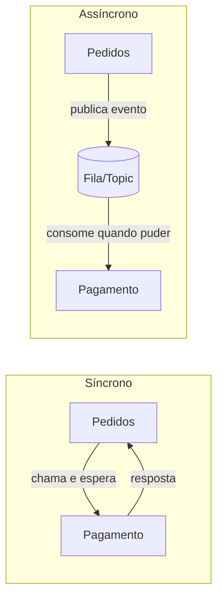
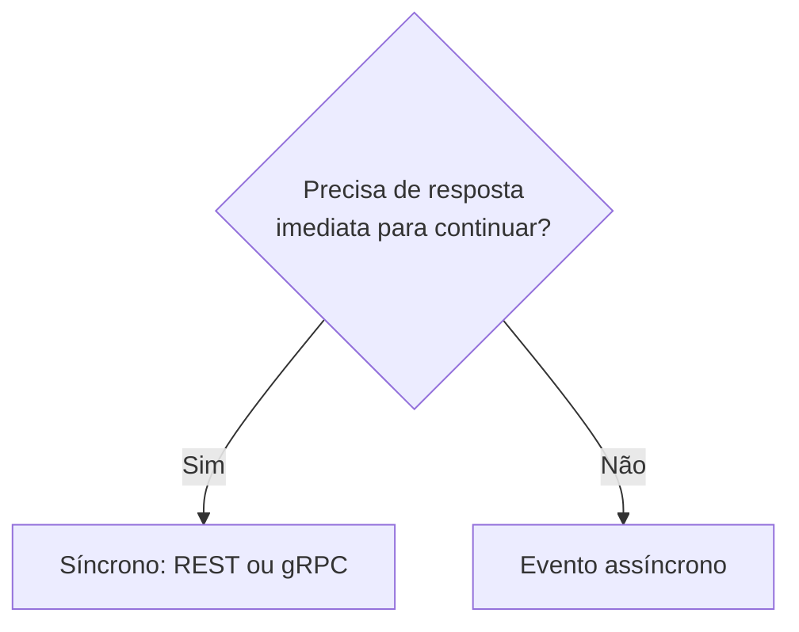
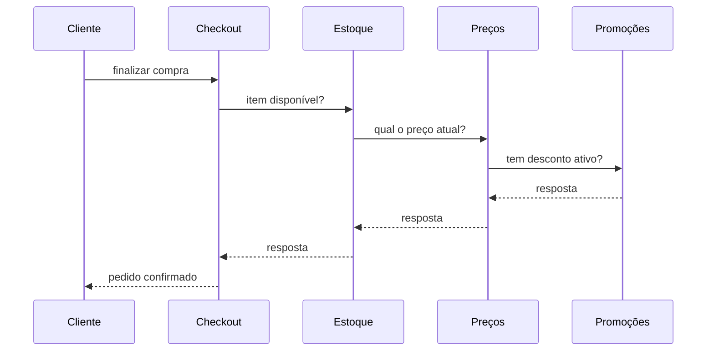

# Comunicação entre Serviços

## Comunicação síncrona e assíncrona

Uma vez que a lógica está espalhada em vários serviços, alguém precisa decidir como um serviço fala com o outro. Essa escolha tem impacto direto em latência, acoplamento e resiliência do sistema inteiro.

**Comunicação síncrona** é quando quem chama fica esperando a resposta antes de continuar. O exemplo mais comum é REST sobre HTTP: o serviço de pedidos chama o serviço de pagamento e só segue em frente depois que a resposta (aprovado ou recusado) chega. É simples de raciocinar, mas acopla os dois serviços no tempo: se o serviço de pagamento está fora do ar, o serviço de pedidos trava ou falha junto.

**Comunicação assíncrona** é quando quem chama não espera resposta imediata, normalmente publicando uma mensagem ou um evento e seguindo em frente. O consumer processa quando puder. Isso desacopla os serviços no tempo, ao custo de não ter mais uma resposta imediata de "deu certo ou não" para devolver ao usuário.

### As opções mais comuns

- **REST**: comunicação síncrona sobre HTTP, usando os verbos e status codes já vistos em [HTTP, APIs e REST](/labs/web-dev/apis/01-http-rest/). É a opção mais simples de começar e a mais interoperável, praticamente qualquer linguagem ou ferramenta sabe falar HTTP.
- **gRPC**: também síncrono, mas usa HTTP/2 e Protocol Buffers (um formato binário) em vez de JSON sobre HTTP/1.1. É mais rápido e mais compacto que REST, com contratos de tipagem forte gerados a partir de um arquivo `.proto`, mas exige mais setup e é menos amigável para debugar manualmente (não dá para simplesmente abrir no navegador ou testar com `curl` sem ferramentas extras). Costuma aparecer em comunicação interna entre serviços de alta performance, onde REST não tem espaço, e menos em APIs públicas voltadas a clientes externos.
- **Eventos e mensageria**: comunicação assíncrona, onde um serviço publica que algo aconteceu ("pedido criado", "pagamento aprovado") e outros serviços reagem a isso sem que o publicador saiba quem está ouvindo. Essa é a base de filas, tópicos e brokers como Kafka, aprofundada em [Filas e Mensageria](/labs/web-dev/mensageria/01-filas-e-mensageria/) e nas notas seguintes daquela seção.

Na prática, a maioria dos sistemas usa as duas formas ao mesmo tempo: síncrono para o que o usuário precisa ver na hora (confirmar que o pagamento passou), assíncrono para o que pode esperar alguns segundos (mandar o e-mail de confirmação, atualizar o painel de analytics).

## Como escolher entre síncrono e assíncrono

Na dúvida entre chamar um serviço direto ou publicar um evento, uma pergunta resolve a maioria dos casos: **essa interação precisa de uma resposta imediata para o fluxo continuar?**

Se o usuário está parado na tela esperando o resultado, ou se o próximo passo do código depende do que o outro serviço respondeu, a chamada é síncrona: REST ou gRPC. Confirmar se o cartão foi aprovado antes de mostrar "pedido concluído" é esse caso.

Se outros serviços só precisam ficar sabendo que algo aconteceu, e cada um reage no seu tempo, é evento. Depois do pedido criado, o serviço de e-mail manda a confirmação, o de analytics registra a venda e o de estoque reserva o produto. Nenhum desses precisa devolver nada para o serviço de pedidos.

### O anti-padrão: simular request-response pelo broker

Um erro comum é usar mensageria para fazer, na prática, uma chamada síncrona. O serviço A publica um evento num topic, cria um segundo topic só para a resposta e fica bloqueado esperando o serviço B publicar lá. Funciona, mas você acabou de reinventar RPC com mais partes móveis: dois topics em vez de uma chamada HTTP, latência maior, e um fluxo bem mais difícil de depurar quando a resposta não chega.

O broker existe para desacoplar serviços no tempo, não para esconder uma dependência síncrona atrás de uma fila. Se a comunicação é síncrona por natureza, assuma isso e use REST ou gRPC, que são feitos para esse formato. A discussão completa de quando eventos fazem sentido está em [Arquitetura Orientada a Eventos](/labs/web-dev/mensageria/02-arquitetura-orientada-a-eventos/).

O ponto de fundo é decidir pela necessidade do negócio, não pela tecnologia. "Vamos usar Kafka" não é um requisito; "o serviço de faturamento não pode travar quando o de notificação cai" é, e é isso que aponta para eventos.

## Cadeias síncronas e serviços tagarelas

Escolher comunicação síncrona serviço a serviço é uma decisão local, mas o efeito dela se acumula. Dois problemas aparecem quando esse acúmulo passa despercebido: cadeias síncronas longas demais e serviços que conversam demais entre si.

**Cadeias síncronas**: cada chamada síncrona soma sua própria latência à latência total da requisição, e soma também o próprio risco de falha ao risco da cadeia inteira. Se o serviço de checkout chama o de estoque, que chama o de preços, que chama o de promoções, a resposta final só sai depois que os quatro responderam, e se qualquer um deles cair ou ficar lento, o checkout inteiro sente.

Cada seta a mais na cadeia é mais um ponto onde a requisição pode travar, e a latência p99 de cada serviço no meio do caminho se soma na latência p99 do fluxo inteiro. Uma cadeia de quatro serviços com 100ms de p99 cada não entrega em 100ms, entrega perto de 400ms no pior caso, e um único serviço fora do ar derruba a cadeia toda.

**Serviços tagarelas (chatty services)**: o problema aparece de outro ângulo quando uma única resposta para o cliente precisa juntar dados de vários serviços diferentes. Uma tela de perfil que mostra dados pessoais, pedidos recentes e pontos de fidelidade pode exigir três, quatro chamadas separadas só para montar aquela tela, cada uma com seu próprio custo de rede. Isso costuma acontecer quando os serviços foram recortados demais (o mesmo problema de over-decomposition visto em [Decomposição de Serviços e Bounded Context](/labs/web-dev/microsservicos/02-decomposicao-e-bounded-context/)) ou quando um dado que poderia estar disponível localmente é buscado remotamente toda vez que é preciso.

Algumas formas de reduzir os dois problemas:

- **Agregação de requisições**: um BFF (Backend for Frontend) ou o próprio API Gateway junta várias chamadas internas numa resposta só para o cliente, tirando do consumidor final o custo de fazer as chamadas uma por uma. Ver [Agregação de requisições (BFF)](/labs/web-dev/escalabilidade/07-api-gateway/).
- **Cache e duplicação controlada de dados**: em vez de perguntar ao serviço vizinho toda vez, guardar uma cópia local do dado que muda pouco (o preço do produto no momento da compra, por exemplo) evita boa parte das chamadas síncronas repetidas.
- **Revisar a granularidade dos serviços**: se dois serviços quase sempre precisam ser chamados juntos para responder qualquer coisa, isso é sinal de que a fronteira entre eles ficou fina demais, e juntar os dois de volta pode ser a solução mais simples.
- **Comunicação assíncrona**: quando a resposta não precisa ser imediata, trocar a chamada síncrona por um evento remove aquele elo da cadeia. O consumidor deixa de esperar e passa a reagir quando o evento chegar.

## Service-to-Service

Comunicação síncrona entre serviços traz um conjunto de problemas específicos, que não existem dentro de um monólito, porque ali a "chamada" é uma chamada de rede real, sujeita a tudo que pode dar errado numa rede.

**Service discovery**: num monólito, chamar outra parte do sistema é só chamar uma função, o endereço dela é resolvido em tempo de compilação. Com serviços separados, cada um rodando em várias instâncias que sobem e descem (deploy, autoscaling, crash), quem chama precisa descobrir, em tempo real, quais instâncias do serviço de destino estão de pé e prontas para receber tráfego agora. Isso é resolvido por um mecanismo de service discovery (um registro central que os serviços consultam ou que atualiza automaticamente, comum em orquestradores como Kubernetes) combinado com [health checks](/labs/web-dev/escalabilidade/05-load-balancer/) para tirar da lista instâncias que pararam de responder.

**Load balancing**: depois de descobrir quais instâncias estão saudáveis, ainda é preciso decidir para qual delas mandar cada chamada, distribuindo a carga entre elas. Os algoritmos e a mecânica disso já estão cobertos em detalhe em [Load Balancer](/labs/web-dev/escalabilidade/05-load-balancer/); aqui o que importa é que, em arquitetura de microsserviços, esse balanceamento não acontece só na borda (entre cliente e sistema), ele também acontece internamente, entre um serviço e outro.

As chamadas de rede entre serviços também podem falhar de formas que uma chamada de função nunca falha: a rede pode cair, o serviço remoto pode estar lento ou sobrecarregado, uma instância pode cair no meio da resposta. Três padrões cuidam disso, e têm uma nota própria com o funcionamento completo de cada um em [Timeout, Retry, Circuit Breaker e Bulkhead](/labs/web-dev/resiliencia/01-timeout-retry-circuit-breaker-e-bulkhead/):

- **Timeouts**: definir por quanto tempo vale a pena esperar uma resposta antes de desistir, para não travar o próprio serviço esperando um vizinho que não vai responder.
- **Retries**: tentar de novo uma chamada que falhou por um motivo provavelmente temporário, com cuidado para não martelar um serviço já sobrecarregado nem duplicar efeitos colaterais.
- **Circuit breaker**: parar de tentar chamar um serviço que está claramente fora do ar, em vez de continuar gastando tempo e recursos em chamadas fadadas ao fracasso.
- **Bulkhead**: isolar os recursos usados para chamar cada dependência, para que uma dependência lenta não consuma os recursos que seriam usados para chamar as outras.

Service discovery, load balancing e esses padrões de resiliência não precisam viver no código de cada serviço: dá para delegar tudo a um [Service Mesh](/labs/web-dev/microsservicos/05-service-mesh/), uma camada de infraestrutura que intercepta a comunicação entre serviços e aplica essas regras de forma uniforme.

O fio condutor de todos esses padrões é o mesmo: numa arquitetura de microsserviços, a rede entre os serviços é uma fonte constante de falha parcial, e o design da comunicação precisa assumir isso desde o início, não tratar como exceção rara.

## Referências

- [Top 10 Anti-Padrões de Microsserviços](https://devsagaz.com.br/10-microservice-anti-patterns/) - devsagaz, pt-BR
- [The Chatty Services Anti-Pattern](https://medium.com/@subham11/the-chatty-services-anti-pattern-a6ead99b7d0b) - satyam kumar, en
