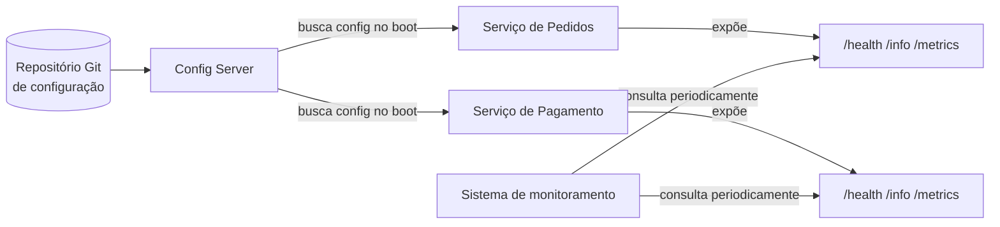

# Config Server e Endpoints Operacionais

Depois que um sistema é decomposto em vários serviços (ver [Decomposição de Serviços e Bounded Context](/labs/web-dev/microsservicos/decomposicao-e-bounded-context/)), duas necessidades operacionais aparecem rápido: como manter a configuração de dezenas de serviços, em vários ambientes, consistente e fácil de mudar; e como olhar de fora para dentro de um serviço para saber se ele está saudável, sem precisar entrar no servidor. Esta nota cobre as duas coisas.

## Configuração centralizada (Config Server)

Num monólito, configuração é simples: um arquivo (ou poucos), lido uma vez na inicialização. Quando o sistema vira dez, vinte, cinquenta serviços, cada um rodando várias instâncias, essa simplicidade desaparece. Se cada serviço guarda sua própria cópia da configuração (URL do banco, timeouts, feature flags, credenciais), mudar um valor que afeta vários serviços vira uma tarefa manual repetida serviço por serviço, com alto risco de um deles ficar desatualizado ou configurado errado sem ninguém perceber.

Um Config Server resolve isso centralizando a configuração num lugar só, servida para os outros serviços em vez de embutida em cada um deles. Em vez de cada serviço carregar um arquivo de configuração empacotado dentro da própria imagem, ele pergunta ao Config Server, na inicialização: "qual é a minha configuração para o ambiente em que estou rodando?"

Na prática, a forma mais comum de implementar isso é usando um repositório Git como fonte de verdade. Esse repositório guarda arquivos de configuração organizados por serviço e por ambiente, por exemplo:

```
config-repo/
  pedidos-service.yml
  pedidos-service-prod.yml
  pagamento-service.yml
  pagamento-service-dev.yml
```

O Config Server é uma aplicação que lê esse repositório e expõe uma API HTTP em cima dele. Cada serviço, ao subir, informa seu nome e o ambiente ativo (`dev`, `test`, `prod`) e recebe de volta a configuração já resolvida (o arquivo comum do serviço, com os valores do ambiente específico sobrescrevendo o que for necessário).

Isso traz algumas vantagens diretas:

- **Um lugar só para mudar**: alterar uma configuração é editar e commitar no repositório de configuração, não caçar arquivos espalhados em dezenas de repositórios de código.
- **Histórico e auditoria de graça**: como a configuração vive num repositório Git, cada mudança já tem autor, data e mensagem de commit, e reverter uma configuração ruim é um `git revert`.
- **Consistência entre ambientes**: fica explícito, em arquivos separados, o que muda entre dev, test e prod, em vez de depender de alguém lembrar de replicar manualmente um ajuste em cada ambiente.

**Refresh em runtime**: nem toda configuração exige reiniciar o serviço para valer. Algumas plataformas de Config Server permitem que uma instância já rodando busque a configuração atualizada sem reiniciar, através de um endpoint de refresh que o próprio serviço expõe (parte da mesma família de endpoints operacionais discutida a seguir), ou através de um evento publicado que avisa todas as instâncias para recarregar a configuração ao mesmo tempo. Isso é especialmente útil para valores como feature flags, limites de rate limiting ou nível de log, coisas que faz sentido ajustar em produção sem passar por um ciclo completo de deploy. Nem toda configuração é segura para trocar em runtime (mudar o tamanho de um pool de conexões com o banco enquanto ele está em uso, por exemplo, pode exigir cuidado), então cabe ao serviço decidir explicitamente quais valores aceitam esse tipo de atualização a quente.



## Endpoints operacionais (Actuator)

Uma vez que um serviço está no ar, alguém precisa conseguir responder perguntas básicas sobre ele sem entrar no servidor: está funcionando? Está lento? Qual versão está rodando agora? Endpoints operacionais (o termo "Actuator" vem do Spring Boot, mas a ideia é genérica e aparece em outros frameworks com outros nomes) são uma API HTTP separada da API de negócio do serviço, dedicada só a expor esse tipo de informação interna.

A ideia é padronizar essa exposição: em vez de cada time inventar sua própria forma de checar se o serviço está saudável, todo serviço passa a expor os mesmos endpoints, no mesmo formato, e ferramentas de monitoramento, orquestradores e load balancers podem consumir isso de forma uniforme, sem código específico para cada serviço.

Alguns dos endpoints mais comuns:

- **`/health`**: retorna se o serviço está saudável (normalmente algo simples como `UP` ou `DOWN`), muitas vezes detalhando também a saúde das dependências que ele checa (conexão com o banco, com o broker de mensagens, espaço em disco). É o endpoint que um load balancer usa para decidir se deve continuar mandando tráfego para uma instância (ver [Load Balancer](/labs/web-dev/escalabilidade/load-balancer/)), e que um orquestrador como Kubernetes usa para decidir se deve reiniciar uma instância travada (liveness) ou simplesmente parar de mandar tráfego para ela até que fique pronta de novo (readiness), sem esses dois sinais confundidos como se fossem a mesma coisa.
- **`/info`**: metadados estáticos sobre o build em execução, como versão, hash do commit e data do build. Parece pouco, mas em um incidente de produção, saber com certeza "qual versão está realmente rodando agora nessa instância" costuma economizar um bom tempo de investigação.
- **`/metrics`**: dados numéricos operacionais do serviço, como contagem de requisições, latência, uso de memória. É normalmente esse endpoint que uma ferramenta de coleta de métricas consulta periodicamente para alimentar dashboards e alertas, um aprofundamento de como usar essas métricas está em [Logs, Metrics e Traces](/labs/web-dev/observabilidade/logs-metrics-e-traces/).
- **`/env`**: mostra as variáveis de ambiente e propriedades de configuração ativas na instância. Extremamente útil para debugar "por que essa instância está se comportando diferente das outras", e, como fica claro na próxima seção, extremamente perigoso se deixado aberto.

Esses endpoints não substituem a API de negócio do serviço, eles são uma preocupação separada, e por isso muitas vezes rodam numa porta diferente da porta da API principal, justamente para poderem ser isolados de forma independente na rede.

## Segurança desses endpoints

Endpoints operacionais existem para expor informação interna, e é exatamente isso que os torna perigosos se ficarem abertos para qualquer um. Um `/env` público pode vazar string de conexão com o banco, credenciais e nomes de hosts internos. Um `/health` detalhado pode revelar quais dependências o serviço usa, informação valiosa para quem estiver mapeando o sistema com más intenções. Por isso, alguns cuidados são obrigatórios, não opcionais:

- **Expor só o necessário**: nem todo endpoint operacional precisa estar ligado. Avalie caso a caso: `/health` num formato resumido pode fazer sentido ficar acessível externamente (para health checks de infraestrutura), enquanto `/env` e endpoints que exponham dumps de memória ou threads deveriam ficar restritos ao ambiente interno.
- **Restringir acesso por papel/IP**: endpoints operacionais deveriam exigir autenticação própria (contas de serviço usadas só por ferramentas de monitoramento, não credenciais de usuário comum) e, quando possível, ficar limitados a faixas de IP internas ou a uma rede privada (VPN, service mesh), nunca acessíveis livremente pela internet pública.
- **Nunca deixar endpoints operacionais publicamente acessíveis**: isso não é exagero de cautela, é um tipo de falha de configuração comum o bastante para aparecer regularmente em varreduras de segurança e relatórios de pentest: serviços em produção com `/env` ou endpoints de debug abertos ao público, vazando segredos que deveriam estar protegidos. Rodar os endpoints operacionais numa porta separada da API pública, como mencionado antes, ajuda bastante a evitar esse tipo de exposição por descuido.
