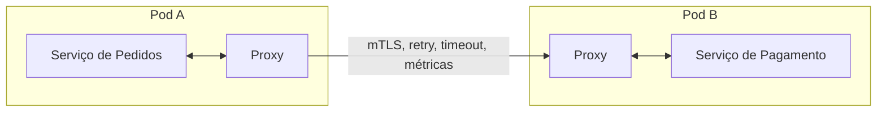
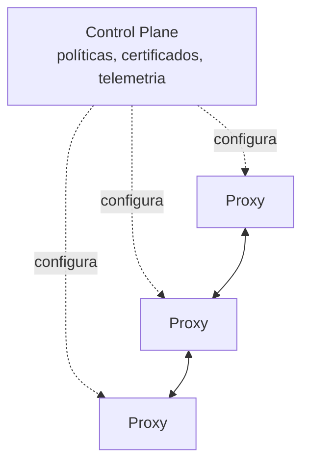
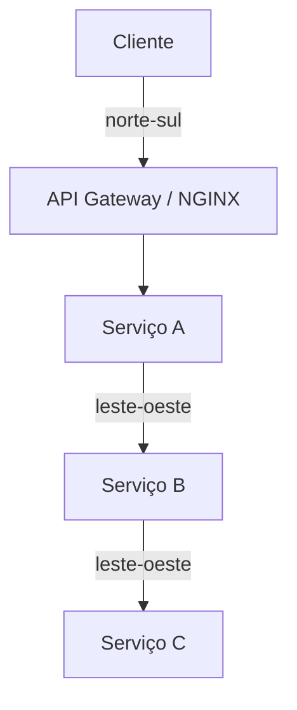

# Service Mesh

A nota de [Comunicação entre Serviços](/labs/web-dev/microsservicos/03-comunicacao-entre-servicos/) mostra o que uma chamada de rede entre dois serviços exige: descobrir onde está o destino, balancear a carga entre as instâncias, aplicar timeout, tentar de novo quando falha, parar de tentar quando o outro lado está fora do ar. A de [Timeout, Retry, Circuit Breaker e Bulkhead](/labs/web-dev/resiliencia/01-timeout-retry-circuit-breaker-e-bulkhead/) detalha cada um desses padrões.

A pergunta que fica é: onde esse código roda? Service mesh é uma das respostas.

## O problema que o service mesh resolve

Sem uma camada dedicada, cada serviço carrega no próprio código a lógica de service discovery, load balancing, retry, timeout, circuit breaker, TLS, coleta de métricas e traces. Isso traz alguns incômodos:

- Num sistema poliglota (um serviço em Java, outro em Go, outro em Python), é uma biblioteca por linguagem para configurar, atualizar e manter em sintonia.
- As regras de resiliência e de segurança ficam espalhadas pelo código de negócio de dezenas de serviços, cada time configurando do seu jeito.
- Mudar uma política ("o timeout para o serviço de pagamento agora é 2s") vira um deploy em todo mundo que chama aquele serviço.

A proposta do service mesh é tirar tudo isso do código da aplicação e colocar numa camada de infraestrutura que trata a comunicação entre serviços de forma uniforme.

## O modelo sidecar

A forma clássica de implementar um mesh é o sidecar: um proxy que roda ao lado de cada instância do serviço. No Kubernetes, ele fica no mesmo pod, então compartilha rede com a aplicação.

Todo o tráfego que entra e sai do serviço passa por esse proxy. A aplicação só precisa falar com `localhost`, e o proxy cuida do resto: resolve para qual instância do destino mandar, aplica o timeout e o retry configurados, cifra a conexão, registra a métrica.

O proxy mais usado nesse papel é o Envoy. Ele é o mesmo componente que aparece dentro de vários API Gateways, aqui operando na comunicação interna.

## Data plane e control plane

Um mesh se divide em duas partes:

O data plane é o conjunto de proxies que efetivamente movem o tráfego. São eles que interceptam cada chamada, aplicam as regras e encaminham o pacote.

O control plane é o cérebro: um componente central que configura e coordena todos os proxies. É ele que distribui as políticas de tráfego, emite e rotaciona os certificados usados no mTLS, e junta a telemetria que os proxies coletam.

As combinações mais comuns são o Istio como control plane usando Envoy no data plane, e o Linkerd, que traz control plane e um proxy próprio escrito em Rust (mais leve que o Envoy, com menos funcionalidades).

## Modo sidecarless (ambient)

Um sidecar por pod tem um custo: cada aplicação ganha um proxy ao lado consumindo CPU e memória, e atualizar o mesh significa reiniciar todos os pods.

O modo ambient do Istio quebra isso. Em vez de um proxy completo em cada pod, a função é dividida em componentes compartilhados:

- Um proxy leve de camada 4 rodando uma vez por nó (o ztunnel), que cuida do mTLS e do roteamento básico.
- Proxies de camada 7 por namespace (os waypoints), acionados só quando você precisa de recursos mais avançados como retry e roteamento por conteúdo.

O ganho é menos consumo de recursos e menos latência, além de conseguir atualizar o mesh sem mexer nas aplicações. Ficou pronto para produção em 2026. Ainda assim, o modelo mental do sidecar continua sendo a melhor forma de entender o que um mesh faz: um proxy no caminho de cada chamada.

## O que o mesh entrega

Com os proxies no lugar e o control plane configurado, o mesh passa a oferecer três blocos de funcionalidade sem que a aplicação escreva código para isso:

Controle de tráfego: load balancing entre as instâncias, retry, timeout, circuit breaking, e traffic splitting (mandar 5% do tráfego para a versão nova de um serviço num deploy canário, por exemplo).

Segurança: mTLS automático entre os serviços, ou seja, toda comunicação interna passa a ser cifrada e autenticada nos dois sentidos sem ninguém configurar certificado na mão. Em cima disso dá para escrever políticas de autorização (o serviço de catálogo pode chamar o de estoque, mas não o de pagamento).

Observabilidade: como todo pacote passa pelo proxy, o mesh gera métricas, traces e logs de cada chamada entre serviços de graça, sem instrumentar o código.

## As três camadas onde a resiliência pode viver

Os padrões de resiliência não precisam morar no mesh. Existem três lugares possíveis, e eles não são excludentes:

Biblioteca na aplicação: um pacote como o Resilience4j (no ecossistema Spring; o Hystrix, hoje descontinuado, fazia esse papel antes) implementa circuit breaker, retry e bulkhead dentro do processo. Dá o controle mais fino, porque o código sabe o contexto de negócio da chamada, mas é uma implementação por linguagem e mais código para manter.

Service mesh: as mesmas políticas, só que fora do código e válidas para qualquer linguagem. O preço é operar mais infraestrutura.

Infraestrutura de borda: um NGINX ou um API Gateway aplica timeout, retry e rate limiting na entrada do sistema e em parte do tráfego interno, com menos granularidade por dependência.

Na prática, um sistema maduro costuma combinar as três: gateway na borda, mesh entre os serviços, e ainda alguma lógica de fallback na aplicação para decidir o que responder quando uma dependência não está no ar.

## Service mesh vs API Gateway

É fácil confundir os dois, porque ambos são proxies que aplicam políticas de tráfego. A diferença está em qual tráfego cada um cuida:

- O [API Gateway](/labs/web-dev/escalabilidade/07-api-gateway/) fica no tráfego norte-sul: entre o cliente externo (navegador, app) e o sistema.
- O service mesh fica no tráfego leste-oeste: entre um serviço e outro, dentro do sistema.

Eles se complementam e normalmente coexistem: o gateway é a porta de entrada, o mesh organiza a conversa interna.

## O custo do service mesh

Service mesh não é escolha default. Ele cobra:

- Latência e recursos: cada chamada ganha um salto de proxy a mais, e cada proxy consome CPU e memória. Numa malha grande isso soma.
- Complexidade operacional: o mesh é mais um sistema distribuído para entender, monitorar e depurar. Quando algo dá errado, agora existe a dúvida "é a aplicação ou é o mesh?".

Vale a pena quando há muitos serviços, várias linguagens, e uma exigência real de mTLS e telemetria uniforme em toda a comunicação interna. Para poucos serviços numa única linguagem, uma biblioteca de resiliência resolve o mesmo problema com bem menos peça móvel.
