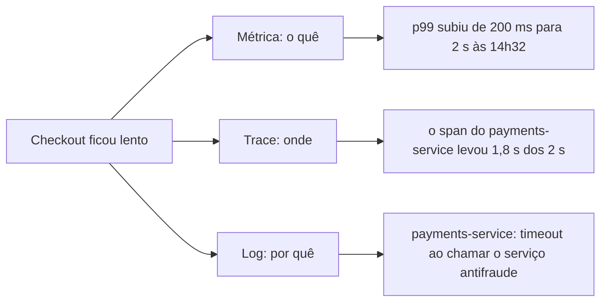

# Observabilidade: Logs, Metrics e Traces

Observabilidade é a capacidade de entender o que está acontecendo dentro de um sistema só olhando para o que ele expõe de fora, sem precisar entrar no código e ficar adivinhando. Quanto mais distribuído o sistema fica, mais essa capacidade deixa de ser um luxo: com um monolito rodando numa máquina só, dá para debugar olhando um único log. Com vinte microsserviços trocando mensagens entre si, uma requisição lenta pode ter passado por oito serviços diferentes antes de voltar para o usuário, e sem observabilidade não tem como saber qual deles é o culpado.

Os três pilares clássicos de observabilidade são logs, metrics e traces. Cada um responde a uma pergunta diferente, e nenhum sozinho conta a história inteira.

## Logs

Logs são registros de eventos que aconteceram em um momento específico: uma requisição chegou, um pagamento falhou, uma exceção foi lançada. São o pilar mais granular e mais próximo do código, o equivalente a um diário de bordo do sistema.

Um bom log de evento normalmente carrega:

- **O que aconteceu**: a ação ou o evento em si ("usuário criou pedido", "conexão com o banco recusada")
- **Erros**: stack trace, mensagem de erro, código de falha, tudo que ajuda a entender por que algo quebrou
- **Contexto**: quem fez a requisição, qual serviço gerou o log, em qual ambiente, com qual ID de rastreamento (mais sobre isso na seção de correlação)

O problema de logs tradicionais é que eles costumam ser texto solto, do tipo:

```
[2026-08-23 14:32:01] ERROR: falha ao processar pedido 4821 para usuario 991
```

Isso é legível para um humano lendo um arquivo, mas péssimo para uma ferramenta que precisa buscar, filtrar e agregar milhões de linhas por dia. É aí que entra o **structured logging**: em vez de uma frase, o log vira um objeto estruturado, geralmente JSON:

```json
{
  "timestamp": "2026-08-23T14:32:01Z",
  "level": "error",
  "message": "falha ao processar pedido",
  "order_id": 4821,
  "user_id": 991,
  "service": "orders-api",
  "trace_id": "7f3a9c1e"
}
```

Com log estruturado, dá para perguntar coisas como "quantos erros o `orders-api` teve na última hora, agrupados por `user_id`" direto numa ferramenta de busca, sem precisar de regex fazendo malabarismo em cima de texto livre.

## Metrics

Enquanto um log conta o que aconteceu num instante específico, uma métrica é um número agregado ao longo do tempo: quantas requisições por segundo, qual a latência média, quanta memória está em uso agora. Métricas são baratas de armazenar (comparado a logs) e ótimas para dashboards e alertas, porque respondem "como o sistema está se comportando" sem precisar guardar cada evento individual.

As métricas mais comuns de monitorar em um serviço:

- **CPU** e **memória**: uso de recursos da máquina ou do container, sinal de que algo pode estar prestes a saturar
- **QPS** (queries/requests por segundo): quanto tráfego o serviço está recebendo
- **Latência**: quanto tempo as requisições estão levando (normalmente em percentis, veja a nota de [Latência, Throughput e Performance](/labs/web-dev/system-design/04-latencia-e-performance/) para entender por que p99 importa mais que a média)
- **Error rate**: porcentagem de requisições que terminam em erro
- **Saturation**: o quão "cheio" um recurso está em relação à sua capacidade máxima, por exemplo uma fila que está quase estourando o buffer, ou um pool de conexões quase no limite

Existe um agrupamento bem conhecido chamado **método RED**, usado especificamente para serviços: **R**ate (taxa de requisições), **E**rrors (taxa de erros) e **Duration** (latência). Se essas três métricas estão saudáveis, o serviço provavelmente está saudável. Para recursos de infraestrutura (CPU, disco, memória) existe o equivalente **método USE**: **U**tilization, **S**aturation, **E**rrors. Não precisa decorar os nomes, mas vale saber que esse é o raciocínio por trás de qualquer dashboard bem feito: poucas métricas, escolhidas para responder "está tudo bem ou não" rapidamente.

## Traces

Logs e métricas contam partes da história, mas nenhum dos dois mostra o caminho completo de uma única requisição passando por vários serviços. É para isso que serve o **distributed tracing**.

Um trace representa a jornada inteira de uma requisição, do primeiro serviço que a recebeu até o último que respondeu. Cada trecho dessa jornada, o tempo que um serviço específico gastou processando aquela requisição, é chamado de **span**. Um trace é literalmente uma árvore de spans.

```mermaid
gantt
    dateFormat X
    axisFormat %L ms
    title Trace de uma requisição (spans ao longo do tempo)
    section API Gateway
    span gateway :0, 180
    section Orders Service
    span orders :20, 120
    section Payments Service
    span payments :40, 90
    section Database
    span query pedidos :50, 70
```



Cada span carrega metadados: qual serviço executou aquele trecho, quanto tempo levou, se terminou em erro, e a que trace ele pertence. Juntando os spans de todos os serviços por onde a requisição passou, dá para reconstruir o caminho inteiro e enxergar exatamente onde o tempo foi gasto.

Para isso funcionar, o **trace ID** (um identificador único gerado no primeiro serviço que recebe a requisição) precisa ser propagado adiante em cada chamada seguinte, normalmente indo dentro de um header HTTP como `traceparent`. Sem essa propagação de contexto, cada serviço geraria spans isolados, sem nenhuma forma de juntá-los depois.

## Mapa das diferenças

As três seções acima explicaram cada pilar por conta própria. Colocando os três lado a lado, dá para ver que eles não são versões concorrentes da mesma coisa, cada um responde a uma pergunta que os outros dois não conseguem responder.

|                       | Logs                                                      | Métricas                                             | Traces                                                               |
| --------------------- | --------------------------------------------------------- | ---------------------------------------------------- | -------------------------------------------------------------------- |
| Pergunta que responde | O que aconteceu neste ponto?                              | Como o sistema está se comportando?                  | Por onde a requisição passou?                                        |
| Formato do dado       | evento com timestamp, em texto ou JSON                    | número agregado numa série temporal                  | árvore de spans, cada um com seu tempo                               |
| Granularidade         | cada evento, um por um                                    | agregado por janela de tempo                         | uma requisição inteira, span a span                                  |
| Volume e custo        | alto, cresce junto com o tráfego                          | baixo e quase constante                              | médio, quase sempre amostrado                                        |
| Bom para              | ver o detalhe exato de um erro                            | perceber tendência, alertar, ter o panorama de saúde | descobrir onde o tempo foi gasto numa requisição                     |
| Ponto cego            | não dá visão agregada nem mostra o caminho entre serviços | não diz o que causou a mudança                       | não serve para agregar comportamento nem para o detalhe fino do erro |

Um jeito rápido de lembrar: **a métrica avisa que algo quebrou, o trace mostra onde quebrou, o log explica por que quebrou**. É a mesma requisição vista de três ângulos.



Esse encadeamento (alerta de métrica, depois trace para achar o span, depois log para a causa) é o fluxo de investigação típico, detalhado na seção "Observabilidade distribuída", mais abaixo.

O erro comum é tratar os três como alternativas ("para que trace se já tenho log?") e acabar com só um deles. Cada pilar sozinho tem um ponto cego, e os pontos cegos dos três não se sobrepõem: é por isso que a resposta certa é ter os três, ligados pelo mesmo identificador de correlação.

## Correlação

Propagar o trace ID entre serviços é um caso específico de um problema mais geral: como conectar registros que, sozinhos, estão espalhados em lugares diferentes (logs de serviços diferentes, métricas, spans de trace) mas pertencem à mesma operação.

A solução é sempre a mesma ideia: gerar um identificador único no início da operação e carregá-lo em tudo que for produzido a partir dali.

- **Correlation ID**: termo genérico para qualquer identificador usado para amarrar eventos relacionados, mesmo os que não fazem parte de um trace formal (por exemplo, correlacionar todas as mensagens de uma fila que vieram do mesmo pedido)
- **Trace ID**: o correlation ID específico do sistema de tracing, presente em todos os spans de uma mesma requisição
- **Request ID**: identificador de uma requisição HTTP específica, às vezes igual ao trace ID, às vezes um nível mais granular dentro dele (uma requisição pode gerar várias chamadas internas, cada uma com seu próprio request ID, todas sob o mesmo trace ID)

Na prática, a regra é simples: todo log gerado durante o processamento de uma requisição deveria incluir o trace ID daquela requisição. Isso é o que permite pular de "vi esse erro no log do `payments-service`" para "consigo ver o trace inteiro e entender que esse erro começou porque o `orders-service` mandou um payload incompleto".

## Observabilidade distribuída

Juntando os três pilares com a correlação entre eles, o ganho real aparece quando algo dá errado num sistema com muitos serviços.

Imagine uma requisição de checkout que passa por gateway, `orders-service`, `payments-service` e banco de dados, e o usuário reclama que ficou lenta. Sem observabilidade, o processo seria abrir manualmente o log de cada serviço, tentando bater o horário aproximado, torcendo para achar a requisição certa em meio a milhares de outras. Com tracing distribuído, o caminho é direto:

1. Pega o trace ID da requisição (pelo próprio usuário, por um alerta, ou buscando por latência alta)
2. Abre o trace e vê visualmente quanto tempo cada span levou
3. Identifica o span mais longo, o gargalo real, sem precisar adivinhar

Isso resolve os três problemas que mais aparecem em sistemas distribuídos:

- **Rastrear uma requisição entre microsserviços**: seguir o caminho completo, mesmo que ele atravesse cinco ou dez serviços diferentes
- **Encontrar gargalos**: ver exatamente qual span consumiu a maior fatia do tempo total, em vez de suspeitar de todo mundo
- **Identificar o serviço causador da falha**: quando um erro aparece no fim da cadeia, o trace mostra se ele nasceu ali ou se é reflexo de uma falha em um serviço anterior

Vale reforçar que os três pilares se complementam, não competem entre si. Métricas avisam que algo está errado (latência subiu, error rate disparou). Traces mostram onde, apontando o span ou o serviço problemático. Logs explicam por quê, com o detalhe do erro específico que aconteceu naquele ponto. Um sistema observável de verdade tem os três funcionando juntos e conectados pelo mesmo identificador de correlação.

## Referências

- [Os 3 pilares da observabilidade: logs, métricas e traces unificados](https://www.elastic.co/pt/blog/3-pillars-of-observability) - Elastic, pt-BR
- [Três Pilares da Observabilidade](https://dev.to/ezziomoreira/tres-pilares-da-observabilidade-1p6d) - Ézzio Moreira (DEV Community), pt-BR
- [Signals (Logs, Metrics, Traces)](https://opentelemetry.io/docs/concepts/signals/) - documentação oficial do OpenTelemetry, inglês
- [Three pillars of observability: Logs, metrics and traces](https://www.ibm.com/think/insights/observability-pillars) - IBM, inglês
