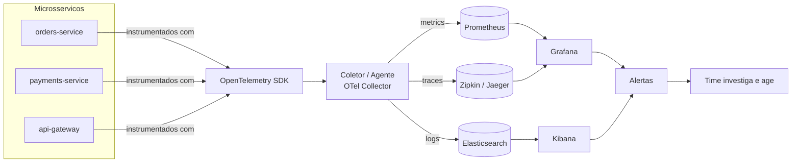

# Ferramentas de Observabilidade

A nota anterior ([Logs, Metrics e Traces](/labs/web-dev/observabilidade/logs-metrics-e-traces/)) explica os três pilares de observabilidade do ponto de vista conceitual: o que cada um responde e por que eles se complementam. Esta nota é sobre o outro lado da moeda: quais ferramentas de verdade coletam, armazenam, visualizam e alertam em cima desses dados no dia a dia de um time.

Nenhuma dessas ferramentas faz observabilidade sozinha. Elas são peças de um pipeline, e entender o pipeline ajuda a entender por que existe tanta ferramenta diferente em vez de uma única "ferramenta de observabilidade" que resolve tudo.

## Pipeline de observabilidade

Todo sistema de observabilidade, não importa a stack escolhida, segue mais ou menos o mesmo fluxo:

Em texto, o caminho é:

1. **Instrumentação**: o código do serviço gera logs, métricas e spans de trace
2. **Coletores/agentes**: processos que recebem esses dados, processam e encaminham para onde devem ser armazenados
3. **Armazenamento**: cada tipo de dado vai para um sistema especializado nele (métricas em série temporal, logs em índices de busca, traces em armazenamento de spans)
4. **Visualização/alertas/troubleshooting**: dashboards, buscas e regras de alerta transformam os dados brutos em algo que um humano consegue agir em cima

Resumindo em uma frase: **coletar → armazenar → visualizar → alertar → agir**. Cada ferramenta que vem a seguir ocupa um ponto específico desse fluxo, quase nunca o fluxo inteiro.

## Tracing distribuído: Zipkin

Zipkin é um sistema de distributed tracing, criado originalmente no Twitter e hoje um dos mais usados no ecossistema Java/Spring. Ele existe para resolver exatamente o problema descrito na nota anterior: rastrear uma requisição que atravessa vários serviços e descobrir onde o tempo foi gasto.

Na prática, cada serviço reporta seus spans para o Zipkin, que junta tudo pelo trace ID e monta a árvore completa. A interface mostra essa árvore visualmente, com a duração de cada span lado a lado, o que torna trivial responder perguntas como:

- Qual serviço é o gargalo dessa requisição lenta?
- Essa chamada ao banco está demorando mais do que o normal?
- Esse erro começou no `payments-service` ou veio de uma falha em cascata de outro serviço?

Zipkin também gera um mapa de dependências entre serviços a partir dos traces coletados, o que é útil para enxergar a topologia real do sistema (não a que está no diagrama de arquitetura, mas a que está de fato acontecendo em produção).

Existe uma alternativa muito parecida chamada Jaeger, criada pela Uber, que resolve o mesmo problema com uma proposta de arquitetura parecida. Na prática, qual das duas usar importa menos do que garantir que os serviços emitem traces em um formato compatível, e é exatamente aí que entra o OpenTelemetry, mais adiante nesta nota.

## Métricas: Prometheus

Prometheus é o toolkit de monitoramento e alertas mais usado no ecossistema de containers e Kubernetes. Ele trabalha com métricas de série temporal: cada métrica é uma sequência de valores numéricos ao longo do tempo, como "requisições por segundo do `orders-service`" ou "uso de memória do container X".

Duas características definem o Prometheus:

- **Modelo pull-based**: em vez dos serviços empurrarem métricas para o Prometheus, é o Prometheus quem periodicamente "puxa" (faz scrape) as métricas expostas por cada serviço em um endpoint HTTP (normalmente `/metrics`). Isso simplifica a configuração dos serviços, que só precisam expor um endpoint, sem se preocupar em saber para onde enviar dados
- **PromQL**: a linguagem de consulta do Prometheus, feita para trabalhar com séries temporais. Com PromQL dá para calcular taxas, médias móveis, percentis e agregações por label, tudo com uma sintaxe compacta

Prometheus também tem seu próprio sistema de regras de alerta: você define uma condição em PromQL (por exemplo, "error rate acima de 5% nos últimos 5 minutos") e, quando ela é verdadeira, o Prometheus dispara um alerta, geralmente encaminhado para um componente separado chamado Alertmanager, que cuida de agrupar, deduplicar e rotear as notificações (Slack, e-mail, PagerDuty etc).

## Visualização: Grafana

Grafana é uma plataforma de visualização e analytics. Ele não coleta nem armazena dados por conta própria, o papel dele é ler dados de outras fontes e transformar isso em dashboards.

O que torna o Grafana tão comum é justamente não ser amarrado a uma única fonte: ele conecta em Prometheus, Elasticsearch, bancos de dados relacionais, sistemas de tracing e dezenas de outras fontes ao mesmo tempo, tudo no mesmo dashboard se for o caso. Isso é útil porque um time raramente quer olhar só métricas ou só logs, quer uma visão combinada.

Funcionalidades centrais do Grafana:

- **Dashboards**: painéis com gráficos, tabelas e indicadores, organizados visualmente para dar uma visão rápida da saúde do sistema
- **Múltiplas fontes de dados**: o mesmo dashboard pode misturar um gráfico vindo do Prometheus com uma tabela vinda do Elasticsearch
- **Monitoramento em tempo real**: os painéis atualizam automaticamente, então um dashboard de Grafana costuma ficar aberto em uma TV na sala do time de plantão
- **Alertas e anotações**: o Grafana também consegue disparar alertas em cima dos dados que ele visualiza, e permite marcar eventos importantes (um deploy, um incidente) diretamente na linha do tempo dos gráficos, o que ajuda a correlacionar "o gráfico mudou de comportamento bem na hora desse deploy"

## Logs centralizados: ELK Stack

ELK é o acrônimo de três ferramentas que juntas resolvem o problema de logs centralizados: coletar logs de dezenas de serviços espalhados e conseguir buscar entre eles como se fosse um lugar só.

- **Elasticsearch**: o motor de busca e armazenamento. Ele indexa os logs (estruturados, como vimos na nota anterior) de um jeito que permite buscas rápidas mesmo em volumes enormes de dados, incluindo busca por texto livre, filtros por campo e agregações
- **Logstash**: o componente de coleta e processamento. Ele recebe logs de várias fontes, aplica transformações (parsear um formato específico, extrair campos, enriquecer com metadados) e envia o resultado para o Elasticsearch
- **Kibana**: a interface de visualização e exploração em cima dos dados do Elasticsearch. É onde alguém do time realmente entra para buscar "todos os erros do `orders-service` na última hora com `user_id` tal", ver gráficos de volume de logs por serviço, ou montar um dashboard próprio de logs

É comum ver o "L" de Logstash substituído por outras ferramentas mais leves de coleta, como o Filebeat (parte da mesma família Elastic, focado só em enviar logs sem processamento pesado), formando variações do mesmo stack. A ideia central não muda: um componente coleta, outro armazena e indexa, outro visualiza.

## Padrão aberto: OpenTelemetry

Até aqui, cada ferramenta resolve uma parte do problema, mas isso levanta uma pergunta prática: como instrumentar o código do serviço sem amarrar essa instrumentação a um fornecedor específico? Se o time decidir trocar o Zipkin pelo Jaeger, ou o ELK por outra solução de logs, o código da aplicação precisaria mudar junto?

É esse problema que o OpenTelemetry resolve. Ele é um padrão aberto e vendor-neutral para observabilidade, mantido pela Cloud Native Computing Foundation (a mesma organização por trás do Kubernetes). A ideia central: o código da aplicação é instrumentado uma única vez, usando as bibliotecas do OpenTelemetry, e o destino dos dados (qual backend de métricas, qual sistema de tracing, qual armazenamento de logs) é uma questão de configuração, não de código.

Pontos importantes do OpenTelemetry:

- **Coleta os três pilares**: logs, métricas e traces em um único padrão, com uma API e um formato de dados comuns entre eles
- **Auto-instrumentação**: para muitas linguagens e frameworks, o OpenTelemetry consegue instrumentar automaticamente chamadas HTTP, consultas a banco de dados e outras operações comuns, sem exigir que o desenvolvedor escreva código de instrumentação manual em cada ponto
- **Funciona com múltiplos backends**: os dados coletados podem ser exportados para Prometheus, Zipkin, Jaeger, Elasticsearch ou qualquer outro backend compatível, muitas vezes ao mesmo tempo, através do OpenTelemetry Collector (um processo intermediário que recebe os dados instrumentados e decide para onde encaminhar cada tipo)

Na prática, o OpenTelemetry virou a camada de instrumentação padrão, e as ferramentas de armazenamento e visualização (Prometheus, Zipkin, ELK, Grafana) viraram os backends que recebem os dados já no formato que o OpenTelemetry produz.

## Como as ferramentas se combinam

Juntando tudo, um setup comum de observabilidade em um sistema de microsserviços funciona assim:

1. Cada serviço é instrumentado com o SDK do OpenTelemetry, gerando logs estruturados, métricas e spans de trace de forma consistente entre todos os serviços
2. Os dados saem do serviço e passam por um OpenTelemetry Collector, que roteia cada tipo de dado para o backend certo: métricas para o Prometheus, traces para o Zipkin (ou Jaeger), logs para o Elasticsearch (via Logstash ou diretamente)
3. Grafana se conecta ao Prometheus e ao backend de tracing para montar dashboards de métricas e visualizar traces; Kibana se conecta ao Elasticsearch para explorar logs
4. Regras de alerta, tanto no Prometheus quanto no Grafana, monitoram os limites definidos (error rate, latência p99, saturação de recursos) e disparam notificações quando algo sai do esperado
5. Quando um alerta dispara, o time usa o trace ID correlacionado entre logs, métricas e traces (como visto na nota anterior) para ir do sintoma até a causa raiz rapidamente

Nenhuma peça desse conjunto é obrigatória exatamente como descrita, dá para trocar Zipkin por Jaeger, ELK por outra solução de logs, ou usar um backend gerenciado (Datadog, New Relic, Honeycomb) no lugar do stack open source inteiro. O que se mantém é o formato do pipeline: instrumentação padronizada, coleta centralizada, armazenamento especializado por tipo de dado, e uma camada de visualização e alerta em cima de tudo.

## Boas práticas

- **Instrumentar cedo e de forma consistente**: adicionar observabilidade depois que o sistema já está em produção e pegando fogo é sempre mais difícil do que instrumentar desde o início, com um padrão comum entre todos os serviços
- **Usar correlation IDs**: garantir que o trace ID (ou outro identificador de correlação) esteja presente em todo log, métrica com contexto e span gerado durante uma requisição, para que dê para pular de uma ferramenta para outra sem perder o fio da meada
- **Definir métricas com labels significativos**: uma métrica sem os labels certos (serviço, endpoint, código de status) é praticamente inútil para investigação, mas labels demais também têm custo (cardinalidade alta deixa o armazenamento caro e lento)
- **Criar alertas acionáveis**: todo alerta deveria significar "alguém precisa fazer alguma coisa agora". Alertas para situações que não exigem ação viram ruído, e ruído demais leva à fadiga de alerta, o ponto em que o time começa a ignorar alertas porque a maioria é falso positivo
- **Manter políticas de retenção**: logs e traces em volume alto ficam caros rápido. Definir por quanto tempo cada tipo de dado precisa ficar disponível (dias para debugging ativo, meses para auditoria, por exemplo) evita pagar para guardar dado que ninguém vai mais consultar
- **Seguir padrões abertos**: instrumentar com OpenTelemetry em vez de amarrar o código a uma ferramenta específica mantém a porta aberta para trocar de backend sem reescrever a instrumentação inteira
