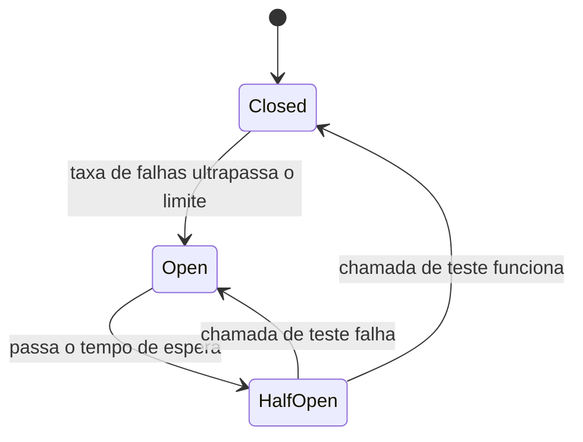

# Timeout, Retry, Circuit Breaker e Bulkhead

Em um sistema distribuído, toda chamada entre dois serviços pode falhar: a rede pode cair, o serviço do outro lado pode estar lento, sobrecarregado ou fora do ar. Os padrões desta nota existem para lidar com esse tipo de falha sem deixar o problema de um serviço derrubar todos os outros.

Esses padrões podem ser implementados em três lugares: numa biblioteca dentro da aplicação (como o Resilience4j no ecossistema Spring), numa camada de infraestrutura entre os serviços (um [Service Mesh](/labs/web-dev/microsservicos/05-service-mesh/)), ou na borda do sistema (um API Gateway ou NGINX). O funcionamento de cada padrão é o mesmo nos três casos, muda só onde o código roda.

## Timeout

Timeout é o tempo máximo que você espera por uma resposta antes de desistir. Sem timeout, uma chamada para um serviço travado pode prender a thread (ou a conexão) que fez a chamada indefinidamente, e isso se espalha: se o serviço A chama o serviço B sem timeout, e B está travado, A também trava. Com dezenas de requisições acumulando, A fica sem recursos livres e para de responder, mesmo sem nenhum bug no próprio código de A.

Existem alguns tipos de timeout, cada um cobrindo uma fase diferente da comunicação:

- **Connection timeout**: tempo máximo para estabelecer a conexão TCP (ou o handshake TLS) com o servidor remoto. Se o servidor está fora do ar ou inacessível na rede, é aqui que a falha aparece primeiro.
- **Read timeout** (também chamado de socket timeout): tempo máximo esperando por dados depois que a conexão já foi estabelecida e a requisição já foi enviada. Cobre o caso em que o servidor aceitou a conexão, mas está demorando demais para responder.
- **Request timeout**: o teto total da operação, do início ao fim, somando conexão, envio, processamento do outro lado e leitura da resposta. É o limite que geralmente importa para quem está chamando: "eu não posso esperar mais que X segundos por essa operação, custe o que custar".

Definir um timeout bom é um equilíbrio: baixo demais e você corta requisições legítimas que só estavam um pouco lentas; alto demais e você perde a proteção, porque a thread ainda fica presa por tempo suficiente para causar dano. Uma prática comum é olhar a latência p99 da dependência (veja [Latência, Throughput e Performance](/labs/web-dev/system-design/04-latencia-e-performance/)) e definir o timeout com alguma margem acima dela, não um número arbitrário.

## Retry

Retry é tentar de novo uma operação que falhou. Faz sentido quando a falha é provavelmente temporária: um timeout, uma queda momentânea de rede, um erro 503 de "serviço temporariamente indisponível". Nesses casos, a mesma requisição enviada de novo alguns instantes depois tem boa chance de funcionar.

Retry **não** faz sentido, e pode até piorar as coisas, em alguns cenários:

- **Erros do próprio pedido**: um 400 (requisição malformada) ou um 404 (recurso não existe) não vão mudar de resultado só porque você tentou de novo. Insistir é desperdício.
- **Serviço já sobrecarregado**: se o serviço está lento porque está no limite da capacidade, uma onda de retries de todos os clientes que falharam é exatamente a pressão extra que pode derrubá-lo de vez. Esse efeito em cascata é conhecido como _retry storm_.
- **Operações não idempotentes sem proteção**: se a primeira tentativa teve efeito (por exemplo, cobrou o cliente) mas a resposta se perdeu no caminho, repetir a chamada pode duplicar o efeito. Retry seguro depende de a operação ser idempotente, isso é tratado em detalhe em [Idempotência](/labs/web-dev/resiliencia/02-idempotencia/).

Para evitar o problema de retries sincronizados martelando o serviço no mesmo instante, duas técnicas costumam andar juntas:

**Exponential backoff**: em vez de tentar de novo imediatamente, o intervalo entre tentativas cresce exponencialmente. Uma sequência comum é 1s, 2s, 4s, 8s, com um número máximo de tentativas antes de desistir de vez.

**Jitter**: se mil clientes falharam no mesmo milissegundo e todos aplicam exatamente o mesmo backoff, eles vão tentar de novo todos juntos, no mesmo instante, o que recria o problema original em menor escala a cada tentativa. Jitter adiciona uma variação aleatória ao tempo de espera (por exemplo, um valor aleatório entre 0 e o tempo calculado pelo backoff) para espalhar as tentativas ao longo do tempo em vez de concentrá-las.

## Circuit Breaker

Se um serviço está fora do ar, continuar tentando chamá-lo (mesmo com backoff) ainda desperdiça tempo, threads e conexões em cada tentativa fadada ao fracasso. O circuit breaker (disjuntor, na tradução literal) resolve isso parando de tentar por um tempo, do mesmo jeito que um disjuntor elétrico desarma para proteger o circuito.

Ele funciona como uma máquina de estados com três posições:

- **Closed** (fechado): estado normal. As chamadas passam direto para o serviço remoto, e o circuit breaker só fica contando falhas e sucessos.
- **Open** (aberto): depois que a taxa de falhas ultrapassa um limite configurado (por exemplo, 50% das últimas 20 chamadas falharam), o circuito abre. Enquanto está aberto, nenhuma chamada real é feita, o breaker falha rápido de propósito (retorna erro imediatamente, ou aciona um fallback) sem nem tentar acessar o serviço com problema.
- **Half-open** (semiaberto): depois de um tempo de espera configurado, o breaker deixa passar um pequeno número de chamadas de teste. Se elas funcionarem, ele fecha o circuito de novo e volta ao normal. Se falharem, ele volta para aberto e espera mais um pouco antes de testar de novo.

O ganho principal é duplo: protege o cliente de ficar gastando recursos numa chamada que provavelmente vai falhar, e protege o serviço remoto de receber tráfego extra bem no momento em que ele está tentando se recuperar.

## Bulkhead

O nome vem dos compartimentos estanques (bulkheads) usados em navios: o casco é dividido em seções seladas, então se uma seção é perfurada e alaga, só aquela seção afunda, o resto do navio continua flutuando.

Aplicado a software, bulkhead significa isolar recursos (threads, conexões, pools de memória) por dependência, para que um problema em uma dependência não consuma os recursos usados para falar com as outras.

Um exemplo concreto: um serviço que chama três dependências externas (pagamentos, recomendações, notificações) usando um único pool de 100 threads para HTTP. Se o serviço de recomendações começa a responder devagar, as threads que estão esperando por ele vão, aos poucos, ocupar o pool inteiro, isso trava também as chamadas para pagamentos e notificações, que não têm nada a ver com o problema. Com bulkhead, cada dependência recebe seu próprio pool isolado (por exemplo, 30 threads para cada uma), então recomendações lento consome só as próprias 30 threads e deixa as outras 70 livres para o resto continuar funcionando.

Isso evita o que se chama de **cascading failure** (falha em cascata): uma falha pequena e localizada em um componente que se propaga e derruba componentes que, isoladamente, estavam saudáveis.

## Graceful Degradation

Graceful degradation (degradação suave) é o princípio de que, quando algo falha, o sistema deve continuar entregando o máximo de valor possível em vez de quebrar por completo.

A ideia central é separar funcionalidades essenciais das secundárias:

- **Funcionalidades secundárias podem falhar** sem derrubar a experiência inteira. Se o serviço de recomendações personalizadas está fora do ar, uma página de produto ainda consegue mostrar preço, descrição e botão de compra, só a seção "quem comprou isso também comprou" some ou mostra um conteúdo genérico.
- **O sistema principal continua funcionando**: o fluxo que realmente importa (nesse exemplo, comprar o produto) não depende de nenhuma peça secundária estar no ar.

Na prática, isso costuma ser implementado com um fallback: quando a chamada para a dependência falha (ou o circuit breaker está aberto), em vez de propagar o erro para o usuário, o código retorna um valor padrão, um cache antigo, ou simplesmente omite aquele pedaço da resposta. Um circuit breaker aberto sem um fallback definido só transforma "lento" em "quebrado" mais rápido, o valor de graceful degradation está justamente em decidir, para cada dependência, o que acontece quando ela não responde.
