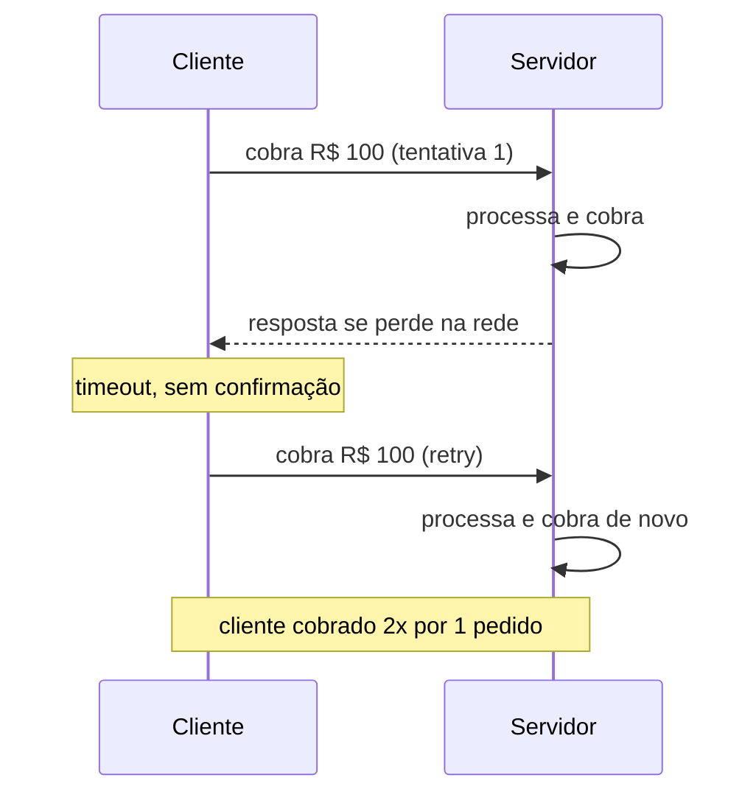

# Idempotência

A nota anterior, [Timeout, Retry, Circuit Breaker e Bulkhead](/labs/web-dev/resiliencia/01-timeout-retry-circuit-breaker-e-bulkhead/), deixou um problema em aberto: retry só é seguro se repetir a operação não causar dano. Essa nota resolve exatamente esse problema.

## Conceito

Uma operação é **idempotente** quando executá-la uma vez ou executá-la várias vezes produz o mesmo resultado final. O termo vem da matemática: multiplicar um número por 1 é idempotente (fazer isso 5 vezes seguidas não muda nada além da primeira vez).

Em APIs, o exemplo clássico é `PUT /usuarios/123 { nome: "Ana" }`. Chamar esse endpoint uma vez ou dez vezes deixa o usuário 123 com o nome "Ana" no final, o estado não muda entre a primeira e a décima chamada. Já `POST /pedidos { produto: "X", quantidade: 1 }` normalmente não é idempotente: cada chamada cria um pedido novo, então dez chamadas geram dez pedidos.

Por que isso importa em sistemas distribuídos? Porque a rede não é confiável. Uma requisição pode chegar ao servidor, ser processada com sucesso, e a resposta se perder no caminho de volta. Do ponto de vista de quem fez a chamada, isso é indistinguível de a requisição nunca ter chegado, então a reação natural é tentar de novo (veja [Retry](/labs/web-dev/resiliencia/01-timeout-retry-circuit-breaker-e-bulkhead/)). Sem idempotência, esse retry duplica o efeito de uma operação que, na verdade, já tinha funcionado.

## Retry seguro

O cenário de falha é sempre parecido: o cliente envia uma requisição, o servidor processa e confirma a operação internamente, mas algo falha entre esse ponto e o cliente receber a resposta (a conexão cai, um timeout dispara do lado do cliente, um proxy no meio do caminho reinicia). O cliente só sabe que não recebeu resposta, não sabe se a operação foi ou não executada do outro lado.



Dois problemas concretos nascem daí:

- **Double payment**: o exemplo mais citado. Um cliente tenta pagar, a confirmação se perde, o cliente (ou o app, automaticamente) tenta de novo, e agora duas cobranças foram feitas para uma única compra.
- **Mensagens duplicadas**: o mesmo problema aparece em filas (veja [Filas e Mensageria](/labs/web-dev/mensageria/01-filas-e-mensageria/)) sempre que a entrega é "pelo menos uma vez" (at-least-once). Se o consumer processa a mensagem mas falha antes de confirmar o processamento ao broker, o broker reenvia a mesma mensagem, e o consumer processa de novo.

## Idempotency Key

A solução prática é o cliente gerar um identificador único para a _intenção_ da operação, não para a requisição HTTP em si, e enviar esse identificador em todas as tentativas daquela mesma operação.

```
POST /pagamentos
Idempotency-Key: 7f3a9c1e-4b2d-4e91-9c3a-1d8f6b2a5e10

{ "valor": 100, "pedidoId": 456 }
```

O fluxo funciona assim:

1. O cliente gera a chave uma única vez, geralmente um UUID, no momento em que a ação do usuário acontece (o clique no botão "pagar"), não a cada tentativa de rede.
2. Toda tentativa daquela mesma operação (a original e qualquer retry) envia a mesma chave.
3. O servidor guarda, junto com a chave, o resultado da primeira execução.
4. Se a mesma chave chegar de novo, o servidor não executa a operação uma segunda vez, ele devolve o resultado que já tinha guardado da primeira vez.

Como detectar a duplicata? Antes de processar, o servidor consulta se aquela chave já foi vista. Se sim, retorna a resposta salva sem tocar de novo na lógica de negócio (sem cobrar de novo, sem criar outro pedido). Se não, processa normalmente e salva o resultado associado à chave, para o caso de ela reaparecer.

## Idempotency Store

A chave e o resultado da operação precisam ficar em algum lugar rápido de consultar, esse lugar é a idempotency store. As opções mais comuns:

- **Redis**: é a escolha mais comum quando a duplicata só é um risco por uma janela curta de tempo (minutos a poucas horas), justamente o cenário de retries de rede. É rápido de consultar, e o dado pode expirar sozinho.
- **Banco de dados**: quando a garantia precisa durar mais tempo (dias) ou precisar sobreviver a uma reinicialização sem risco de perda, uma tabela `idempotency_keys` no mesmo banco transacional da operação garante que a checagem da chave e a execução da operação aconteçam na mesma transação, evitando uma janela de corrida entre "checar se já existe" e "gravar o resultado".

Independente de onde a chave é guardada, dois detalhes são importantes:

- **TTL**: a chave não precisa (nem deve) ficar guardada para sempre. Um TTL de 24h a alguns dias costuma ser suficiente, cobrindo qualquer retry razoável sem acumular dado indefinidamente.
- **Estado da operação**: vale guardar não só "essa chave já foi vista", mas em que estado a operação ficou (`em processamento`, `concluída`, `falhou`). Isso evita um problema sutil: se uma segunda requisição com a mesma chave chega _enquanto_ a primeira ainda está sendo processada, o servidor precisa saber que deve esperar ou rejeitar, não processar a operação em paralelo duas vezes.

## Exemplos

- **Pagamento**: o caso mais citado. Uma chave de idempotência por tentativa de cobrança garante que retries de rede não gerem cobranças duplicadas no cartão do cliente.
- **Criação de pedido**: um app de delivery que reenvia a criação de um pedido por causa de uma conexão instável não deve gerar dois pedidos idênticos na cozinha do restaurante.
- **Envio de e-mail**: um worker que processa a fila de e-mails de confirmação e é reiniciado no meio do processamento não deve mandar o mesmo e-mail de novo para o cliente ao reprocessar a mensagem.
- **Processamento de eventos**: um consumer Kafka que recebe a mesma mensagem duas vezes (garantia at-least-once, ver [Garantias de Entrega](/labs/web-dev/mensageria/05-garantias-de-entrega/)) usa o ID do evento como chave de idempotência para não aplicar o mesmo efeito colateral (debitar estoque, por exemplo) duas vezes.

No contexto de mensageria, checar o ID do evento antes de processar tem nome próprio, deduplicação, e um conjunto de técnicas específicas (inbox pattern, janela de tempo, bloom filter) descritas em [Deduplicação de Mensagens](/labs/web-dev/mensageria/07-deduplicacao-de-mensagens/). A deduplicação descarta a mensagem repetida; a idempotência garante que, se uma passar, o efeito acontece uma vez só.
