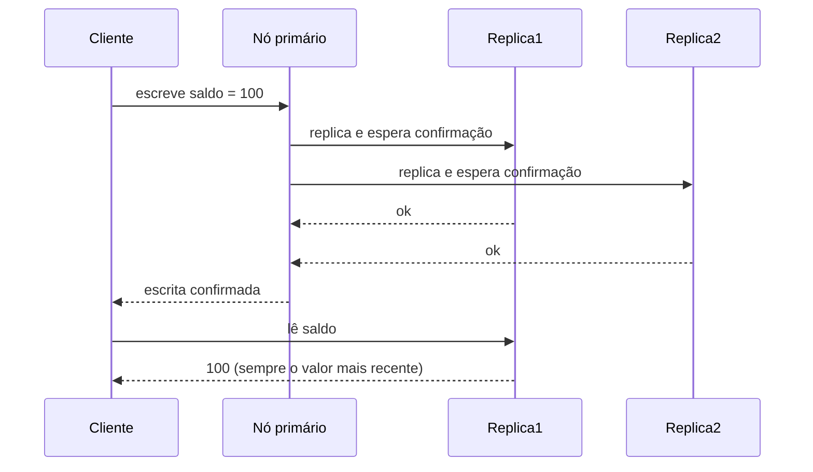
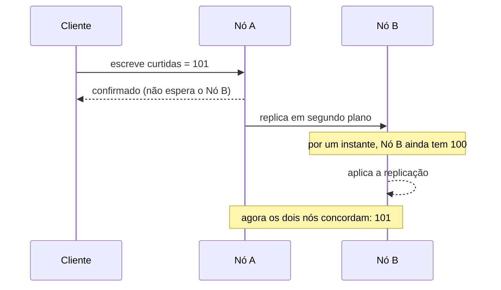

# Consistência e Replicação

Todo banco distribuído precisa responder a uma pergunta incômoda: quando um dado é escrito num nó e replicado para outros, o que acontece com quem lê esse dado um instante depois? A resposta que o sistema escolhe dar é o seu **nível de consistência**, e ela define boa parte do comportamento (e das dores de cabeça) de qualquer aplicação que rode em mais de uma máquina.

Essa nota foca no espectro entre consistência forte e consistência eventual. O [Teorema de CAP](/labs/web-dev/banco-de-dados/03-teorema-de-cap/) já cobre o que acontece durante uma partição de rede, e o [PACELC](/labs/web-dev/banco-de-dados/04-teorema-de-pacelc/) cobre a troca entre consistência e latência no dia a dia. Aqui o objetivo é outro: entender, na prática, o que significa um sistema ser "fortemente consistente" ou "eventualmente consistente", e como a replicação entra nessa conta.

## Strong Consistency

Num sistema com **consistência forte** (strong consistency), toda leitura enxerga a escrita mais recente, sem exceção. Assim que uma escrita é confirmada, qualquer nó que for consultado depois disso retorna esse valor, nunca um valor antigo.



Para garantir isso, o nó que recebe a escrita precisa esperar a confirmação de outras réplicas antes de considerar a operação concluída (o que o PACELC chama de priorizar consistência sobre latência). É a garantia mais fácil de raciocinar, porque o sistema se comporta como se existisse uma única cópia dos dados, mesmo estando replicado.

O custo aparece em dois lugares:

- **Latência**: esperar a confirmação de réplicas leva tempo, principalmente se elas estão em regiões geográficas diferentes.
- **Disponibilidade**: se uma réplica necessária para confirmar a escrita estiver fora do ar ou inacessível, a escrita (ou a leitura) pode ter que esperar ou falhar, em vez de responder com um valor possivelmente desatualizado.

## Eventual Consistency

Num sistema com **consistência eventual** (eventual consistency), uma escrita não precisa ser vista imediatamente por todos os nós. Existe uma janela de tempo, geralmente de milissegundos a poucos segundos, em que réplicas diferentes podem responder valores diferentes para a mesma pergunta. Se nenhuma escrita nova acontecer, todas as réplicas eventualmente convergem para o mesmo valor.



A vantagem é justamente o oposto da consistência forte: o nó responde na hora, sem esperar ninguém, o que deixa o sistema mais rápido e mais disponível mesmo quando parte da rede está instável. O trade-off é aceitar que, por um tempo curto, dois clientes lendo o mesmo dado em nós diferentes podem ver respostas diferentes.

Esse é o mesmo trade-off que aparece no CAP como a escolha AP (disponibilidade) e no PACELC como a escolha EL (latência): abrir mão de uma resposta sempre atualizada em troca de velocidade e resiliência.

## Exemplos práticos

Nem todo dado merece o mesmo nível de rigor. Faz parte do trabalho de design escolher, dado por dado, se vale a pena pagar o custo da consistência forte ou se a eventual já é suficiente.

**Pede consistência forte:**

- **Pagamentos**: confirmar um pagamento duas vezes, ou perder o registro de uma cobrança, gera prejuízo direto e problema jurídico.
- **Saldo bancário**: um saldo desatualizado pode levar a um saque que deixa a conta negativa sem ninguém perceber a tempo.
- **Controle de estoque crítico**: vender duas vezes a última unidade de um produto porque duas réplicas achavam que ele ainda estava disponível é um erro caro de corrigir depois.

**Tolera consistência eventual:**

- **Contador de likes**: mostrar 1.204 curtidas em vez de 1.205 por alguns segundos não muda a experiência de ninguém.
- **Feed de rede social**: um post demorar alguns segundos a mais para aparecer para todo mundo é imperceptível na prática.
- **Métricas e dashboards**: números de monitoramento quase sempre toleram atraso, ninguém toma decisão de segundo a segundo em cima de uma métrica de uso.
- **Número de visualizações**: contagens agregadas (visualizações de vídeo, acessos a uma página) já são aproximações por natureza.

A regra prática: se um valor desatualizado pode causar prejuízo financeiro, violação de regra de negócio ou uma decisão errada e irreversível, ele pede consistência forte. Se o pior cenário é alguém ver um número levemente atrasado por segundos, consistência eventual é a escolha mais barata e mais rápida.

## Replicação e consistência

Consistência não existe no vácuo, ela é consequência direta de como a replicação entre os nós é feita. Três conceitos aparecem sempre que o assunto é "o que exatamente um cliente vê depois de escrever um dado":

### Read-after-write

É a garantia de que, depois que **um cliente específico** escreve um dado, esse mesmo cliente sempre lê o valor que acabou de escrever, mesmo que o sistema seja eventualmente consistente para outros clientes. Um caso clássico: você atualiza sua foto de perfil e, ao recarregar a página, ela precisa aparecer atualizada para você, mesmo que outro usuário ainda veja a foto antiga por mais alguns segundos.

Sistemas eventualmente consistentes costumam implementar essa garantia direcionando as leituras do próprio cliente para o nó que recebeu a escrita (ou para uma réplica já sincronizada), em vez de qualquer réplica aleatória.

### Replication lag

É o atraso entre o momento em que um dado é escrito no nó primário e o momento em que essa escrita chega em cada réplica. Quanto maior o lag, maior a janela em que uma leitura numa réplica pode retornar um valor desatualizado.

Lag alto costuma vir de réplicas geograficamente distantes, picos de escrita que saturam a replicação, ou réplicas sobrecarregadas de leitura. Monitorar o replication lag é rotina em qualquer sistema com réplicas de leitura, porque ele é o número que diz "o quão eventual é a sua consistência eventual" na prática.

### Quorum

Quando um sistema tem várias réplicas, ele não precisa esperar todas confirmarem uma escrita (nem depender de uma única réplica para responder uma leitura). Ele pode exigir apenas um **quorum**, um número mínimo de réplicas que concordam, para considerar a operação válida.

A fórmula mais comum usa duas variáveis: `W` (quantas réplicas precisam confirmar uma escrita) e `R` (quantas réplicas precisam ser consultadas numa leitura), sobre um total de `N` réplicas. Se `W + R > N`, o sistema garante que toda leitura vai enxergar pelo menos uma réplica com a escrita mais recente, porque o conjunto de réplicas lidas e o conjunto de réplicas escritas sempre se sobrepõem em pelo menos um nó.

```
N = 3 réplicas
W = 2 (precisa de 2 confirmações para escrever)
R = 2 (precisa consultar 2 réplicas para ler)

W + R = 4 > N = 3 -> leitura sempre enxerga a escrita mais recente
```

Ajustar `W` e `R` é uma forma de escolher, na prática, entre consistência e latência sem precisar trocar de banco de dados: quóruns maiores aproximam o sistema da consistência forte (mais réplicas precisam responder, mais devagar); quóruns menores aproximam da consistência eventual (responde mais rápido, com menos garantia).

Esse mecanismo de replicação com réplicas primárias e secundárias é aprofundado, do ponto de vista de escalabilidade e performance do banco, em [Replicação e Escalabilidade do Banco de Dados](/labs/web-dev/escalabilidade/03-replicacao-de-banco-de-dados/).

## Referências

- [CAP twelve years later: How the "rules" have changed - Eric Brewer](https://www.infoq.com/articles/cap-twelve-years-later-how-the-rules-have-changed/)
- [Designing Data-Intensive Applications - Martin Kleppmann (capítulo 5: Replication)](https://dataintensive.net/)
