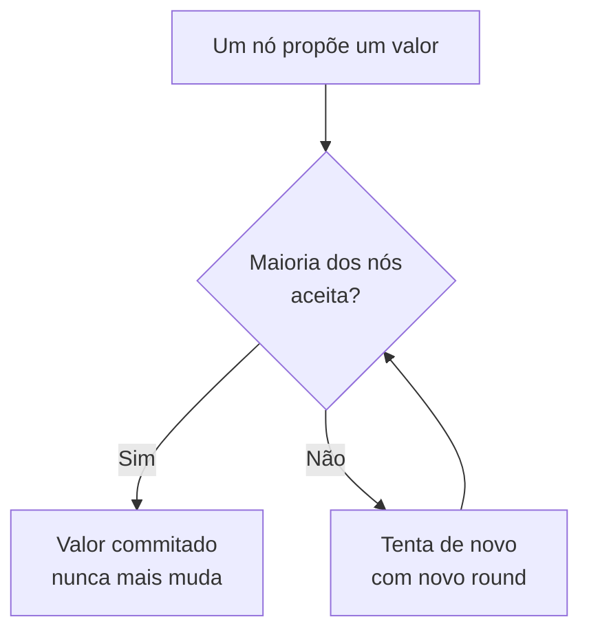
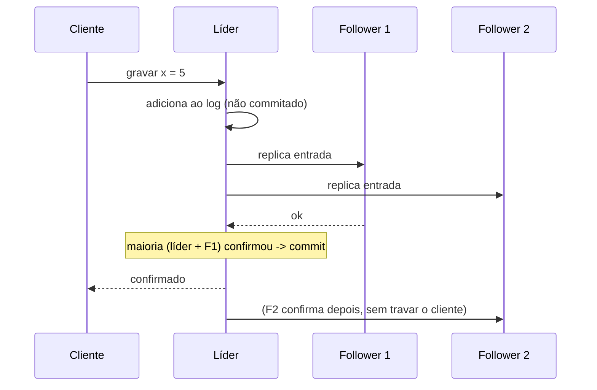

# Consenso: Paxos e Raft

Consenso é o problema de fazer vários computadores concordarem sobre um único valor, mesmo que alguns caiam no meio do caminho e a rede entre eles seja instável. Parece simples até você tentar fazer. Paxos e Raft são os dois algoritmos que resolvem isso, e eles estão por baixo de quase todo banco distribuído, fila e sistema de coordenação que você usa.

## O problema do consenso

Imagine três servidores que precisam concordar sobre "quem é o líder agora" ou "qual é a próxima operação a ser aplicada". Todos começam sem saber a resposta, e cada um pode propor uma. No fim, todos os que continuarem vivos precisam escolher **o mesmo valor**, e essa escolha não pode voltar atrás.

As dificuldades são todas de sistema distribuído:

- Mensagens se perdem, atrasam ou chegam fora de ordem
- Um nó pode cair e voltar minutos depois achando que nada mudou
- Nenhum nó tem uma visão completa e atualizada do estado dos outros

Um resultado teórico famoso, o **teorema FLP** (Fischer, Lynch, Paterson, 1985), mostra que num sistema totalmente assíncrono, com pelo menos um nó que pode falhar, não existe algoritmo que garanta consenso em tempo finito em todos os casos. Paxos e Raft contornam isso na prática usando timeouts: eles não garantem que sempre vão decidir rápido, mas garantem que, quando decidem, a decisão está correta.

O ponto em comum das duas soluções é a **maioria** (quorum). Se cada decisão precisa do voto de mais da metade dos nós, dois grupos que não se falam nunca conseguem, cada um, formar uma maioria. Isso impede que o sistema tome duas decisões conflitantes durante uma partição de rede. É a mesma lógica de quorum vista em [Consistência e Replicação](/labs/web-dev/sistemas-distribuidos/01-consistencia-e-replicacao/), aplicada agora à ordem das operações, não só ao valor de um dado.

Uma observação de escopo: Paxos e Raft assumem falhas do tipo **crash** (o nó para de responder, mas nunca mente). Sistemas que precisam tolerar nós maliciosos, que mandam respostas erradas de propósito, usam algoritmos de consenso bizantino (BFT), um assunto à parte, mais comum em blockchains do que em backend de empresa.

## Paxos

Paxos foi descrito por Leslie Lamport nos anos 90 e é o algoritmo de consenso clássico. Ele funciona em duas fases, com três papéis (um mesmo nó costuma acumular papéis):

- **Proposer**: propõe um valor
- **Acceptor**: vota nas propostas; a maioria dos acceptors é que decide
- **Learner**: descobre qual valor foi escolhido para agir sobre ele

O fluxo resumido de um round:

1. **Prepare / Promise**: o proposer escolhe um número de round `n` e pergunta à maioria dos acceptors "posso propor com o round `n`?". Cada acceptor promete não aceitar nada com round menor que `n` e conta se já aceitou algum valor antes.
2. **Accept / Accepted**: se a maioria prometeu, o proposer manda "aceite o valor `v` no round `n`". Se a maioria aceitar, `v` está escolhido.

Se dois proposers competem, um vai "atropelar" o round do outro e o processo recomeça com um número maior. Isso garante segurança (nunca dois valores diferentes são escolhidos), mas pode em teoria ficar girando sem decidir.

Na prática ninguém roda esse ciclo completo para cada operação. Usa-se **Multi-Paxos**: elege-se um líder estável que pula a fase 1 e só faz a fase 2 repetidamente, uma vez por operação do log. Quando o líder cai, um novo round de fase 1 elege outro.

Paxos tem fama justa de ser difícil. O artigo original é denso, e a distância entre "entendi a ideia" e "implementei sem bug" é grande. Mesmo assim ele roda em produção há décadas, por exemplo no Google Chubby (serviço de lock) e no Spanner.

## Raft

Raft (Ongaro e Ousterhout, 2014) nasceu de uma pergunta direta: dá para ter as mesmas garantias do Paxos com um algoritmo que dá para ensinar em uma aula? A resposta foi sim, e por isso quase todo sistema novo escolhe Raft.

Raft separa o problema em duas partes bem definidas: eleição de líder e replicação de log.

### Eleição de líder

O tempo é dividido em **termos** (terms), numerados. Cada nó está em um de três estados: follower, candidate ou leader.

- Todo nó começa como follower e espera receber "sinais de vida" (heartbeats) do líder
- Se um follower fica um tempo aleatório sem heartbeat, ele vira candidate, incrementa o termo e pede votos
- Cada nó vota em no máximo um candidate por termo; quem juntar a maioria vira leader
- O timeout aleatório evita que todos virem candidate ao mesmo tempo e empatem para sempre

### Replicação de log

Toda escrita passa pelo líder:

1. O cliente manda a operação para o líder
2. O líder adiciona a operação no próprio log e replica para os followers
3. Quando a maioria confirma que gravou, o líder marca a entrada como **commitada** e responde ao cliente
4. Os followers aplicam a operação na mesma ordem

A **segurança** do Raft garante que, uma vez commitada, uma entrada nunca é perdida nem reordenada: um nó só pode ser eleito líder se o log dele estiver pelo menos tão atualizado quanto o da maioria, então nenhum líder novo apaga um commit antigo.

Para **mudar o conjunto de nós** (adicionar ou trocar uma máquina) sem parar o cluster, Raft usa uma transição em duas etapas (joint consensus), em que a configuração antiga e a nova precisam concordar durante a troca.

Onde você encontra Raft rodando: etcd (o banco de configuração do Kubernetes), Consul, CockroachDB, TiDB, o replica set do MongoDB e o [modo KRaft do Kafka](/labs/web-dev/mensageria/02-kafka/), que substituiu o ZooKeeper.

## Paxos vs Raft na prática

Os dois resolvem o mesmo problema e dão as mesmas garantias: enquanto a maioria dos nós estiver viva e conseguir se falar, o sistema decide e permanece consistente; se a maioria cair ou a rede partir o cluster ao meio, o sistema para de aceitar escritas em vez de arriscar uma inconsistência. É a escolha por consistência do [teorema de CAP](/labs/web-dev/banco-de-dados/04-teorema-de-cap/), feita no nível do algoritmo.

A diferença é de engenharia, não de poder:

| | Paxos | Raft |
| --- | --- | --- |
| Ano | anos 90 | 2014 |
| Foco do projeto | correção teórica | ser fácil de entender e implementar |
| Estrutura | fases e papéis genéricos | líder forte + log replicado |
| Onde aparece | Chubby, Spanner | etcd, Consul, CockroachDB, Kafka KRaft |

Para quem está aprendendo, o caminho prático é entender Raft bem (a mecânica de líder e log replicado aparece em todo lugar) e saber que Paxos existe, é mais antigo e resolve a mesma coisa. Quando bater a dúvida "esse banco distribuído para de responder se cair a maioria dos nós?", a resposta quase sempre é sim, e o motivo é o algoritmo de consenso por baixo.

Consenso também não é a mesma coisa que [two-phase commit](/labs/web-dev/transacoes-distribuidas/02-two-phase-commit/): o 2PC coordena uma transação entre serviços diferentes e trava se o coordenador cai; o consenso replica uma decisão entre cópias do mesmo sistema e sobrevive à queda de qualquer nó individual, inclusive o líder.

## Referências

- [In Search of an Understandable Consensus Algorithm (Raft) - Ongaro, Ousterhout](https://raft.github.io/raft.pdf)
- [Visualização interativa do Raft](https://raft.github.io/)
- [Paxos Made Simple - Leslie Lamport](https://lamport.azurewebsites.net/pubs/paxos-simple.pdf)
- [Designing Data-Intensive Applications - Martin Kleppmann (capítulo 9: Consistency and Consensus)](https://dataintensive.net/)
