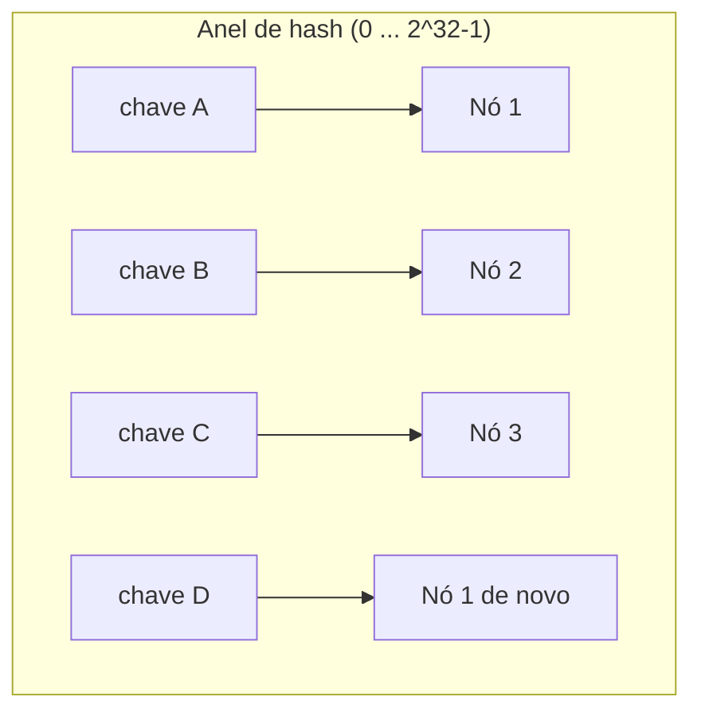
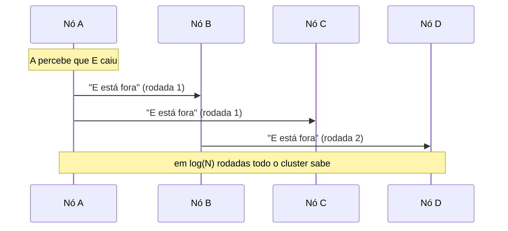

# Consistent Hashing e Gossip

Quando você tem vários servidores guardando dados (um pool de cache, os shards de um banco), duas perguntas aparecem: **onde cada chave mora** e **como os nós sabem quem está vivo**. Consistent hashing responde a primeira, gossip responde a segunda. As duas técnicas andam juntas em bancos estilo Dynamo, como Cassandra e DynamoDB.

## O problema: distribuir chaves entre nós

Digamos que você tem 4 servidores de cache e milhões de chaves para espalhar entre eles. A ideia mais direta é usar o resto da divisão:

```js
const servidor = hash(chave) % 4;
```

Funciona bem até o dia em que você adiciona um quinto servidor (ou perde um). Agora a conta virou `% 5`, e o resultado muda para **quase todas as chaves**. Praticamente todo o cache é invalidado de uma vez, todo mundo vai buscar no banco ao mesmo tempo, e o sistema pode cair só por causa do rebalanceamento.

```
hash(chave) = 100

Com 4 nós:  100 % 4 = 0  -> nó 0
Com 5 nós:  100 % 5 = 0  -> nó 0   (essa deu sorte)

hash(chave) = 101
Com 4 nós:  101 % 4 = 1  -> nó 1
Com 5 nós:  101 % 5 = 1  -> nó 1

hash(chave) = 102
Com 4 nós:  102 % 4 = 2  -> nó 2
Com 5 nós:  102 % 5 = 2  -> nó 2

hash(chave) = 103
Com 4 nós:  103 % 4 = 3  -> nó 3
Com 5 nós:  103 % 5 = 3  -> nó 3

hash(chave) = 104
Com 4 nós:  104 % 4 = 0  -> nó 0
Com 5 nós:  104 % 5 = 4  -> nó 4   (mudou)
```

Parece pouco no exemplo pequeno, mas na média `1 - 1/N` das chaves trocam de dono. Com 4 para 5 nós, são 80% das chaves remapeadas.

## Consistent hashing

A sacada do consistent hashing é colocar **nós e chaves no mesmo espaço**, um círculo de valores de hash (de 0 até 2³² - 1, por exemplo). Você imagina esse intervalo como um anel.

- Cada nó recebe uma posição no anel (o hash do nome ou IP dele)
- Cada chave também recebe uma posição (o hash da chave)
- A chave pertence ao **primeiro nó que aparece andando no sentido horário** a partir da posição dela



O ganho aparece quando o conjunto de nós muda. Se o Nó 2 cai, só as chaves que pertenciam a ele passam para o próximo nó do anel (o Nó 3). Todas as outras ficam onde estavam. Adicionar um nó novo é igual: ele "rouba" só a fatia do anel entre a posição dele e o nó anterior. Em vez de remapear `1 - 1/N` das chaves, você remapeia cerca de `1/N`.

### Nós virtuais (vnodes)

Tem um problema com poucos nós: as posições no anel caem em lugares aleatórios, e um nó pode acabar responsável por um pedaço bem maior do anel que os outros. A distribuição fica torta.

A solução é dar a cada nó físico **várias posições** no anel, não uma só. Cada nó vira, digamos, 100 ou 256 pontos espalhados (os vnodes). Com muitos pontos, a lei dos grandes números entra em ação e a fatia total de cada nó físico fica perto da média. Isso também facilita ter máquinas de tamanhos diferentes: uma máquina com o dobro de capacidade recebe o dobro de vnodes.

### Replicação no anel

Para não perder dados quando um nó cai, a chave não fica só no nó dono: ela é copiada para os **N nós seguintes** no anel (fator de replicação N). Assim, se o dono sai, o próximo nó já tem uma cópia e assume sem parada.

## Onde consistent hashing aparece

- **Caches distribuídos**: clientes de Memcached e o Redis Cluster usam consistent hashing para decidir em qual nó cada chave vive, justamente para não perder o cache inteiro quando um nó entra ou sai (ver [Cache e Redis](/labs/web-dev/escalabilidade/08-cache-e-redis/))
- **Sharding de banco**: é uma das estratégias de "sharding por hash" descritas em [Stateless, Particionamento e Sharding](/labs/web-dev/escalabilidade/02-stateless-e-particionamento/), com a vantagem de rebalancear barato
- **Cassandra e DynamoDB**: particionam os dados por um token ring, que é consistent hashing com vnodes (ver [Escolha de Banco de Dados](/labs/web-dev/banco-de-dados/06-escolha-de-banco-de-dados/))
- **Load balancers**: quando você quer que o mesmo cliente caia sempre no mesmo backend (afinidade), sem guardar uma tabela de sessão

## Gossip protocol

Consistent hashing decide onde a chave mora, mas isso só funciona se cada nó souber **quais nós existem no anel e quais estão vivos**. Num sistema sem coordenador central, quem mantém essa lista atualizada?

A resposta do gossip é imitar como um boato se espalha. Periodicamente (a cada segundo, por exemplo), cada nó escolhe alguns outros nós **ao acaso** e troca com eles o que sabe sobre o estado do cluster: quem entrou, quem saiu, quem parece estar fora do ar. Cada nó que recebe a novidade vai repassá-la adiante na próxima rodada.



Esse jeito de espalhar informação (chamado de disseminação epidêmica) tem propriedades boas para um cluster grande:

- A novidade chega a todos os nós em tempo proporcional a `log(N)`, mesmo com centenas de nós
- Não existe ponto único de falha: não tem um "servidor de membership" para cair
- O tráfego por nó é constante, não cresce com o tamanho do cluster

O gossip carrega principalmente três coisas: **membership** (quem faz parte do cluster), **detecção de falha** (algoritmos como o phi accrual estimam a probabilidade de um nó estar morto a partir do atraso dos sinais) e propagação de metadados leves, como o esquema das tabelas.

O custo é que a informação é **eventualmente consistente**: durante alguns segundos, nós diferentes podem ter visões ligeiramente diferentes de quem está no cluster. Para membership isso é aceitável; para decidir a ordem de uma transação, não, e aí entra consenso.

## Como as duas coisas se encaixam

Bancos estilo Dynamo (Cassandra, DynamoDB, Riak) combinam as duas técnicas e **não têm líder**:

- O **gossip** mantém em cada nó a lista de quem está no anel e vivo
- O **consistent hashing** usa essa lista para calcular, localmente, qual nó é dono de cada chave
- Qualquer nó pode receber a requisição do cliente, descobrir o dono da chave e encaminhar

Isso é o oposto da abordagem com líder de [Paxos e Raft](/labs/web-dev/sistemas-distribuidos/02-consenso-paxos-e-raft/), onde todas as escritas passam por um nó eleito. A troca é clara: sem líder, o sistema aguenta melhor a perda de nós e escala a escrita mais fácil, mas abre mão da consistência forte por padrão, ficando com quorum ajustável e consistência eventual (a mesma discussão de [Consistência e Replicação](/labs/web-dev/sistemas-distribuidos/01-consistencia-e-replicacao/)).

## Referências

- [Dynamo: Amazon's Highly Available Key-value Store (2007)](https://www.allthingsdistributed.com/files/amazon-dynamo-sosp2007.pdf)
- [Consistent Hashing and Random Trees - Karger et al. (1997)](https://www.cs.princeton.edu/courses/archive/fall09/cos518/papers/chash.pdf)
- [Consistent Hashing Explained - ByteByteGo](https://blog.bytebytego.com/p/consistent-hashing)
