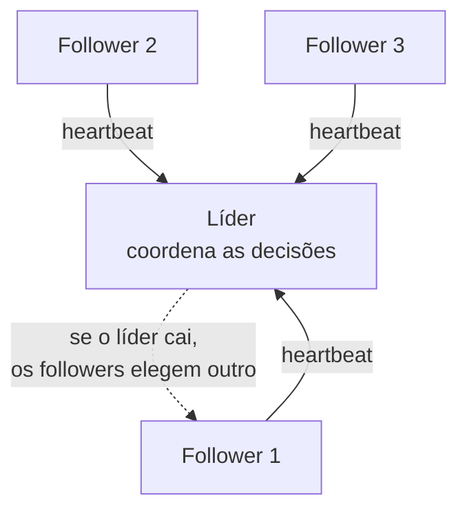
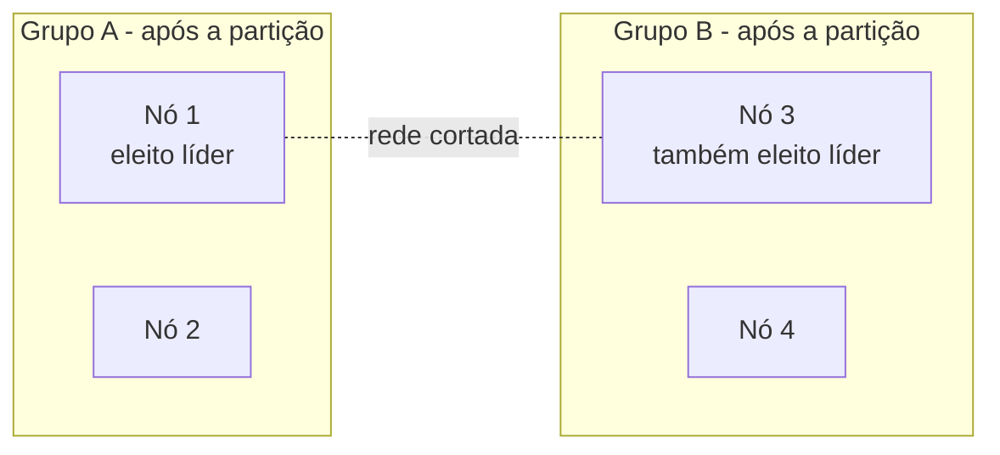
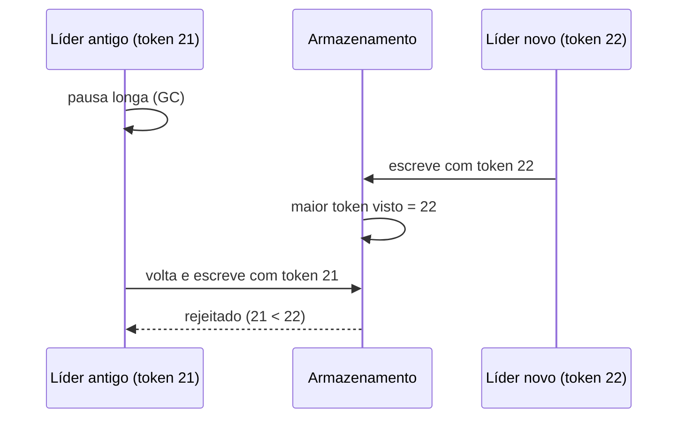

# Eleição de Líder

Em um sistema distribuído, várias cópias do mesmo serviço rodam ao mesmo tempo. Na maior parte das tarefas isso é ótimo: mais réplicas, mais capacidade. Mas existe um grupo de tarefas que dá errado quando duas réplicas fazem ao mesmo tempo, por exemplo, decidir qual réplica do banco recebe as escritas, ou disparar a cobrança mensal dos clientes. Para essas, o sistema precisa escolher **um** nó responsável. Esse processo de escolha é a eleição de líder.

## Por que um sistema precisa de um líder

Quando todos os nós são iguais (pares, ou *peers*) e nenhum é naturalmente o chefe, deixar cada um agir por conta própria gera três tipos de problema:

- **Trabalho duplicado**: um job que deveria rodar uma vez roda uma vez por réplica. Três réplicas, três e-mails de cobrança para o mesmo cliente.
- **Escrita conflitante**: duas réplicas atualizam o mesmo registro com valores diferentes e uma sobrescreve a outra.
- **Decisão incoerente**: duas réplicas resolvem, cada uma do seu lado, coisas que precisavam de uma resposta única (quem é o dono da partição X, qual a configuração ativa).

A saída é eleger um líder (às vezes chamado de *primary*, *master* ou *coordinator*) que centraliza essas decisões. As outras réplicas viram seguidoras (*followers*): continuam servindo o que dá para servir em paralelo e deixam as decisões sensíveis com o líder.

Nem todo problema de coordenação precisa de eleição de líder. Se o que você quer é só acesso ordenado a um recurso compartilhado, um lock (otimista ou pessimista) já resolve, e é mais leve. A eleição de líder entra quando há um papel de coordenação contínuo para alguém ocupar.

## O que a eleição precisa garantir

Uma eleição correta tem duas propriedades, o mesmo par que aparece em [Consenso: Paxos e Raft](/labs/web-dev/sistemas-distribuidos/02-consenso-paxos-e-raft/):

- **Safety (segurança)**: no máximo um líder por vez. É a garantia que não pode ser violada nunca, porque violar significa dois primários aceitando escrita.
- **Liveness (vivacidade)**: se o líder cai, em algum momento um novo é eleito. O sistema não pode ficar sem líder para sempre.

Além disso, os nós precisam **concordar sobre quem é o líder atual**. Não adianta o nó A achar que ele é o líder e o nó B achar que é o C.

Detectar que o líder caiu costuma ser feito por **heartbeat**: o líder manda um "estou vivo" de tempos em tempos, e quem fica um tempo sem receber assume que o líder morreu e dispara nova eleição. O ajuste desse tempo é um trade-off: curto demais e uma lentidão de rede vira falsa detecção de falha; longo demais e o sistema fica parado esperando.

## Split-brain

O cenário mais perigoso da eleição de líder tem nome: **split-brain** (cérebro dividido). Acontece quando uma **partição de rede** corta o cluster em dois grupos que não se enxergam. Cada grupo acha que o outro morreu e elege o seu próprio líder. Agora existem dois líderes aceitando escrita, e os dados divergem dos dois lados.

Quando a rede volta, você tem dois históricos de escrita conflitantes e nenhuma forma automática e óbvia de fundir os dois. Por isso "só eleger um líder" não é suficiente: a eleição precisa ser feita de um jeito que **impeça dois líderes simultâneos mesmo durante uma partição**, e o sistema precisa se proteger de um líder antigo que volta achando que ainda manda.

## Elegendo com segurança

Duas ideias resolvem o split-brain na hora da eleição:

**Maioria (quórum).** Um nó só vira líder se juntar o voto de mais da metade do cluster (`N/2 + 1`). Como dois grupos não podem ter, cada um, mais da metade dos nós, no máximo um lado consegue eleger líder. O outro lado fica sem maioria e sem líder até a rede voltar. É o mesmo princípio de quórum que aparece em [Consistência e Replicação](/labs/web-dev/sistemas-distribuidos/01-consistencia-e-replicacao/), e a razão de clusters de coordenação quase sempre terem um número ímpar de nós (3, 5, 7).

**Número de época (epoch/term).** Cada eleição incrementa um contador global. O líder do termo 5 sabe que é o quinto. Se aparece uma mensagem de um "líder" do termo 3, todo mundo ignora, porque já existe um termo mais novo. Esse número monotônico é o que permite descartar ordens de um líder ultrapassado.

Você raramente vai implementar isso na mão. Algoritmos de consenso como **Raft** e **Paxos** já fazem eleição de líder com maioria e termo embutidos, e é por isso que sistemas de coordenação são construídos em cima deles. Existem também algoritmos clássicos só de eleição, como o [Bully](https://pt.wikipedia.org/wiki/Algoritmo_do_valent%C3%A3o) (o nó de maior ID ganha) e o Chang-Roberts (eleição em anel), mais comuns em material acadêmico do que em produção hoje.

## Fencing token e leases

Falta resolver o outro lado do split-brain: **o líder zumbi**. Imagine que o líder trava por 30 segundos (uma pausa de garbage collector numa JVM consegue isso). Nesse meio-tempo os followers acham que ele morreu, elegem um novo líder e a vida segue. Aí o líder antigo volta do congelamento, sem saber que ficou fora, e manda uma escrita. Agora são dois de novo.

**Lease (concessão)** é a primeira defesa: a liderança é "alugada" por um tempo (digamos 10s) e o líder precisa **renovar** antes de expirar. Se ele não renova, perde a liderança automaticamente. Ajuda, mas não fecha o buraco: se o relógio do líder está atrasado, ou a renovação ficou presa na fila durante a pausa, ele pode achar que o lease ainda vale quando na verdade já expirou.

**Fencing token** é a defesa que realmente funciona. É um número que **aumenta a cada eleição** e viaja junto com toda operação que o líder manda para o armazenamento. O armazenamento guarda o maior token que já viu e **rejeita qualquer operação com token menor**.

O líder zumbi até tenta escrever, mas o armazenamento barra porque o token dele é velho. Martin Kleppmann tem um artigo clássico mostrando que lock ou lease sem fencing token é inseguro por causa exatamente desses cenários de pausa e atraso de rede.

## Implementações na prática

Na maioria dos casos você não escreve eleição de líder: usa um serviço pronto ou herda de um componente que já faz isso.

**Serviços de coordenação:**

- **Apache ZooKeeper**: cria um nó efêmero e sequencial por candidato; quem tem o menor número é o líder, e cada um observa (*watch*) só o nó imediatamente anterior para evitar avalanche de notificações quando o líder cai. O nó é efêmero, então some sozinho se a sessão daquele processo morrer.
- **etcd** e **Consul**: usam Raft internamente e expõem leases com renovação; a eleição de líder da sua aplicação vira "quem segurar esta chave com lease é o líder".

**Componentes que já trazem eleição embutida:**

- **Failover de primário de banco**: em Postgres/MySQL com réplicas, quando o primário cai, uma ferramenta de failover (Patroni, orchestrator) elege uma réplica para virar o novo primário. Veja [Replicação e Escalabilidade do Banco de Dados](/labs/web-dev/escalabilidade/03-replicacao-de-banco-de-dados/).
- **Controller do Kafka**: um dos nós do cluster é eleito controller e cuida da atribuição de partições e líderes de réplica. Ver [Kafka](/labs/web-dev/mensageria/03-kafka/).
- **Kubernetes**: componentes do control plane (scheduler, controller-manager) rodam em várias réplicas para alta disponibilidade, mas só a que segura o *lease* de liderança age; as outras ficam de prontidão. Ver [Kubernetes](/labs/web-dev/entrega-continua/02-kubernetes/).
- **Jobs agendados distribuídos**: quando o mesmo cron roda em várias instâncias, a eleição de líder garante que só uma dispare a execução.

Nem todo sistema distribuído usa líder. A abordagem sem líder, com nós trocando informação por gossip e resolvendo conflito por quórum, é o outro extremo do espectro e está em [Consistent Hashing e Gossip](/labs/web-dev/sistemas-distribuidos/04-consistent-hashing-e-gossip/). Ter líder simplifica a coerência das decisões; não ter líder tolera melhor a perda de nós. É um trade-off, não uma resposta única.

## Referências

- [Padrão de eleição de líder - Azure Architecture Center](https://learn.microsoft.com/pt-br/azure/architecture/patterns/leader-election) - Microsoft Learn, pt-BR
- [How to do distributed locking - Martin Kleppmann](https://martin.kleppmann.com/2016/02/08/how-to-do-distributed-locking.html) - Martin Kleppmann (autor de "Designing Data-Intensive Applications"), en
- [ZooKeeper Recipes - Leader Election](https://zookeeper.apache.org/doc/current/recipes.html#sc_leaderElection) - documentação oficial do Apache ZooKeeper, en
- [Designing Data-Intensive Applications, cap. 8 e 9 - Martin Kleppmann](https://dataintensive.net/) - livro de referência, en
