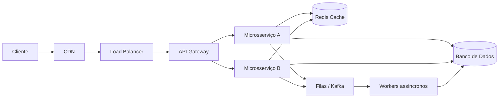

# Arquitetura de uma Aplicação Distribuída

## Fluxo de uma requisição

Antes de mergulhar em cada componente separadamente, vale ter uma imagem mental de como eles se encaixam. A maioria dos sistemas web em escala, de um encurtador de URL a uma rede social inteira, segue uma variação do mesmo esqueleto:

Lendo esse diagrama da esquerda para a direita:

- O **cliente** (navegador, app mobile) faz uma requisição
- A **CDN** intercepta pedidos por conteúdo estático (imagens, JS, CSS) direto de um ponto próximo do usuário, sem nem chegar ao backend
- O **Load Balancer** distribui as requisições que chegam entre várias instâncias do backend, para nenhuma máquina ficar sobrecarregada sozinha
- O **API Gateway** centraliza autenticação, roteamento e outras preocupações transversais antes de encaminhar a requisição para o microsserviço certo
- Os **microsserviços** contêm a lógica de negócio. Eles consultam o **Redis** para dados que precisam de leitura rápida e frequente, e o **banco de dados** para o estado persistente e confiável
- Trabalho que não precisa ser feito na hora (enviar um e-mail, processar um pagamento em lote, gerar um relatório) é jogado em uma **fila** (Kafka, RabbitMQ, SQS), e processado depois por **workers** assíncronos

Nenhum sistema real usa todas essas peças ao mesmo tempo desde o primeiro dia. Um MVP pode rodar só com cliente, um servidor e um banco. Mas conforme a carga cresce, cada uma dessas peças entra no design para resolver um gargalo específico, e é exatamente essa ordem (o que adicionar e por quê) que as próximas notas desta seção e da seção de Escalabilidade e Infraestrutura cobrem em detalhe:

- CDN: [CDN (Content Delivery Network)](/labs/web-dev/escalabilidade/04-cdn/)
- Load Balancer: [Load Balancer](/labs/web-dev/escalabilidade/05-load-balancer/)
- API Gateway: [API Gateway](/labs/web-dev/escalabilidade/07-api-gateway/)
- Cache: [Cache e Redis](/labs/web-dev/escalabilidade/08-cache-e-redis/)
- Filas e Kafka: [Filas e Mensageria](/labs/web-dev/mensageria/01-filas-e-mensageria/)
- Microsserviços: [Fundamentos de Microsserviços](/labs/web-dev/microsservicos/01-fundamentos-de-microsservicos/)

Vale notar que esse diagrama já é o resultado de várias decisões de trade-off (por que ter um API Gateway em vez de expor os microsserviços direto, por que ter cache antes do banco). O motivo de cada peça existir fica muito mais claro depois de estudar [Capacity Planning](/labs/web-dev/system-design/03-capacity-planning/) e [Latência, Throughput e Performance](/labs/web-dev/system-design/04-latencia-e-performance/): é a carga esperada e o orçamento de latência que dizem quais dessas peças realmente valem a complexidade de adicionar.
