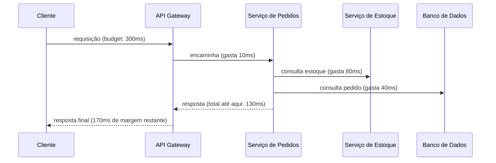

# Latência, Throughput e Performance

## Latência

Latência é o tempo que uma única operação leva do início ao fim, por exemplo, o tempo entre o cliente enviar uma requisição HTTP e receber a resposta. Ela é medida em milissegundos, e é a métrica que o usuário sente diretamente: uma tela que demora para carregar é alta latência, não baixo throughput.

O erro mais comum ao medir latência é olhar só para a **latência média**. Uma média esconde exatamente o que mais importa: como o sistema se comporta nos piores casos. Imagine 100 requisições em que 99 levam 50ms e uma leva 5 segundos. A média fica em torno de 99ms, um número que parece ótimo, mas esconde completamente que 1% dos usuários teve uma experiência péssima.

Por isso, latência é medida em **percentis**:

- **p50** (mediana): metade das requisições foi mais rápida que esse valor, metade foi mais lenta. É próxima da experiência "típica".
- **p90**: 90% das requisições foram mais rápidas que esse valor. Já começa a capturar parte da cauda lenta.
- **p95**: 95% das requisições foram mais rápidas. Comum em SLOs de APIs internas.
- **p99**: 99% das requisições foram mais rápidas que esse valor, ou seja, 1% foi mais lenta. É o percentil mais citado em entrevistas e em dashboards de produção, porque em sistemas com muito tráfego, 1% ainda representa um número absoluto grande de usuários.

```
Sistema com 1 milhão de requisições/dia e p99 = 800ms:

-> 10.000 requisições por dia (o "1% de cauda") levaram 800ms ou mais
```

Quanto maior o tráfego do sistema, mais essa cauda de 1% (ou até 0,1%, o p999) importa: são milhares de usuários reais tendo uma experiência ruim, mesmo que a média pareça saudável no dashboard.

## Throughput

Throughput é quantas operações o sistema consegue processar por unidade de tempo, normalmente medido em requests por segundo (RPS/QPS) ou operações por segundo. Enquanto latência mede a velocidade de **uma** operação, throughput mede a capacidade de processamento do sistema **como um todo**.

Os dois estão relacionados, mas não são a mesma coisa, e otimizar um às vezes piora o outro. Um exemplo clássico: agrupar várias escritas pequenas num único lote (batching) antes de mandar para o banco aumenta o throughput (o banco processa mais operações por segundo, no total), mas aumenta a latência de cada escrita individual, porque ela precisa esperar o lote se formar antes de ser processada.

```mermaid
flowchart LR
    A[Sem batching] -->|latência baixa por request<br/>throughput menor| B((]))
    C[Com batching] -->|latência maior por request<br/>throughput maior| D((]))
```

Um sistema bem dimensionado normalmente define um teto aceitável de latência (via SLO, veja [Disponibilidade](/labs/web-dev/resiliencia/disponibilidade/)) e otimiza throughput dentro desse limite, em vez de tratar as duas métricas como se fossem independentes.

## Performance e gargalos

Quando latência ou throughput pioram, o motivo está em algum recurso específico que virou o fator limitante, o **gargalo**. Os candidatos mais comuns:

- **CPU**: processamento intenso (serialização, criptografia, cálculos) satura os núcleos disponíveis e cada requisição começa a esperar sua vez.
- **Memória**: falta de RAM força o sistema operacional a usar swap (disco), o que é ordens de magnitude mais lento, ou causa garbage collection agressivo em linguagens gerenciadas, pausando a aplicação por instantes.
- **I/O de disco**: leituras e escritas em disco (logs, banco de dados local, arquivos) são muito mais lentas que operações em memória.
- **Rede**: latência entre serviços, banda limitada, ou muitas conexões TCP sendo abertas e fechadas.
- **Banco de dados**: queries mal otimizadas, falta de índice, ou o banco simplesmente recebendo mais tráfego do que consegue processar (veja [Database bottlenecks](/labs/web-dev/escalabilidade/replicacao-de-banco-de-dados/)).
- **Cache**: quando o cache tem baixa taxa de acerto (hit rate), a maioria das requisições acaba caindo no banco de qualquer forma, perdendo o benefício de ter um cache (veja [Cache e Redis](/labs/web-dev/escalabilidade/cache-e-redis/)).
- **Filas**: consumers processando mais devagar do que producers publicam fazem a fila crescer sem parar, e o atraso entre publicar e processar (que também é uma forma de latência) aumenta continuamente.

Identificar o gargalo certo é mais importante que otimizar o que é fácil de otimizar. Adicionar mais CPU a um serviço que está travado esperando resposta de um banco lento não resolve nada, o gargalo real está em outro lugar.

## Latency Budget

Numa arquitetura com vários serviços encadeados, a latência total percebida pelo usuário é a soma das latências de cada etapa do caminho, e não só a latência do serviço que ele chamou primeiro. Esse limite total de tempo aceitável, dividido entre as etapas do caminho, é o **latency budget** (orçamento de latência).



Se o orçamento total é 300ms e a soma das chamadas já bate 280ms, sobram só 20ms de margem, qualquer variação (um pico de tráfego, uma query um pouco mais lenta) estoura o orçamento.

O problema fica mais sério quando as chamadas são **síncronas em cadeia**: se o serviço A espera o serviço B, que espera o serviço C, a latência de A é, no mínimo, a soma das latências de B e C, mais o tempo próprio de A. Cada camada síncrona adicionada ao caminho crítico de uma requisição aumenta o piso da latência total, e multiplica a chance de falha (se qualquer serviço na cadeia falhar ou ficar lento, o efeito se propaga para trás).

Duas estratégias comuns para não deixar o latency budget estourar:

- **Paralelizar chamadas independentes**: se o serviço de pedidos precisa consultar estoque e frete, e essas duas consultas não dependem uma da outra, chamá-las em paralelo custa o tempo da mais lenta das duas, não a soma das duas.
- **Tirar do caminho síncrono o que pode ser assíncrono**: enviar um e-mail de confirmação não precisa acontecer antes de responder ao usuário que o pedido foi criado, esse tipo de trabalho pode ir para uma fila (veja [Filas e Mensageria](/labs/web-dev/mensageria/filas-e-mensageria/)) e sair do orçamento de latência da requisição principal.
