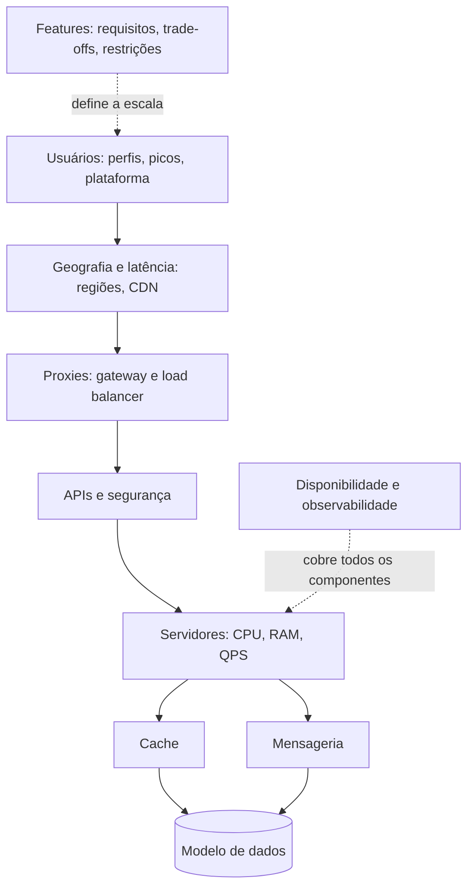

# Roadmap de System Design

Este é um guia de tópicos para estudar e para conduzir um design de sistema do começo ao fim, organizado em dez áreas na ordem em que elas costumam aparecer: primeiro entender o que o sistema faz e quem o usa, depois modelar os dados, expor APIs, dimensionar servidores, aproximar do usuário, proteger contra falhas, acelerar com cache e desacoplar com mensageria.

Cada tópico aponta para a nota deste lab que o explica. Quando o tópico ainda não tem nota própria, aparece como "Em breve". Para a ordem de raciocínio de um design completo, veja [Como Estruturar um System Design](/labs/web-dev/system-design/06-metodologia-de-design/).

## 01. Features

O que o sistema precisa fazer, e sob quais condições. É a área que define o peso de todas as outras.

| Tópico | Onde estudar |
| ------ | ------------ |
| Requisitos funcionais | [System Design: Fundamentos](/labs/web-dev/system-design/01-o-que-e-system-design/) |
| Requisitos não funcionais | [System Design: Fundamentos](/labs/web-dev/system-design/01-o-que-e-system-design/) |
| Trade-offs (consistency vs availability) | [Trade-offs Arquiteturais](/labs/web-dev/system-design/05-trade-offs-arquiteturais/) e [Teorema de CAP](/labs/web-dev/banco-de-dados/05-teorema-de-cap/) |
| Constraints (ex: baixa latência) | [Latência, Throughput e Performance](/labs/web-dev/system-design/04-latencia-e-performance/) |
| Read-heavy vs write-heavy | [Stateless, Particionamento e Sharding](/labs/web-dev/escalabilidade/02-stateless-e-particionamento/) |

## 02. Usuários

Quem usa o sistema, quando e com que frequência. Esses números viram a carga que o sistema precisa aguentar.

| Tópico | Onde estudar |
| ------ | ------------ |
| Tipos de usuário, roles e demografia | Em breve |
| Picos (horário do dia, dias do ano) | [Capacity Planning e Capacity Math](/labs/web-dev/system-design/03-capacity-planning/) |
| Frequência de uso e duração média | [Capacity Planning e Capacity Math](/labs/web-dev/system-design/03-capacity-planning/) |
| Web vs mobile | [API Gateway](/labs/web-dev/escalabilidade/07-api-gateway/) (BFF por tipo de cliente) |

## 03. Modelo de dados

Como os dados são organizados, armazenados e escalados.

| Tópico | Onde estudar |
| ------ | ------------ |
| Relacional: ACID e indexação | [ACID](/labs/web-dev/banco-de-dados/04-acid/) e [Índices e Planos de Execução](/labs/web-dev/banco-de-dados/14-indices-e-planos-de-execucao/) |
| Relacional: normalização | [Normalização de Banco de Dados](/labs/web-dev/banco-de-dados/02-normalizacao/) |
| NoSQL (document, column-oriented, key-value, graph) | [NoSQL](/labs/web-dev/banco-de-dados/11-nosql/) |
| Armazenamento distribuído (S3, blob storage) | [Categorias de Serviço em Nuvem](/labs/web-dev/entrega-continua/05-categorias-de-servico-em-nuvem/) (object storage). HDFS ainda não tem nota própria |
| Escala horizontal vs sharding | [Escalabilidade](/labs/web-dev/escalabilidade/01-escalabilidade/) e [Stateless, Particionamento e Sharding](/labs/web-dev/escalabilidade/02-stateless-e-particionamento/) |
| Write master + read replicas | [Replicação e Escalabilidade do Banco de Dados](/labs/web-dev/escalabilidade/03-replicacao-de-banco-de-dados/) |
| Spark (consulta distribuída) | Em breve |

Para escolher entre as opções acima num caso real, veja também [Escolha de Banco de Dados na Prática](/labs/web-dev/banco-de-dados/07-escolha-de-banco-de-dados/).

## 04. APIs e segurança

Como o sistema conversa com o mundo e como se protege.

| Tópico | Onde estudar |
| ------ | ------------ |
| SOAP | [Classificação de APIs por Público](/labs/web-dev/apis/04-classificacao-de-apis-por-publico/) |
| REST | [HTTP, APIs e REST](/labs/web-dev/apis/01-http-rest/) |
| gRPC e GraphQL | [Estilos de Comunicação de API](/labs/web-dev/apis/03-estilos-de-comunicacao/) |
| Rate limiting | [Rate Limiting](/labs/web-dev/escalabilidade/10-rate-limiting/) |
| Ataques: DoS e MITM | [Segurança e Evolução de APIs](/labs/web-dev/apis/02-seguranca-e-evolucao-de-apis/) (Ameaças comuns) |
| Ataques: DDoS e XSS | Em breve |
| Autenticação vs autorização, JWT | [Segurança e Evolução de APIs](/labs/web-dev/apis/02-seguranca-e-evolucao-de-apis/) e [SSO, OAuth 2.0, OIDC e SAML](/labs/web-dev/apis/06-sso-oauth-oidc-saml/) |
| TLS/HTTPS e certificados | [Segurança e Evolução de APIs](/labs/web-dev/apis/02-seguranca-e-evolucao-de-apis/) (HTTPS e mTLS) |
| CRUD e métodos HTTP | [HTTP, APIs e REST](/labs/web-dev/apis/01-http-rest/) |
| Paginação | [Paginação](/labs/web-dev/apis/05-paginacao/) |

## 05. Capacidade do servidor

Quanto cada máquina aguenta e quando é hora de escalar.

| Tópico | Onde estudar |
| ------ | ------------ |
| CPU, RAM e storage | [Capacity Planning e Capacity Math](/labs/web-dev/system-design/03-capacity-planning/) |
| Escala vertical | [Escalabilidade](/labs/web-dev/escalabilidade/01-escalabilidade/) |
| Requests por segundo e QPS | [Capacity Planning e Capacity Math](/labs/web-dev/system-design/03-capacity-planning/) |
| Largura de banda de rede | [Capacity Planning e Capacity Math](/labs/web-dev/system-design/03-capacity-planning/) |
| Paralelização e threads | Em breve |

## 06. Geografia e latência

Onde o sistema roda em relação a quem o usa, e o que a distância custa.

| Tópico | Onde estudar |
| ------ | ------------ |
| Regiões | [Disponibilidade](/labs/web-dev/resiliencia/03-disponibilidade/) (multi-região e disaster recovery) |
| CDN | [CDN](/labs/web-dev/escalabilidade/04-cdn/) |
| Distância e RTT | [CDN](/labs/web-dev/escalabilidade/04-cdn/) e [Latência, Throughput e Performance](/labs/web-dev/system-design/04-latencia-e-performance/) |
| Latência de rede | [Latência, Throughput e Performance](/labs/web-dev/system-design/04-latencia-e-performance/) |

## 07. Proxies

O que fica entre o cliente e os servidores.

| Tópico | Onde estudar |
| ------ | ------------ |
| Reverse proxy (API Gateway, application gateway) | [API Gateway](/labs/web-dev/escalabilidade/07-api-gateway/) |
| Forward proxy | Em breve |
| Load balancers e estratégias | [Load Balancer](/labs/web-dev/escalabilidade/05-load-balancer/) |
| Layer 4 vs layer 7 | [Load Balancer](/labs/web-dev/escalabilidade/05-load-balancer/) |

## 08. Disponibilidade e microsserviços

Como o sistema continua de pé quando algo falha. A arquitetura de microsserviços em si está na seção [Microsserviços](/labs/web-dev/microsservicos/01-fundamentos-de-microsservicos/).

| Tópico | Onde estudar |
| ------ | ------------ |
| Redundância | [Disponibilidade](/labs/web-dev/resiliencia/03-disponibilidade/) |
| Tolerância a falhas e circuit breakers | [Timeout, Retry, Circuit Breaker e Bulkhead](/labs/web-dev/resiliencia/01-timeout-retry-circuit-breaker-e-bulkhead/) |
| Eleição de líder | [Eleição de Líder](/labs/web-dev/sistemas-distribuidos/03-eleicao-de-lider/) |
| Orquestração de containers | [Kubernetes](/labs/web-dev/entrega-continua/02-kubernetes/) |
| Observabilidade (logs, métricas, tracing distribuído, alertas) | [Observabilidade: Logs, Metrics e Traces](/labs/web-dev/observabilidade/01-logs-metrics-e-traces/) e [Ferramentas de Observabilidade](/labs/web-dev/observabilidade/02-ferramentas-de-observabilidade/) |

## 09. Cache

Como evitar trabalho repetido e proteger o banco.

| Tópico | Onde estudar |
| ------ | ------------ |
| Write-through e write-behind | [Cache e Redis](/labs/web-dev/escalabilidade/08-cache-e-redis/) (Estratégias de cache) |
| Algoritmos de hash | [Consistent Hashing e Gossip](/labs/web-dev/sistemas-distribuidos/04-consistent-hashing-e-gossip/) |
| Políticas de eviction (LRU e outras) | [Cache e Redis](/labs/web-dev/escalabilidade/08-cache-e-redis/) (Políticas de eviction) |
| Cache hit e miss | [Cache e Redis](/labs/web-dev/escalabilidade/08-cache-e-redis/) |

## 10. Mensageria

Como partes do sistema se comunicam sem esperar umas pelas outras.

| Tópico | Onde estudar |
| ------ | ------------ |
| TCP vs UDP | Em breve |
| Síncrono vs assíncrono | [Comunicação entre Serviços](/labs/web-dev/microsservicos/03-comunicacao-entre-servicos/) e [Filas e Mensageria](/labs/web-dev/mensageria/01-filas-e-mensageria/) |
| Filas (FIFO, ordenação) | [Filas e Mensageria](/labs/web-dev/mensageria/01-filas-e-mensageria/) e [Garantias de Entrega](/labs/web-dev/mensageria/05-garantias-de-entrega/) |
| Pull vs push | [Kafka](/labs/web-dev/mensageria/03-kafka/) (consumer com poll) e [RabbitMQ](/labs/web-dev/mensageria/04-rabbitmq/) (entrega push-based) |
| WebSockets | [Estilos de Comunicação de API](/labs/web-dev/apis/03-estilos-de-comunicacao/) |
| Publish-subscribe | [Arquitetura Orientada a Eventos](/labs/web-dev/mensageria/02-arquitetura-orientada-a-eventos/) |

## Extras

**Ordem de grandeza.** Guarde a escala do sistema em potências de 10 (10⁶ usuários, 10⁹ requisições por dia): é esse número que indica se uma arquitetura simples basta ou se precisa de cache, sharding e filas. O passo a passo dessas contas está em [Capacity Planning e Capacity Math](/labs/web-dev/system-design/03-capacity-planning/).

**Componentes interligados.** As dez áreas não são independentes: a decisão em uma muda a pressão sobre as outras. Um pico de usuários vira QPS nos servidores, que vira leitura no cache e no banco, e o que o cache não segura vira fila na mensageria. O diagrama mostra como elas se conectam, e a arquitetura completa está em [Arquitetura de uma Aplicação Distribuída](/labs/web-dev/system-design/02-arquitetura-de-referencia/).

