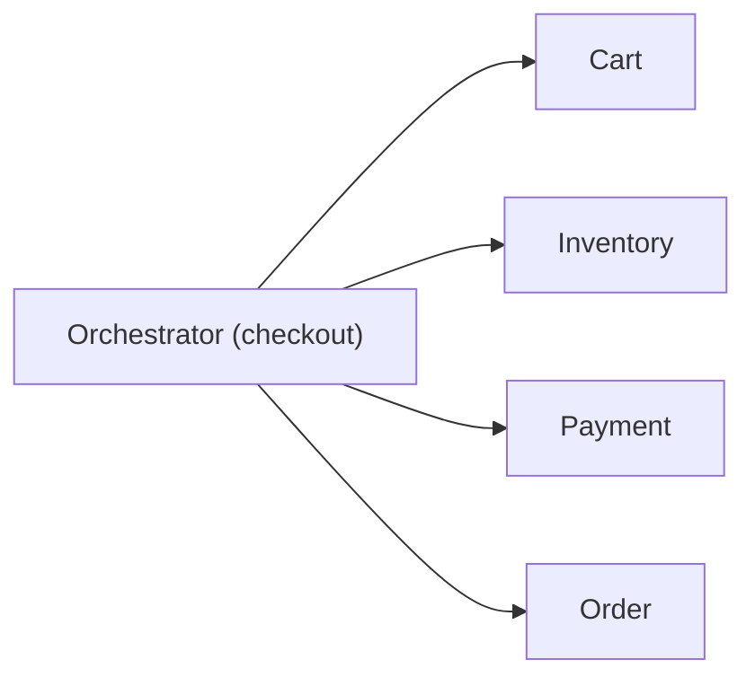
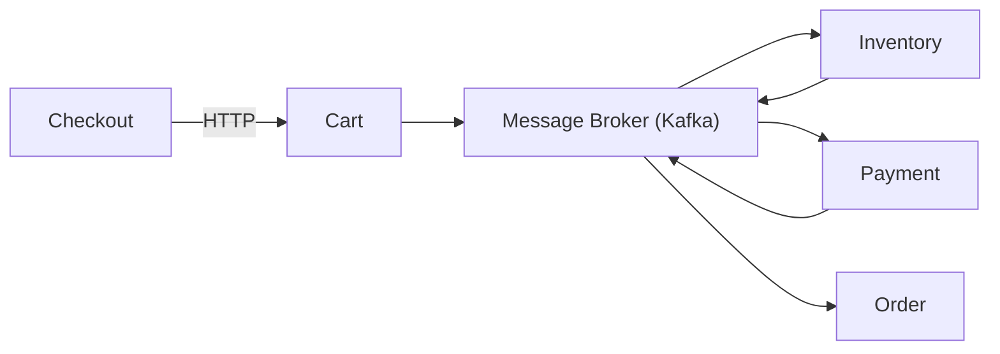

# Consistência Transacional: Monolito vs Microsserviços

## Monolito

No monolito, consistência é simples porque existe **um único banco de dados** e transações ACID resolvem boa parte do problema.

Características:

- Atomicidade
- Consistência forte
- Rollback automático

Exemplo: criar pedido e debitar saldo na mesma transação.

## Microsserviços

Cada serviço tem seu próprio banco e sua própria responsabilidade. O resultado é que **não existe transação ACID global**.

Você entra no mundo de:

- Consistência eventual
- Sistemas distribuídos
- Falhas parciais

## Problema central

Como garantir consistência em um fluxo como:

1. Criar pedido
2. Cobrar pagamento
3. Atualizar estoque

Se cada passo está em um serviço diferente?

## Sagas

Uma saga é uma sequência de transações locais:

- Cada serviço executa sua parte
- Em caso de erro, executa ações compensatórias

Exemplo:

1. Pedido criado
2. Pagamento falhou
3. Pedido cancelado como compensação

## Orquestração vs Coreografia

### Orquestração

Existe um orquestrador central que controla o fluxo.

**Vantagens**: fluxo explícito, mais fácil de depurar, controle total.

**Desvantagens**: ponto único de falha e maior acoplamento.

### Coreografia

Não existe controlador central. Cada serviço reage a eventos.

**Vantagens**: baixo acoplamento, alta escalabilidade, resiliência maior.

**Desvantagens**: debug e observabilidade mais difíceis.

## Comparação direta

| Aspecto             | Orquestração | Coreografia  |
| ------------------- | ------------ | ------------ |
| Controle            | Centralizado | Distribuído  |
| Acoplamento         | Médio        | Baixo        |
| Observabilidade     | Mais fácil   | Mais difícil |
| Escalabilidade      | Menor        | Maior        |
| Complexidade mental | Baixa        | Alta         |

## Insight principal

> Consistência em microsserviços não é sobre evitar falhas. É sobre saber lidar com elas.

## Boas práticas

- Idempotência
- Retries com backoff
- Dead letter queues
- Observabilidade
- Versionamento de eventos

## Resumo

- Monolito: simples e consistente
- Microsserviços: distribuídos e sujeitos a falhas parciais
- Sagas: forma comum de coordenar consistência
- Orquestração: controle central
- Coreografia: eventos distribuídos

## Referências

- [System Design Interview. A pergunta mais comum em entrevista sobre microsservicos | Leonardo Zamariola](https://www.youtube.com/watch?v=bBYjxqLSXeU)

