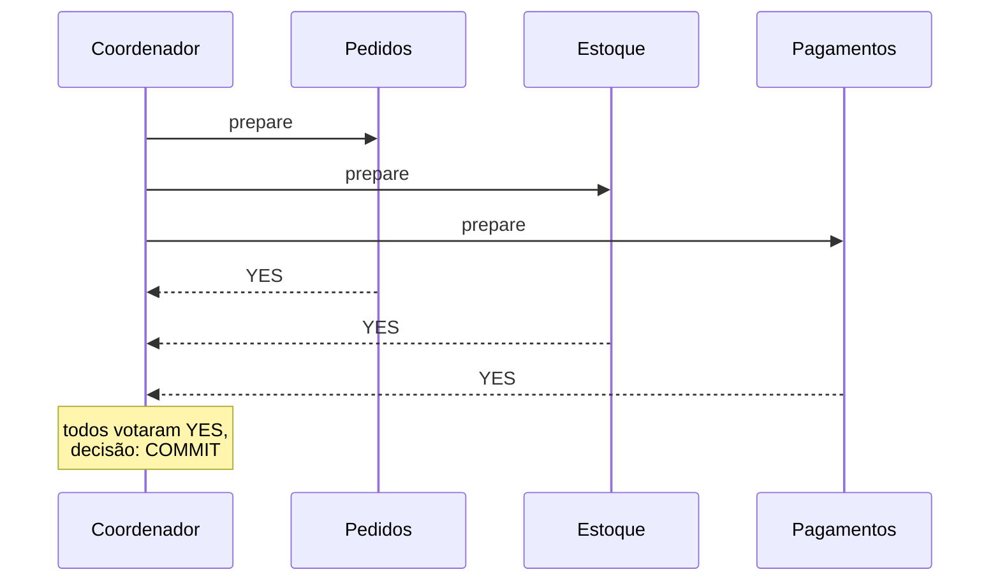
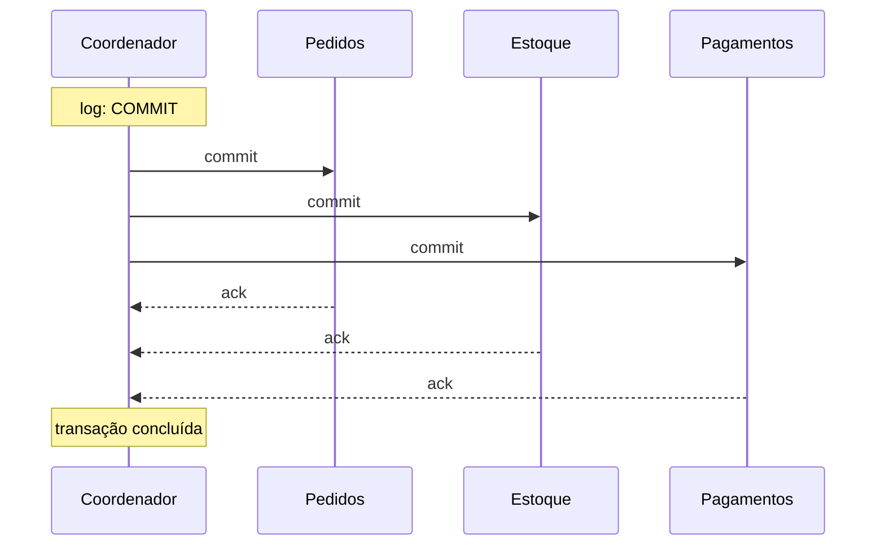

# Two-Phase Commit (2PC)

A nota de [Consistência Transacional](/labs/web-dev/transacoes-distribuidas/01-consistencia-transacional/) mostra o problema: quando uma operação de negócio atravessa vários serviços, cada um com seu banco, não existe uma transação ACID cobrindo tudo. O Two-Phase Commit é a resposta mais antiga para esse problema, a tentativa de manter consistência forte mesmo com os dados espalhados. Ele funciona, mas cobra um preço alto, e é por isso que a maioria dos sistemas hoje prefere Saga. Esta nota explica como o 2PC funciona por dentro e por que ele caiu em desuso.

## O que o 2PC tenta garantir

Imagine um checkout que precisa, na mesma operação, criar o pedido no serviço de Pedidos, reservar o item no serviço de Estoque e registrar a cobrança no serviço de Pagamentos. Cada um desses passos é uma transação local, num banco diferente. O que você quer é atomicidade distribuída: ou os três bancos confirmam a mudança, ou nenhum confirma. Nada de pedido criado sem estoque reservado, nada de cobrança sem pedido.

O 2PC é um protocolo que coordena esses commits. A ideia é simples: antes de qualquer um dos bancos efetivar a mudança, todos concordam que conseguem efetivá-la. Só depois desse acordo é que o commit real acontece, em todos ao mesmo tempo.

Ele aparece na prática em alguns lugares:

- Transações XA (o padrão que bancos de dados e brokers implementam para participar de um 2PC), geralmente acessadas via JTA no mundo Java
- Bancos distribuídos que fazem 2PC internamente entre seus nós
- Message brokers que oferecem "transação distribuída" entre a fila e o banco

## Os papéis: coordenador e participantes

O protocolo tem dois tipos de ator:

- **Coordenador** (também chamado de transaction manager): o cérebro da operação. É ele que conduz as duas fases, coleta os votos e decide o desfecho. Normalmente é o serviço que iniciou a transação, ou um componente dedicado.
- **Participantes** (ou resource managers): cada banco ou serviço que tem uma transação local envolvida. No exemplo do checkout, seriam os bancos de Pedidos, Estoque e Pagamentos.

O coordenador mantém um **log durável** de cada decisão que toma. Esse log é o que permite ele se recuperar se cair no meio do processo, e vamos ver que ele é peça central (e problema central) do protocolo.

## Fase 1: prepare (ou voto)

O coordenador pergunta a cada participante: "você consegue commitar essa transação?"

Cada participante, ao receber o `prepare`:

1. Executa a transação local até o ponto do commit, mas **não commita**
2. Grava as mudanças de forma durável (num log de undo/redo), para conseguir tanto confirmar quanto desfazer depois
3. Trava (`lock`) as linhas e recursos que a transação tocou, para ninguém mexer neles enquanto a decisão não sai
4. Responde ao coordenador com **YES** (estou preparado, prometo que consigo commitar) ou **NO** (não consigo, pode abortar)

Quando um participante responde YES, ele fez uma promessa que não pode voltar atrás: mesmo que ele reinicie logo depois, ao voltar ele precisa honrar o commit se o coordenador mandar. Por isso o estado "preparado" é gravado em disco antes da resposta.

## Fase 2: commit (ou rollback)

Com os votos na mão, o coordenador decide:

- **Todos votaram YES** -> ele grava "COMMIT" no seu log e envia `commit` para todos
- **Alguém votou NO, ou não respondeu dentro do tempo** -> ele grava "ABORT" e envia `rollback` para todos

Cada participante aplica a decisão: efetiva o commit (tornando as mudanças visíveis) ou desfaz tudo usando o log de undo. Depois, libera os locks e responde ao coordenador com um `ack`. Quando todos os acks chegam, a transação distribuída terminou.

O ponto que faz o 2PC "funcionar": entre a Fase 1 e a Fase 2, todo participante que votou YES fica num estado de espera obrigatória. Ele não pode commitar por conta própria nem abortar por conta própria. Ele **tem que** esperar a ordem do coordenador. É essa espera que garante que todos terminam do mesmo jeito, e é também a origem dos problemas do protocolo.

## Por que o 2PC é problemático

### É bloqueante

Um participante que votou YES e está esperando a decisão fica com os recursos travados. Se o coordenador demora (rede lenta, coordenador sobrecarregado), esses locks seguram outras transações que precisam das mesmas linhas. Em um sistema com bastante concorrência, isso vira fila e a vazão despenca.

### O coordenador é um ponto único de falha

Esse é o problema mais citado. Se o coordenador cai **depois** que os participantes votaram YES mas **antes** de mandar a decisão, os participantes ficam presos. Eles não sabem se a decisão foi COMMIT ou ABORT, prometeram que conseguem commitar, e não podem simplesmente desistir. Ficam segurando os locks, "in doubt", até o coordenador voltar e ler seu log para retomar de onde parou. Enquanto isso, as linhas travadas ficam inacessíveis.

Dá para amenizar com um coordenador replicado, mas aí você adicionou um sistema de consenso só para coordenar a transação, e a complexidade cresce de novo.

### Custo de coordenação

Cada transação distribuída são várias idas e voltas síncronas pela rede: prepare para todos, coletar votos, decisão para todos, coletar acks. Com participantes em máquinas diferentes (ou regiões diferentes), a latência de cada transação é a soma de todas essas viagens. Quanto mais participantes, pior.

### Não escala bem

Juntando tudo: locks segurados por mais tempo, mais mensagens de rede, dependência de todos os participantes estarem no ar ao mesmo tempo. O 2PC funciona razoavelmente com poucos participantes na mesma rede local. Espalhado por dezenas de serviços em regiões diferentes, ele trava.

## Variações que tentam melhorar

- **Three-Phase Commit (3PC)**: adiciona uma fase intermediária ("pre-commit") entre o voto e o commit, para que os participantes consigam decidir sozinhos em alguns cenários de queda do coordenador, reduzindo o bloqueio. O custo é mais uma rodada de mensagens, e ele ainda assume uma rede que não particiona. Na prática, é raro ver 3PC em produção.
- **Presumed abort / presumed commit**: otimizações no log do coordenador que evitam gravar alguns registros, assumindo um desfecho padrão quando não há informação. Reduzem o custo de disco, não resolvem o bloqueio.

## 2PC vs Saga

As duas abordagens resolvem o mesmo problema por caminhos opostos:

| Aspecto         | Two-Phase Commit                                             | [Saga](/labs/web-dev/transacoes-distribuidas/03-saga/)            |
| --------------- | ------------------------------------------------------------ | ----------------------------------------------------------------- |
| Consistência    | Forte: ninguém enxerga estado parcial                        | Eventual: passos intermediários ficam visíveis                    |
| Como desfaz     | Rollback técnico, antes de qualquer commit                   | Compensação: uma nova transação de negócio que reverte            |
| Locks           | Segurados entre as duas fases                                | Cada passo commita e solta na hora                                |
| Ponto de falha  | Coordenador preso trava os participantes                     | Sem coordenador obrigatório; orquestrador, se houver, é retomável |
| Disponibilidade | Todos os participantes precisam estar no ar juntos           | Cada passo pode ser retentado quando o serviço voltar             |
| Escala          | Ruim conforme cresce o número de participantes e a distância | Boa, é o padrão em arquiteturas distribuídas grandes              |

A consequência prática: a maioria dos sistemas distribuídos modernos evita 2PC e usa Saga com eventos. Grandes plataformas de e-commerce e streaming operam fluxos de pedido, pagamento e entrega em cima de sagas e consistência eventual, não de commit distribuído.

O 2PC ainda faz sentido em um nicho: poucos participantes, mesma rede, e uma exigência real de consistência forte, como sistemas financeiros legados construídos sobre XA. Fora disso, o custo raramente compensa.

Para entender melhor o lado "consistência forte vs eventual" dessa decisão, veja [Consistência e Replicação](/labs/web-dev/sistemas-distribuidos/01-consistencia-e-replicacao/).

## Referências

- [Designing Data-Intensive Applications, cap. 9 - Martin Kleppmann](https://dataintensive.net/)
- [Pattern: Saga - Chris Richardson (microservices.io)](https://microservices.io/patterns/data/saga.html)
