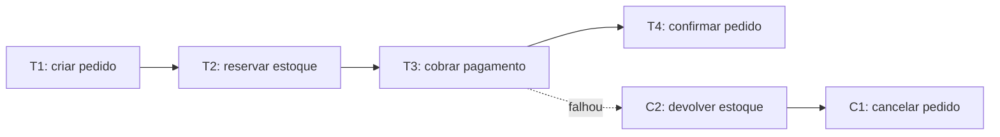
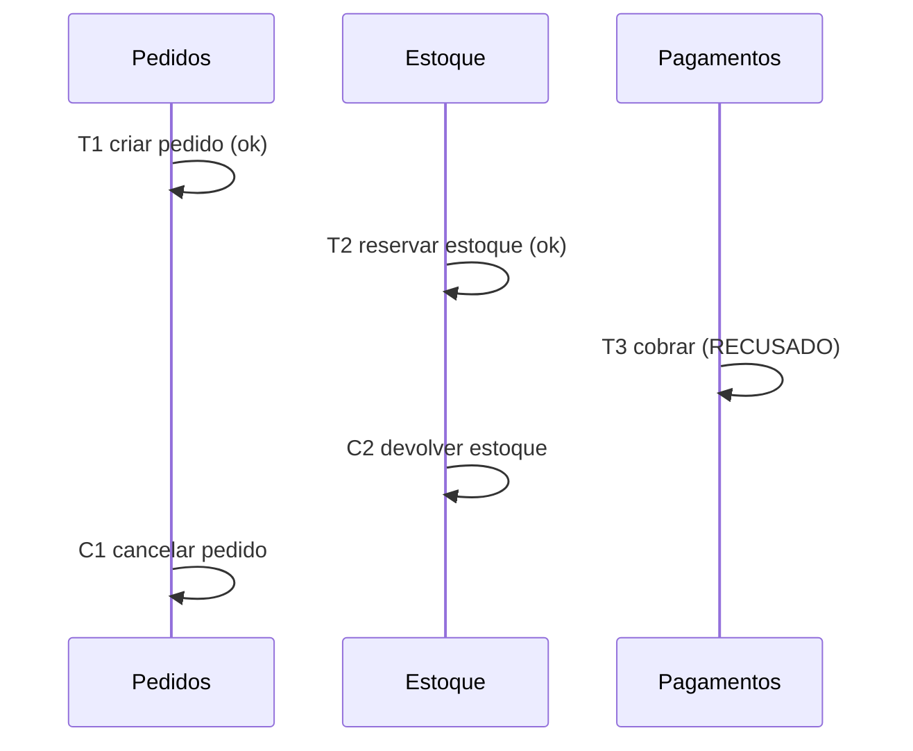

# Saga Pattern

A nota de [Consistência Transacional](/labs/web-dev/transacoes-distribuidas/01-consistencia-transacional/) apresenta a saga em nível introdutório e compara coreografia com orquestração. A nota de [Two-Phase Commit](/labs/web-dev/transacoes-distribuidas/02-two-phase-commit/) mostra a alternativa de consistência forte e por que ela não escala. Esta nota é o aprofundamento da saga: os tipos de passo, como projetar uma ação compensatória que funcione de verdade, o problema de isolamento e o que fazer quando a própria compensação falha.

## O que é uma saga

Uma saga troca "uma transação grande que cobre tudo" por "várias transações pequenas, uma por serviço, encadeadas". Cada passo commita no seu próprio banco assim que termina. Não existe um rollback global esperando no fim: se um passo lá na frente falha, a saga desfaz os passos anteriores executando **ações compensatórias**, que são novas transações de negócio.

O objetivo não é fingir que os serviços compartilham um banco. É aceitar que eles não compartilham e, mesmo assim, manter o negócio consistente: se o pagamento não passou, o pedido não fica pendurado como se tivesse dado certo.

## Transação local e ação compensatória

Para cada passo `T1, T2, ..., Tn`, você define uma compensação `C1, C2, ..., Cn-1` (o último passo não precisa de compensação, porque se ele deu certo a saga terminou).

O ponto que confunde no começo: a compensação **não é um `ROLLBACK`**. O passo `T2` já commitou, a reserva de estoque já está gravada e visível. `C2` é uma operação nova que reverte o efeito no nível do negócio: devolve as unidades para o estoque disponível. Alguns exemplos de par passo/compensação:

| Passo                                 | Compensação                      |
| ------------------------------------- | -------------------------------- |
| Criar pedido com status "processando" | Marcar pedido como "cancelado"   |
| Reservar 2 unidades no estoque        | Liberar as 2 unidades reservadas |
| Autorizar cobrança no cartão          | Estornar a cobrança              |
| Emitir nota fiscal                    | Emitir nota de cancelamento      |

Repare que "desfazer" nem sempre volta ao estado exato de antes. Depois de `C1`, o pedido não some, ele fica registrado como cancelado. Isso costuma ser aceitável e até desejável, porque o histórico do que aconteceu tem valor.

## O exemplo do checkout, passo a passo

Caminho feliz: criar pedido, reservar estoque, cobrar pagamento, confirmar pedido. Quatro transações locais, cada uma num serviço.

Falha no pagamento (cartão recusado):

Falha no estoque (item esgotou entre a listagem e o checkout): `T2` falha logo de cara, então só `C1` roda para cancelar o pedido. Como `T3` nunca aconteceu, ninguém foi cobrado.

## Tipos de passo

Nem todo passo tem o mesmo comportamento diante de falha. É útil classificar cada um:

- **Compensável**: pode ser desfeito por uma compensação. "Reservar estoque" é compensável, é só devolver.
- **Pivô**: o ponto sem volta. Depois dele, a saga não recua mais, só avança. "Capturar o pagamento" costuma ser o pivô: a partir daí faz mais sentido entregar o pedido do que estornar.
- **Retriável**: um passo depois do pivô que **precisa** eventualmente dar certo. Ele não pode falhar de forma definitiva, então a saga fica retentando até conseguir. "Agendar a entrega" é retriável: se o serviço de logística está fora do ar, você tenta de novo daqui a pouco, não cancela a compra.

Projetar a saga é, em boa parte, decidir onde fica o pivô e garantir que tudo antes dele seja compensável e tudo depois seja retriável.

## Recuperação: para trás ou para frente

Quando algo falha, a saga tem dois caminhos:

- **Backward recovery**: desfazer o que já foi feito, rodando as compensações na ordem inversa. É o caminho para falhas antes do pivô.
- **Forward recovery**: insistir para a frente, retentando os passos retriáveis até completar. É o caminho para falhas depois do pivô.

Sagas reais combinam os dois: recuam enquanto ainda dá, e depois de um certo ponto só seguem em frente.

## Coreografia vs orquestração, com mais detalhe

A nota introdutória já traz os diagramas e a tabela comparativa. Aqui vale aprofundar o critério de escolha.

Na **coreografia**, cada serviço publica um evento quando termina seu passo, e os outros serviços reagem a esses eventos. Ninguém está "no comando". Funciona bem quando a saga tem poucos passos e o fluxo é praticamente linear. O problema aparece quando a saga cresce: para entender o que acontece, você precisa abrir o código de cinco serviços diferentes e montar o quebra-cabeça na cabeça. Ciclos de eventos (o serviço A reage a um evento de B que reagiu a um evento de A) ficam fáceis de criar sem querer.

Na **orquestração**, um componente central (o orquestrador, ou saga executor) manda os comandos: "Estoque, reserve"; recebe a resposta; "Pagamentos, cobre"; e assim por diante. Se algo falha, é o orquestrador que dispara as compensações na ordem certa. O fluxo inteiro fica descrito num lugar só, o que ajuda demais no debug e na hora de mudar a sequência. O custo é um ponto a mais de acoplamento: todos os serviços agora conversam com o orquestrador.

Um guia prático:

- Poucos passos, fluxo linear, times que já usam eventos: coreografia
- Muitos passos, ramificações, necessidade de visibilidade e de mudar o fluxo com frequência: orquestração

Uma coisa que a orquestração exige e costuma ser esquecida: o orquestrador **tem que persistir o estado da saga** (em qual passo está, o que já foi feito, o que falta compensar), tipicamente como uma máquina de estados no banco. Sem isso, se o orquestrador reinicia no meio de uma saga, ele não sabe de onde continuar.

## Cuidados de projeto

**Compensação precisa ser idempotente.** O orquestrador pode mandar "estorne o pagamento", cair antes de registrar a resposta, e mandar de novo quando voltar. Estornar duas vezes não pode virar dois estornos. O padrão de [Idempotência](/labs/web-dev/resiliencia/02-idempotencia/) resolve isso, geralmente com uma chave que identifica a operação.

**Compensação pode falhar.** O serviço de estoque pode estar fora do ar bem na hora de devolver as unidades. A saga não pode simplesmente desistir e deixar o estoque errado. O caminho é retentar com backoff, e se não resolver em algum tempo, gerar um alerta para intervenção manual. Compensação é código que precisa ser tão confiável quanto o caminho feliz, ou mais.

**Algumas ações não dão para compensar.** Um e-mail de confirmação que já saiu não volta. Dinheiro que já foi sacado em espécie não é estornável. Para esses casos: coloque a ação depois do pivô (assim ela só acontece quando a saga já vai dar certo), ou use uma mitigação semântica (mandar um segundo e-mail dizendo "ignore o anterior").

**Isolamento não existe de graça.** Numa transação ACID, ninguém enxerga o meio do caminho. Numa saga, o pedido fica visível como "criado" mesmo antes do pagamento confirmar, e outro processo pode ler esse estado intermediário. Contramedidas comuns:

- Campos de status explícitos (`pendente`, `confirmado`, `cancelado`) para que quem lê saiba que o dado ainda não está definitivo
- Lock semântico: marcar o registro como "em processamento" e fazer os outros fluxos respeitarem essa marca
- Reler o valor antes de agir, em vez de confiar numa leitura antiga

**Timeouts.** Cada passo precisa de um tempo limite, e a saga inteira também. Uma saga que ficou presa num passo há horas precisa ser detectada e tratada, não ficar pendurada para sempre.

## Saga e Outbox andam juntos

Tanto na coreografia (publicar eventos) quanto na orquestração (enviar comandos e reagir a respostas), a saga precisa gravar o estado no banco **e** colocar uma mensagem no broker. Isso é exatamente o [Dual-Write Problem](/labs/web-dev/transacoes-distribuidas/04-escrita-dupla/): se você grava o estado e cai antes de publicar, a saga trava; se publica antes de gravar e a gravação falha, você disparou um passo que não deveria.

A solução é o [Transactional Outbox Pattern](/labs/web-dev/transacoes-distribuidas/05-outbox-pattern/): grava o estado da saga e a mensagem na mesma transação, numa tabela outbox, e deixa um processo separado publicar. Na prática, você não implementa saga confiável sem outbox.

## Observabilidade

Uma saga é um fluxo distribuído, então acompanhar o que aconteceu exige preparo:

- Todo passo e toda compensação carregam o mesmo `saga id` (ou correlation id), para conseguir juntar tudo depois
- Registre os marcos: saga iniciada, cada passo concluído, cada compensação disparada, desfecho final (concluída ou compensada)
- Métricas que valem a pena: sagas iniciadas por minuto, taxa de sagas que precisaram compensar, sagas presas há mais tempo que o limite

Quando uma saga dá errado às 3 da manhã, é esse rastro que diz se o problema foi o cartão do cliente, o serviço de estoque ou um bug na ordem das compensações.

## Referências

- [Pattern: Saga - Chris Richardson (microservices.io)](https://microservices.io/patterns/data/saga.html)
- [Managing data consistency in a microservice architecture using Sagas - microservices.io](https://microservices.io/post/microservices/2019/07/09/developing-sagas-part-1.html)
