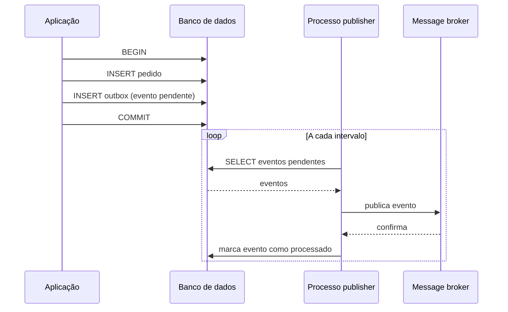

# Transactional Outbox Pattern

A nota de [Dual-Write Problem](/labs/web-dev/transacoes-distribuidas/04-escrita-dupla/) apresenta o Outbox Pattern como uma das estratégias para resolver o problema da escrita dupla, de forma resumida. Esta nota é o aprofundamento dedicado desse padrão: como ele funciona por dentro, como estruturar a tabela outbox, como publicar os eventos, e quais cuidados operacionais ele exige na prática.

## O problema, relembrando

Quando uma operação de negócio precisa gravar um dado no banco **e** publicar um evento sobre essa mudança (ex: criar um pedido e avisar outros serviços que o pedido foi criado), não existe uma transação distribuída confiável entre o banco de dados e o message broker. Se a aplicação salva no banco e cai antes de publicar o evento, o evento nunca é publicado. Se publica o evento antes de salvar no banco e o `INSERT` falha, um evento "mentiroso" já saiu para o resto do sistema. Os detalhes desse problema estão na nota de [Dual-Write Problem](/labs/web-dev/transacoes-distribuidas/04-escrita-dupla/), aqui o foco é só na solução.

## A ideia central: publicar dentro da própria transação

O Outbox Pattern resolve isso evitando escrever em dois sistemas diferentes. Em vez de gravar no banco **e depois** publicar no broker (duas operações, dois sistemas, sem garantia conjunta), a aplicação grava **duas linhas no mesmo banco, na mesma transação**: a mudança de negócio em si, e um registro do evento numa tabela dedicada, chamada de **outbox** (caixa de saída).

```sql
BEGIN;

INSERT INTO pedidos (id, cliente_id, status)
VALUES (123, 456, 'criado');

INSERT INTO outbox (aggregate_id, event_type, payload, created_at)
VALUES (123, 'PedidoCriado', '{"pedidoId": 123, "clienteId": 456}', now());

COMMIT;
```

Como as duas gravações acontecem dentro de uma única transação ACID (veja [ACID](/labs/web-dev/banco-de-dados/02-acid/)), ou as duas são salvas, ou nenhuma é. Não existe mais o cenário onde o pedido foi criado mas o evento se perdeu, ou vice-versa: a atomicidade do banco garante os dois juntos.

Só que isso resolve só metade do problema: o evento está seguro dentro do banco, mas ainda precisa sair de lá e chegar até o message broker (Kafka, RabbitMQ, SQS). Essa segunda parte é o papel do **publisher**.

## Como o evento sai do banco: o publisher

Um processo separado, rodando fora da transação de negócio, é responsável por ler a tabela `outbox` e publicar cada evento pendente no broker:



Existem duas formas comuns de implementar esse publisher:

### Polling

Um job agendado consulta periodicamente a tabela outbox em busca de eventos pendentes, publica cada um, e marca como processado (ou remove a linha):

```sql
SELECT * FROM outbox
WHERE processed_at IS NULL
ORDER BY created_at
LIMIT 100;
```

É simples de implementar, mas tem um custo: sempre existe um pequeno atraso entre o `COMMIT` e a publicação (o tempo até o próximo ciclo do polling), e consultar a tabela repetidamente gera carga extra no banco.

### CDC (Change Data Capture)

Em vez de a aplicação consultar a tabela de tempos em tempos, uma ferramenta de CDC (como o Debezium, já mencionado na nota de [Dual-Write Problem](/labs/web-dev/transacoes-distribuidas/04-escrita-dupla/)) observa diretamente o log de transações do banco (o mesmo _write-ahead log_ usado para durabilidade, veja [ACID](/labs/web-dev/banco-de-dados/02-acid/)) e publica o evento assim que a linha é inserida na outbox, sem precisar consultar a tabela ativamente. É mais rápido e não sobrecarrega o banco com consultas repetidas, ao custo de uma peça de infraestrutura a mais para operar.

## Idempotência: uma peça obrigatória, não opcional

Existe um detalhe que não pode ser ignorado: o publisher pode publicar um evento com sucesso no broker, mas falhar (crashar, perder conexão) **antes** de conseguir marcar esse evento como processado no banco. Na próxima rodada, ele vai encontrar o mesmo evento ainda como "pendente" e publicá-lo de novo. O mesmo pode acontecer do lado do broker, que em geral garante entrega **pelo menos uma vez** (at-least-once), não exatamente uma vez.

Isso significa que o Outbox Pattern, por si só, garante que o evento **não se perde**, mas não garante que ele **não vai duplicar**. Por isso, todo consumidor desses eventos precisa ser **idempotente**: processar o mesmo evento (identificado por um ID único) mais de uma vez precisa produzir o mesmo resultado que processá-lo uma vez só, geralmente guardando os IDs de eventos já processados e ignorando repetições.

## Limpeza da tabela outbox

Eventos já publicados com sucesso não precisam ficar para sempre na tabela. Sem alguma forma de limpeza, a outbox cresce indefinidamente e passa a pesar nas consultas do publisher. As duas abordagens comuns:

- **Marcar como processado** (`processed_at`) e rodar um job periódico que deleta linhas antigas já processadas, mantendo um histórico curto para debug.
- **Deletar imediatamente** após a confirmação de publicação, se não houver necessidade de manter histórico.

## "A outbox não vira um único ponto de falha?"

É uma dúvida razoável: se a tabela outbox depende do mesmo banco que a aplicação já usa, um problema nesse banco não afeta tudo? Vale separar dois pontos aqui:

- A tabela outbox **não introduz uma dependência nova**. Ela mora no mesmo banco que a aplicação já precisa que esteja no ar para gravar o pedido (ou qualquer outro dado de negócio). Se esse banco cair, a aplicação já estaria com problema antes mesmo de pensar no evento.
- O que o Outbox Pattern **de fato introduz** é o processo publisher como uma nova peça em operação: se ele ficar parado (travado, sem monitoramento), os eventos continuam seguros na tabela, mas param de sair. Por isso, o publisher precisa de monitoramento e alertas dedicados (ex: alertar se existem eventos pendentes há mais tempo do que o esperado).

## Vantagens e trade-offs

| Aspecto                  | Descrição                                                                                                                                           |
| ------------------------ | --------------------------------------------------------------------------------------------------------------------------------------------------- |
| Atomicidade              | Dado de negócio e evento são gravados juntos, na mesma transação, sem risco de um sem o outro                                                       |
| Resiliência              | Uma instabilidade temporária no message broker não trava nem corrompe o processo de negócio, o evento fica seguro na tabela até poder ser publicado |
| Desacoplamento           | A aplicação não depende do broker estar disponível no exato momento da escrita                                                                      |
| Latência extra           | O evento só chega ao broker depois que o publisher processa a tabela, não instantaneamente                                                          |
| Complexidade operacional | Mais uma tabela, mais um processo (publisher) para manter, monitorar e limpar                                                                       |
| Duplicidade possível     | O padrão garante entrega pelo menos uma vez, exigindo consumidores idempotentes                                                                     |

## Recapitulando

- O Outbox Pattern resolve o Dual-Write Problem gravando o dado de negócio e o evento na mesma transação de banco, numa tabela `outbox` dedicada.
- Um processo publisher (via polling ou CDC) lê essa tabela e publica os eventos pendentes no broker, marcando ou removendo os já processados.
- O padrão garante que o evento não se perde, mas não garante entrega exatamente uma vez, por isso consumidores precisam ser idempotentes.
- A tabela outbox não é uma dependência nova (já está no banco que a aplicação usa), mas o processo publisher é uma peça nova que precisa de monitoramento próprio.
- O ganho de resiliência e atomicidade vem ao custo de latência extra na publicação e mais complexidade operacional.

## Referências

- [Padrões de Resiliência - Transactional Outbox Pattern | André Secco](https://www.youtube.com/watch?v=Fl_zXWvK2F8)
