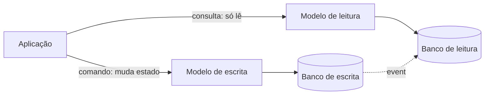
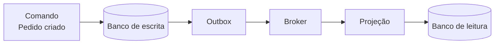

# CQRS

A nota de [Dual-Write Problem](/labs/web-dev/transacoes-distribuidas/04-escrita-dupla/) já citou "reconstruir um read model" e o [Outbox Pattern](/labs/web-dev/transacoes-distribuidas/05-outbox-pattern/) mostrou como publicar um evento junto com a gravação no banco. O CQRS é o padrão que costura essas duas ideias: separar o lado que escreve do lado que lê, e manter os dois em sincronia por eventos.

CQRS é sigla para Command Query Responsibility Segregation, "segregação de responsabilidade entre comando e consulta". O nome é feio, a ideia é simples.

## O problema: um modelo só para ler e escrever

Na arquitetura mais comum, o mesmo modelo de dados serve para tudo: as mesmas tabelas, as mesmas classes, o mesmo ORM atendem tanto quem grava quanto quem consulta. Para um CRUD simples isso é ótimo e não há motivo para complicar.

O incômodo aparece quando o sistema cresce e os dois lados passam a querer coisas opostas:

- **Quem escreve** quer dados normalizados, com regras de negócio, validação e integridade transacional. Quer poucas tabelas bem modeladas e uma agregação que garante consistência.
- **Quem lê** quer o dado já mastigado: a tela de detalhe do pedido junta cliente, itens, pagamento e status de entrega. Fazer isso com `JOIN` em cima do modelo normalizado, milhares de vezes por minuto, fica caro.

Forçar os dois pelo mesmo modelo leva a consultas cada vez mais complicadas de um lado e a um modelo de escrita poluído com campos que só existem para facilitar leitura do outro. Some a isso a contenção de lock quando leitura pesada e escrita disputam as mesmas linhas.

## A ideia central

CQRS separa a aplicação em dois caminhos:

- **Comandos**: operações que mudam estado. Representam intenção de negócio ("reservar quarto", "cancelar pedido"), não um `UPDATE` genérico. Passam por validação e lógica de domínio.
- **Consultas**: operações que só devolvem dados. Nunca alteram nada. Retornam um objeto pronto para a tela (um DTO), sem lógica de domínio.

Cada lado evolui sozinho. O time que cuida da regra de negócio mexe no modelo de escrita; o time que cuida das telas mexe no modelo de leitura, sem pisar um no outro.

## Modelo de escrita x modelo de leitura

Separar os dois modelos tem níveis, do mais leve ao mais radical:

1. **Mesmo banco, modelos separados no código**. As classes e a lógica de comando são diferentes das de consulta, mas por baixo ainda é o mesmo banco. É o CQRS "básico": já organiza o código sem trazer o custo de sincronização.
2. **Bancos diferentes**. A escrita vai para um banco relacional; a leitura é servida de outro armazenamento otimizado para consulta, por exemplo um índice de busca ou um banco de documentos com o pedido inteiro já montado num só registro. Aqui os dois precisam ser mantidos em sincronia.
3. **Réplicas de leitura**. O banco de leitura é replicado várias vezes para distribuir carga de consulta e reduzir latência.

Um exemplo concreto do nível 2: um e-commerce grava pedidos em PostgreSQL (transações, integridade, regras) e serve a busca e a listagem de pedidos a partir de um índice no Elasticsearch, onde cada pedido é um documento único, sem `JOIN`.

## Como os dois lados ficam em sincronia

Quando os bancos são separados, alguém precisa levar a mudança do lado da escrita para o lado da leitura. O padrão é o modelo de escrita **publicar um evento** a cada mudança, e um consumidor atualizar o modelo de leitura a partir desse evento.

Isso esbarra no problema da escrita dupla: gravar no banco e publicar no broker não é atômico. A solução é a mesma da nota de [Outbox Pattern](/labs/web-dev/transacoes-distribuidas/05-outbox-pattern/), gravar o evento na mesma transação do banco, e deixar um processo separado publicá-lo. O componente que consome esses eventos e escreve o modelo de leitura costuma ser chamado de **projeção**: ele "projeta" o fluxo de eventos numa visão pronta para consulta. Change Data Capture, visto em [Casos de Uso do Kafka](/labs/web-dev/mensageria/08-casos-de-uso-do-kafka/), é outra forma de alimentar essa projeção.

Como o evento pode chegar duas vezes, a projeção precisa ser idempotente (ver [Idempotência](/labs/web-dev/resiliencia/02-idempotencia/)): aplicar o mesmo evento de novo tem que dar o mesmo resultado.

## Consistência eventual

O modelo de leitura fica sempre alguns instantes atrás da escrita, o tempo do evento trafegar e a projeção rodar. Normalmente são milissegundos, mas é tempo suficiente para o usuário criar um pedido, ser redirecionado para a lista e não ver o pedido que acabou de criar.

Formas comuns de lidar com isso na interface:

- **Ler a própria escrita**: logo depois de um comando, servir aquela tela específica a partir do modelo de escrita, ou de um cache local, em vez do modelo de leitura
- **Feedback otimista**: a tela mostra o resultado esperado do comando na hora, antes de a projeção confirmar, e corrige depois se algo deu errado
- **Deixar explícito**: um "processando..." honesto é melhor que uma tela que parece ter perdido o dado

Se o seu caso não tolera nem esse atraso, CQRS com bancos separados provavelmente não é a escolha certa ali.

## Relação com Event Sourcing

CQRS e [Event Sourcing](/labs/web-dev/transacoes-distribuidas/04-escrita-dupla/) aparecem quase sempre na mesma conversa, mas são padrões distintos:

- **CQRS** separa leitura de escrita. Não diz nada sobre como você guarda o estado.
- **Event Sourcing** guarda o estado como a sequência de eventos que aconteceram, em vez de só o valor atual. É a mesma ideia do [Ledger Pattern](/labs/web-dev/banco-de-dados/08-ledger-pattern/).

Dá para usar CQRS sem Event Sourcing (o modelo de escrita é um banco normal que só publica eventos) e Event Sourcing sem CQRS (raro, mas possível). Quando os dois andam juntos, o encaixe é natural: o log de eventos é o modelo de escrita e a fonte da verdade, e as projeções constroem os modelos de leitura a partir dele. Se um modelo de leitura precisa mudar de forma, é só apagar e reprojetar do zero relendo os eventos.

## Quando usar

- Leitura e escrita com cargas muito assimétricas, em geral muito mais leitura que escrita, e que precisam escalar separado
- Várias visões de leitura diferentes do mesmo dado (uma para a tela do cliente, outra para o relatório, outra para a busca)
- Domínio de escrita complexo, com muitas regras e interface guiada por tarefas, onde separar o lado de consulta simplifica bastante o modelo de negócio
- Times que precisam trabalhar em paralelo nos dois lados sem conflito
- Integração com sistemas que já usam Event Sourcing

## Quando não usar

- CRUD simples, domínio sem regra de negócio relevante: CQRS só adiciona código, partes móveis e um bug novo (sincronização) sem pagar por isso
- Quando a equipe não está confortável com consistência eventual e o produto não tolera dados momentaneamente desatualizados
- Como decisão do sistema inteiro. CQRS é aplicado por contexto: um punhado de áreas do sistema se beneficia, o resto continua CRUD

## Referências

- [Padrão CQRS - Azure Architecture Center](https://learn.microsoft.com/pt-br/azure/architecture/patterns/cqrs) - Microsoft, pt-BR
- [CQRS](https://martinfowler.com/bliki/CQRS.html) - Martin Fowler, en
- [Pattern: Command Query Responsibility Segregation (CQRS)](https://microservices.io/patterns/data/cqrs.html) - Chris Richardson (microservices.io), en
- [Event Sourcing](https://martinfowler.com/eaaDev/EventSourcing.html) - Martin Fowler, en
