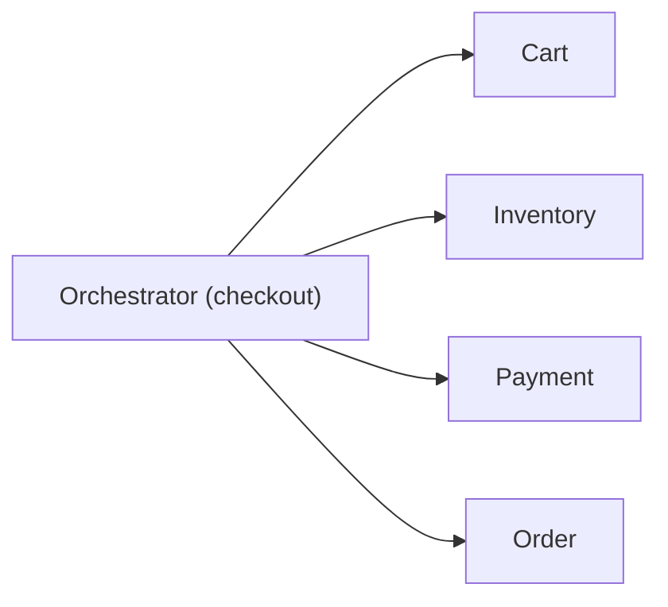
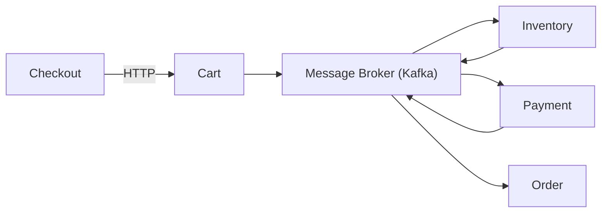

## Monolito

No monolito, consistencia e simples porque existe **um unico banco de dados** e transacoes ACID resolvem boa parte do problema.

Caracteristicas:

- Atomicidade
- Consistencia forte
- Rollback automatico

Exemplo: criar pedido e debitar saldo na mesma transacao.

## Microsservicos

Cada servico tem seu proprio banco e sua propria responsabilidade. O resultado e que **nao existe transacao ACID global**.

Voce entra no mundo de:

- Consistencia eventual
- Sistemas distribuidos
- Falhas parciais

## Problema central

Como garantir consistencia em um fluxo como:

1. Criar pedido
2. Cobrar pagamento
3. Atualizar estoque

Se cada passo esta em um servico diferente?

## Sagas

Uma saga e uma sequencia de transacoes locais:

- Cada servico executa sua parte
- Em caso de erro, executa acoes compensatorias

Exemplo:

1. Pedido criado
2. Pagamento falhou
3. Pedido cancelado como compensacao

## Orquestracao vs Coreografia

### Orquestracao

Existe um orquestrador central que controla o fluxo.

**Vantagens**: fluxo explicito, mais facil de depurar, controle total.

**Desvantagens**: ponto unico de falha e maior acoplamento.

### Coreografia

Nao existe controlador central. Cada servico reage a eventos.

**Vantagens**: baixo acoplamento, alta escalabilidade, resiliencia maior.

**Desvantagens**: debug e observabilidade mais dificeis.

## Comparacao direta

| Aspecto | Orquestracao | Coreografia |
| --- | --- | --- |
| Controle | Centralizado | Distribuido |
| Acoplamento | Medio | Baixo |
| Observabilidade | Mais facil | Mais dificil |
| Escalabilidade | Menor | Maior |
| Complexidade mental | Baixa | Alta |

## Insight principal

> Consistencia em microsservicos nao e sobre evitar falhas. E sobre saber lidar com elas.

## Boas praticas

- Idempotencia
- Retries com backoff
- Dead letter queues
- Observabilidade
- Versionamento de eventos

## Resumo

- Monolito: simples e consistente
- Microsservicos: distribuidos e sujeitos a falhas parciais
- Sagas: forma comum de coordenar consistencia
- Orquestracao: controle central
- Coreografia: eventos distribuidos

## Referencias

- [System Design Interview. A pergunta mais comum em entrevista sobre microsservicos | Leonardo Zamariola](https://www.youtube.com/watch?v=bBYjxqLSXeU)

[Voltar ao indice](/web-dev-labs/indice/)
