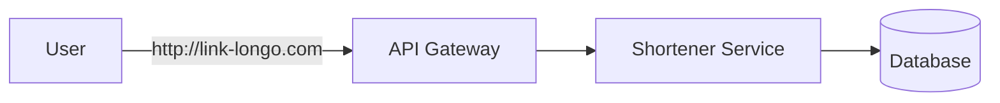

Um encurtador de URL e um sistema que:

- Recebe uma URL longa
- Gera uma URL curta unica
- Redireciona usuarios da URL curta para a original

## Estrutura de raciocinio

Um framework util para entrevistas de system design e o FENCAFA:

1. Funcional
2. Escala
3. Nao-funcional
4. Componentes
5. Arquitetura
6. Fluxo
7. Ajustes

## Requisitos do sistema

### Funcionais

- Criar URL curta
- Redirecionar URL
- Metricas de acesso

### Nao-funcionais

- Alta disponibilidade
- Baixa latencia
- Escalabilidade massiva
- Consistencia eventual aceitavel

## Estimativa de escala

Voce deve pensar em:

- Numero de URLs criadas por dia
- Numero de redirecionamentos
- Volume de armazenamento

> Esse e um sistema read-heavy.

## Modelo basico

1. Usuario envia URL longa
2. Sistema gera codigo curto
3. Salva o mapping `short_code -> original_url`
4. O redirecionamento consulta esse mapping

## Geracao da URL curta

### Estrategias

**Auto-increment + Base62**

Simples e deterministico, mas previsivel.

**Hash da URL**

Pode colidir e dificulta controle.

**ID distribuido**

Escalavel e evita gargalo central.

## Escala e otimizacoes

Como a leitura domina o sistema, o gargalo principal costuma estar no redirecionamento.

### Otimizacoes

- **Cache** para reduzir latencia
- **CDN** para distribuicao geografica
- **Banco distribuido** com sharding por chave

## Arquitetura proposta

Componentes principais:

- API Service
- Banco de dados
- Cache
- Load Balancer
- Pipeline de analytics

### Fluxo de leitura

1. Recebe short URL
2. Busca no cache
3. Se der miss, consulta o banco
4. Retorna redirect HTTP 301 ou 302

### Fluxo de escrita

1. Gera ID
2. Salva mapping
3. Atualiza cache

## Problemas avancados

- Cache invalidation
- Hot keys
- Consistencia eventual
- Abuso e seguranca
- Analytics em sistema separado

## Trade-offs

| Decisao | Trade-off |
| --- | --- |
| Cache agressivo | Consistencia |
| ID sequencial | Seguranca |
| Hash | Colisao |
| Banco unico | Escala |
| Banco distribuido | Complexidade |

## Resumo

- Sistema simples conceitualmente, dificil na escala
- Leitura domina o sistema
- Cache e essencial
- Geracao de ID e critica

## Referencias

- [System Design: Encurtador de URL - Desafio Real de Entrevista RESOLVIDO | Leonardo Zamariola](https://www.youtube.com/watch?v=JHavVCLQT4k)

[Voltar ao indice](/web-dev-labs/indice/)
